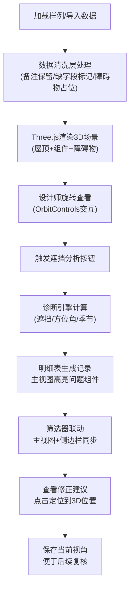

## 1. 产品概述

太阳能阵列阴影台是面向光伏设计师的Web3D专业工具，解决屋顶光伏阵列阴影分析、发电估算、遮挡诊断的核心痛点。设计师无需预先清洗数据，系统可直接处理带备注的屋顶模型、缺字段的组件排布、延迟到达的障碍物数据。

核心价值：将模糊的"方位角错算不算"问题转化为可视化、可追溯、可操作的专业分析结论，让设计师在同事质疑时能直接摊开3D模型、组件排布、发电数据说话。

## 2. 核心功能

### 2.1 用户角色

| 角色 | 注册方式 | 核心权限 |
|------|----------|----------|
| 光伏设计师 | 无需注册，本地使用 | 导入数据、3D交互、阴影分析、发电估算、导出结论 |

### 2.2 功能模块

1. **3D主视图**：屋顶模型渲染、光伏组件排布、障碍物显示、视角交互
2. **侧边栏-阴影播放**：太阳轨迹动画、时段控制、季节切换、阴影可视化
3. **侧边栏-发电估算**：逐时发电量、组件效率、损失分析、修正前后对比
4. **明细表**：遮挡记录、方位角错误记录、季节切换漏算记录、修正建议
5. **筛选系统**：按组件、按遮挡类型、按时段、按严重程度筛选，主视图与侧边栏同步
6. **数据层**：脏数据处理、备注透传、缺字段补全、障碍物延迟加载
7. **诊断引擎**：组件遮挡精确计算、方位角错误检测、季节切换漏算识别、可操作修正建议

### 2.3 页面详情

| 页面名称 | 模块名称 | 功能描述 |
|----------|----------|----------|
| 主工作台 | 3D视图区 | Three.js渲染屋顶、组件、障碍物，支持鼠标拖拽旋转、滚轮缩放、右键平移 |
| 主工作台 | 顶部工具栏 | 筛选器下拉、视角保存/恢复、重置视角、触发遮挡分析 |
| 主工作台 | 左侧边栏 | 阴影播放控制面板（时间轴、播放/暂停、速度调节、季节切换） |
| 主工作台 | 右侧边栏 | 发电估算面板（图表、数据列表、修正前后对比） |
| 主工作台 | 底部面板 | 明细表（遮挡记录、错误记录、修正建议，点击定位到3D组件） |

## 3. 核心流程

用户操作流程：
1. 启动开发服务器，打开应用默认加载样例数据
2. 鼠标左键旋转查看屋顶全貌，滚轮缩放细节
3. 点击"开始阴影分析"触发完整诊断
4. 查看底部明细表中的遮挡记录、方位角错误、季节漏算
5. 点击任意记录，主视图自动定位并高亮对应组件
6. 使用左侧边栏播放24小时阴影动画，切换季节观察变化
7. 查看右侧边栏发电估算，对比修正前后的发电量差异
8. 保存当前问题视角，便于后续与同事讨论

## 4. 用户界面设计

### 4.1 设计风格

**工业级专业工具风格**——拒绝花哨，强调信息密度和可读性
- 主色调：深空蓝 `#0f172a`（背景）+ 光伏蓝 `#3b82f6`（高亮）+ 警示橙 `#f97316`（错误）+ 危险红 `#ef4444`（严重遮挡）
- 中性色：石板灰系列，区分不同层级信息
- 字体：等宽字体 `JetBrains Mono` 显示数据，`Inter` 显示标题（刻意避免默认系统字体）
- 按钮风格：直角、细边框、hover轻微发光，专业仪表感
- 布局：高密度四分区，主3D视图占60%空间，三侧边栏信息密度优先
- 图标：纯线条SVG，无填充，保持锐利感

### 4.2 页面设计概览

| 页面名称 | 模块名称 | UI元素 |
|----------|----------|--------|
| 主工作台 | 3D视图区 | WebGL画布、网格地面、坐标轴指示器、角标显示当前视角名称 |
| 主工作台 | 顶部工具栏 | 筛选下拉（组件状态/遮挡类型/季节）、视角保存按钮组、分析触发按钮、数据导入按钮 |
| 主工作台 | 左侧阴影面板 | 24小时时间轴滑块、播放/暂停/步进按钮、速度选择、季节切换（春分/夏至/秋分/冬至）、太阳高度角/方位角实时显示 |
| 主工作台 | 右侧发电面板 | 面积图（逐时发电）、数据卡片（总发电/有效发电/遮挡损失/方位角损失）、修正前后对比条 |
| 主工作台 | 底部明细表 | 可折叠数据表格、行点击高亮、状态标签（正常/警告/错误）、操作按钮（定位/修正建议） |

### 4.3 响应式

桌面端优先，最小支持1280px宽度。不做移动端适配，专业工具需要大屏。

### 4.4 3D场景指引

- **环境**：纯深色背景 + 半球光（天空蓝/地面深灰），无HDRI避免反射干扰
- **光照**：方向光模拟太阳（可随时间动画旋转），环境光补光确保暗部可见
- **相机**：PerspectiveCamera，初始位置俯视角45度，距离屋顶15米
- **交互**：OrbitControls，限制极角避免钻到地下，开启阻尼感
- **阴影**：PCFSoftShadowMap，组件和障碍物投射阴影到屋顶
- **材质**：屋顶用深灰StandardMaterial，组件用深蓝带轻微发光，障碍物用橙色半透明，问题组件用红色线框高亮
- **后处理**：轻微Bloom效果突出高亮组件，OutlinePass描边选中组件
- **性能**：组件数量控制在200以内，单实例化渲染，目标60fps

