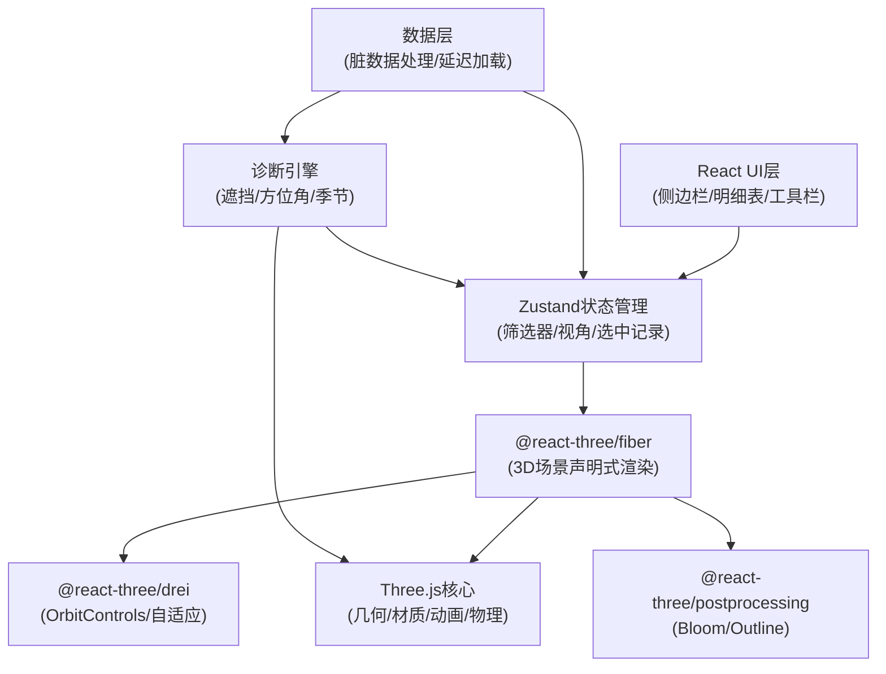
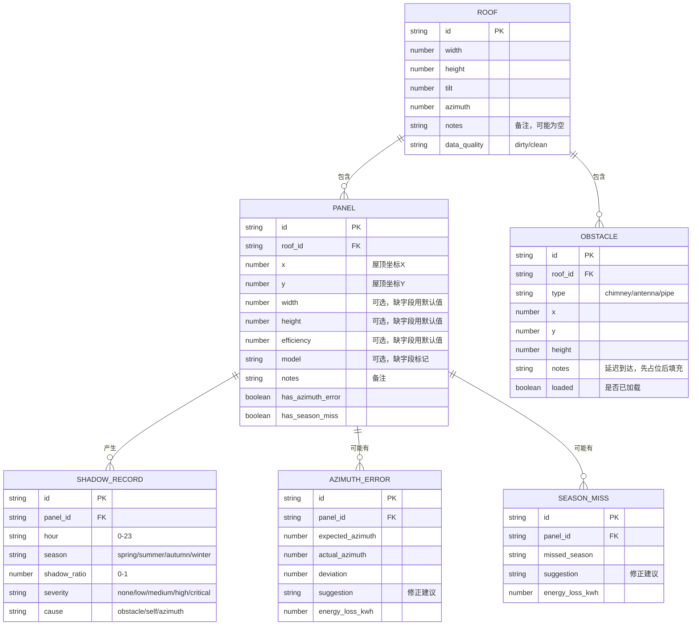

## 1. 架构设计

## 2. 技术描述

- **前端框架**：React@18 + TypeScript + Vite@5
- **3D渲染**：three@0.160 + @react-three/fiber@8 + @react-three/drei@9 + @react-three/postprocessing@2
- **状态管理**：Zustand（轻量，跨组件同步筛选状态）
- **样式**：TailwindCSS@3（原子化，高密度UI）
- **图表**：recharts（发电估算面积图）
- **数据**：本地Mock数据，模拟脏数据场景（缺字段、备注、延迟加载）

## 3. 路由定义

| 路由 | 用途 |
|------|------|
| / | 主工作台，完整3D阴影台界面 |

## 4. 数据模型

### 4.1 数据模型定义

### 4.2 脏数据处理规则

- **缺字段**：组件width/height缺失时用默认值(1.7x1.0)，但在UI中用虚线边框标记"缺字段"
- **备注**：屋顶和组件的notes字段直接透传到tooltip，不截断不清洗
- **延迟障碍物**：先显示橙色占位框，2秒后模拟数据到达填充真实信息
- **方位角错误**：与屋顶azimuth偏差>5度即标记，给出具体修正度数

## 5. 核心模块说明

### 5.1 诊断引擎 (`src/engine/`)

- `shadowCalculator.ts`：射线法计算组件遮挡率，每小时采样
- `azimuthChecker.ts`：检测组件方位角与屋顶偏差
- `seasonAnalyzer.ts`：检查季节切换时的发电异常
- `suggestionGenerator.ts`：生成可操作的修正建议（含具体度数、发电量提升）

### 5.2 3D场景 (`src/scene/`)

- `Roof.tsx`：屋顶平面，支持倾斜角度
- `SolarPanel.tsx`：单块光伏组件，支持实例化
- `Obstacle.tsx`：障碍物，支持延迟加载动画
- `ShadowVisualizer.tsx`：阴影可视化层
- `Scene.tsx`：场景入口，光照、相机、后处理

### 5.3 UI组件 (`src/components/`)

- `Toolbar.tsx`：顶部工具栏，筛选器、视角管理
- `ShadowPlayer.tsx`：左侧阴影播放面板
- `EnergyPanel.tsx`：右侧发电估算面板
- `DataTable.tsx`：底部明细表
- `FilterSync.tsx`：筛选同步Hook

### 5.4 状态管理 (`src/store/`)

- `useAppStore.ts`：筛选条件、选中记录、视角、诊断结果

## 6. 性能优化

- 组件使用InstancedMesh批量渲染
- 阴影计算使用WebWorker离线计算，不阻塞UI
- 视角保存只存camera参数矩阵，不存截图
- 明细数据虚拟滚动，支持1000+条记录

