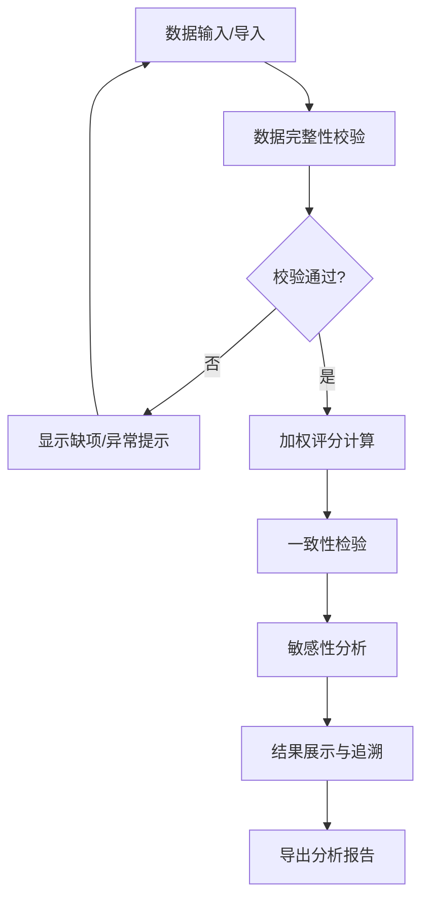

## 1. 产品概述
矩阵评分一致性检查工具是一款面向绩效分析员的专业计算工具，用于解决评委打分和权重矩阵分析中的一致性问题。通过内置的统计算法，自动检测权重不归一、打分缺项、极端评委等问题，提供详细的失败原因解释和可追溯的分析报告。

- **核心价值**：帮助绩效分析员快速定位评分偏差，提供科学的决策依据
- **目标用户**：绩效分析员、采购评审专员、质量评估人员

## 2. 核心功能

### 2.1 用户角色
| 角色 | 注册方式 | 核心权限 |
|------|----------|----------|
| 绩效分析员 | 无需注册，本地使用 | 完整功能使用权、数据导入导出 |

### 2.2 功能模块
1. **主控制面板**：数据输入区、实时计算区、结果展示区
2. **矩阵计算引擎**：加权评分计算、权重归一化处理
3. **一致性检验模块**：Cronbach's α系数、Kendall协同系数、极端评委检测
4. **敏感性分析**：权重变动影响分析、打分波动模拟
5. **数据管理**：评委打分导入、供应商资料、复议记录
6. **报告导出**：PDF/Excel报告生成、计算过程追溯

### 2.3 页面详情
| 页面名称 | 模块名称 | 功能描述 |
|-----------|-------------|---------------------|
| 主页面 | 数据输入区 | 支持手动输入和JSON/Excel导入评委打分矩阵、权重配置、供应商信息、复议记录 |
| 主页面 | 实时计算区 | 点击计算后实时显示加权评分结果，附带单位说明 |
| 主页面 | 一致性检验 | 显示各项检验指标，明确标注适用范围和失败原因 |
| 主页面 | 敏感性分析 | 可视化展示权重和打分变动对最终结果的影响 |
| 主页面 | 追溯面板 | 点击任意结果可展开查看详细计算过程和原始数据来源 |
| 主页面 | 导出功能 | 导出包含完整分析结论的报告文件 |

## 3. 核心流程

用户导入或输入评分数据 → 系统自动验证数据完整性 → 执行加权评分计算 → 进行多维度一致性检验 → 生成敏感性分析报告 → 用户可追溯任意计算环节 → 导出完整分析报告

## 4. 用户界面设计

### 4.1 设计风格
- **主色调**：深蓝色系 (#1e3a5f)，体现专业和可信度
- **辅助色**：橙色警示 (#f59e0b)、红色错误 (#ef4444)、绿色成功 (#10b981)
- **按钮风格**：圆角矩形，悬停时有阴影和轻微缩放效果
- **字体**：标题使用 Noto Sans SC Bold，正文使用 Noto Sans SC Regular
- **布局风格**：三栏式卡片布局，左侧数据输入、中间计算结果、右侧分析详情
- **图标风格**：使用线性图标，保持简洁专业

### 4.2 页面设计概述
| 页面名称 | 模块名称 | UI元素 |
|-----------|-------------|-------------|
| 主页面 | 数据输入区 | Tab切换（评委/供应商/复议）、表格编辑、文件上传按钮 |
| 主页面 | 计算结果区 | 评分排名卡片、指标标签、单位说明、追溯展开按钮 |
| 主页面 | 分析详情区 | 进度条可视化、原因解释文本框、适用范围提示 |
| 主页面 | 导出区 | 格式选择下拉框、下载按钮、报告预览 |

### 4.3 响应性
- 桌面端优先设计，三栏布局
- 平板端自适应为上下两栏布局
- 移动端单列流式布局，关键信息优先展示
