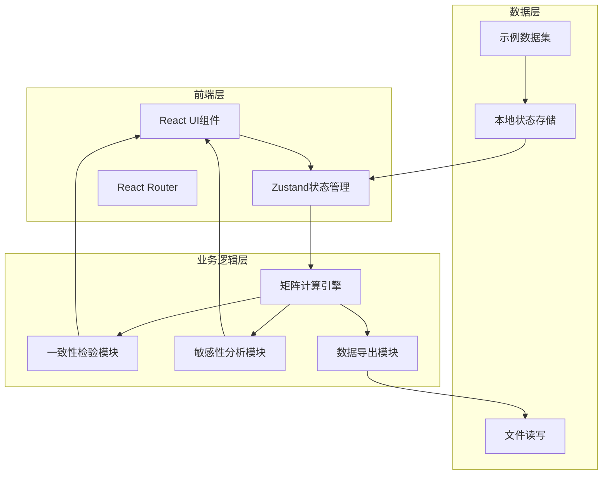
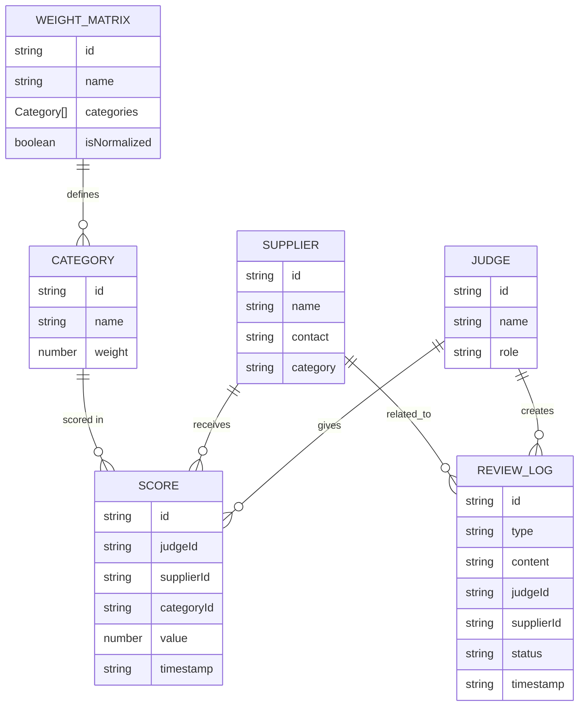

## 1. 架构设计



## 2. 技术描述
- **前端框架**：React@18 + TypeScript@5 + Vite@5
- **样式方案**：Tailwind CSS@3
- **状态管理**：Zustand@4
- **路由管理**：React Router DOM@6
- **图标库**：Lucide React
- **文件处理**：xlsx (Excel导出)、jspdf (PDF导出)
- **图表可视化**：recharts
- **初始化工具**：vite-init
- **后端**：无 (纯前端应用)
- **数据库**：无 (本地存储 + 示例数据)

## 3. 路由定义
| 路由 | 用途 |
|-------|---------|
| / | 主应用页面，包含所有功能模块 |

## 4. 数据模型

### 4.1 数据模型定义


### 4.2 TypeScript 类型定义
```typescript
// 评委信息
interface Judge {
  id: string;
  name: string;
  role: string;
}

// 供应商信息
interface Supplier {
  id: string;
  name: string;
  contact: string;
  category: string;
}

// 评分项类别
interface ScoreCategory {
  id: string;
  name: string;
  weight: number;
  unit: string;
  range: [number, number];
}

// 打分记录
interface Score {
  judgeId: string;
  supplierId: string;
  categoryId: string;
  value: number | null;
  timestamp: string;
}

// 复议记录
interface ReviewLog {
  id: string;
  type: 'appeal' | 'correction' | 'verification';
  content: string;
  judgeId: string;
  supplierId: string;
  status: 'pending' | 'resolved' | 'rejected';
  timestamp: string;
}

// 计算结果
interface CalculationResult {
  supplierId: string;
  totalScore: number;
  weightedScores: { categoryId: string; score: number; weight: number }[];
  rank: number;
}

// 一致性检验结果
interface ConsistencyResult {
  cronbachAlpha: number;
  cronbachAlphaStatus: 'pass' | 'warning' | 'fail';
  cronbachAlphaReason: string;
  cronbachAlphaScope: string;
  
  kendallCoefficient: number;
  kendallStatus: 'pass' | 'warning' | 'fail';
  kendallReason: string;
  kendallScope: string;
  
  extremeJudges: string[];
  extremeReasons: { [judgeId: string]: string };
}

// 敏感性分析结果
interface SensitivityResult {
  weightImpact: { categoryId: string; impact: number; change: number }[];
  scoreVolatility: { supplierId: string; volatility: number }[];
}
```

## 5. 核心算法说明

### 5.1 加权评分计算
```
最终得分 = Σ(评委平均分 × 权重)
其中：评委平均分 = Σ(评委打分) / 有效评委数
```

### 5.2 Cronbach's α 系数
用于衡量评委间一致性，取值范围 [0, 1]
- α ≥ 0.8: 一致性良好
- 0.7 ≤ α < 0.8: 一致性可接受
- α < 0.7: 一致性较差

### 5.3 Kendall 协同系数
用于衡量多个评委排名的一致性
- W ≥ 0.7: 高度一致
- 0.4 ≤ W < 0.7: 中度一致
- W < 0.4: 一致性较低

### 5.4 极端评委检测
基于 Z-score 检测偏离均值超过 2σ 的评委
