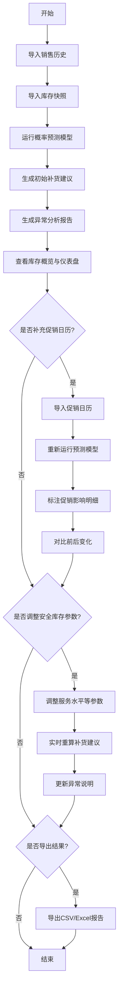

## 1. 产品概述

概率库存补货器是一款面向零售数据分析师的智能库存决策工具，基于概率统计模型预测安全库存水平，自动生成补货建议并检测异常。解决传统经验补货导致的畅销款缺货和滞销款积压并存问题。

- 核心价值：用数据驱动的概率预测替代经验判断，实现库存优化
- 目标用户：零售数据分析师、门店运营经理、供应链管理人员
- 独特优势：支持增量数据导入（先销售历史/库存，后促销日历），清晰标注数据变化对补货建议的影响，异常说明、图表、导出结果三者严格一致

## 2. 核心功能

### 2.1 用户角色

| 角色 | 注册方式 | 核心权限 |
|------|----------|----------|
| 数据分析师 | 系统内置 | 导入数据、运行预测、查看结果、导出报告、调整安全库存参数 |
| 运营经理 | 系统内置 | 查看补货建议、异常报告、历史对比 |

### 2.2 功能模块

1. **数据导入页**：销售历史导入、库存快照导入、促销日历导入（支持二次导入）、导入进度与校验
2. **库存概览页**：库存健康度仪表盘、SKU库存状态分布、库存周转率指标
3. **补货建议页**：概率预测结果、安全库存计算、补货建议列表、参数调整模拟
4. **异常分析页**：异常检测结果、异常详情说明、边界样例展示（需求突增、到货延迟、负库存）
5. **历史对比页**：两次导入前后变化对比、促销日历影响标注、版本回溯

### 2.3 页面详情

| 页面名称 | 模块名称 | 功能描述 |
|----------|----------|----------|
| 数据导入页 | 销售历史导入 | 支持CSV/Excel导入，包含SKU、日期、销量字段校验，数据质量报告 |
| 数据导入页 | 库存快照导入 | 支持CSV/Excel导入，包含SKU、库存数量、仓库字段校验 |
| 数据导入页 | 促销日历导入 | 支持二次导入，包含促销日期、SKU、促销类型、折扣力度 |
| 数据导入页 | 导入状态追踪 | 显示导入进度、数据行数、错误明细、数据样例预览 |
| 库存概览页 | 健康度仪表盘 | 整体库存健康度评分、缺货风险、积压风险、资金占用 |
| 库存概览页 | 库存分布图表 | SKU库存状态分布图（安全/预警/缺货/积压） |
| 库存概览页 | 关键指标卡 | 库存周转天数、库销比、动销率、缺货率 |
| 补货建议页 | 概率预测模型 | 基于泊松分布/正态分布的需求预测，置信区间展示 |
| 补货建议页 | 安全库存计算 | 支持服务水平调整，实时重算补货建议和异常说明 |
| 补货建议页 | 补货建议列表 | 建议补货量、补货时间、预计到货期、成本估算 |
| 补货建议页 | 参数调整面板 | 服务水平、补货周期、到货周期参数调整，实时预览变化 |
| 异常分析页 | 异常检测引擎 | 自动检测需求突增、到货延迟、负库存等异常 |
| 异常分析页 | 异常详情说明 | 每个异常的原因分析、影响评估、处理建议 |
| 异常分析页 | 边界样例库 | 预置典型边界案例，展示系统处理逻辑 |
| 历史对比页 | 版本对比 | 两次导入前后补货建议、安全库存、异常说明的变化对比 |
| 历史对比页 | 促销影响标注 | 高亮显示促销日历影响的SKU明细，量化影响程度 |
| 历史对比页 | 数据导出 | 支持导出CSV/Excel格式，包含补货建议、异常说明、对比分析 |

## 3. 核心流程

用户首次使用时，先导入销售历史和库存快照数据，系统运行概率预测模型生成初始补货建议和异常分析。之后可补充导入促销日历，系统重新计算并清晰标注促销日历对各SKU补货建议的影响。用户可调整安全库存参数（如服务水平），系统实时更新补货建议和异常说明。所有数据均可导出，且导出结果与页面展示的图表、异常说明严格一致。

## 4. 用户界面设计

### 4.1 设计风格

采用专业数据仪表盘风格，以精准、可信、专业为核心调性。

- **主色调**：深海蓝 (#0F3B5F) - 代表专业与可信
- **辅助色**：
  - 成功绿 (#10B981) - 库存健康状态
  - 警告橙 (#F59E0B) - 库存预警状态
  - 危险红 (#EF4444) - 缺货/异常状态
  - 信息紫 (#8B5CF6) - 促销影响标注
- **中性色**：冷灰系列 (#F8FAFC, #F1F5F9, #CBD5E1, #475569, #0F172A)
- **字体**：
  - 标题：IBM Plex Serif - 专业权威感
  - 正文：Inter - 清晰易读
  - 数据：JetBrains Mono - 数字对齐精准
- **布局风格**：卡片式模块化布局，左侧导航+右侧内容区，数据表格采用斑马纹提升可读性
- **按钮风格**：微圆角 (6px)、微妙阴影、悬停状态有轻微上浮效果
- **图表风格**：简洁的ECharts图表，强调数据精度，网格线弱化
- **动效**：数据加载骨架屏、参数调整时的数值过渡动画、异常状态的呼吸灯效果

### 4.2 页面设计概述

| 页面名称 | 模块名称 | UI元素 |
|----------|----------|----------|
| 数据导入页 | 导入区域 | 拖拽上传区、文件格式说明、导入进度条、数据预览表格 |
| 数据导入页 | 步骤指示器 | 三步流程指示器（销售历史→库存快照→促销日历） |
| 库存概览页 | 健康度仪表盘 | 半圆环形进度图、风险指标卡片、趋势迷你图 |
| 库存概览页 | 指标卡片区 | 四个核心指标卡片，带图标和趋势箭头 |
| 库存概览页 | 库存分布图 | 堆叠柱状图 + 饼图组合 |
| 补货建议页 | 参数调整面板 | 滑块控件、数字输入框、实时预览按钮 |
| 补货建议页 | 概率预测图表 | 需求预测曲线 + 置信区间填充 + 安全库存线 |
| 补货建议页 | 补货建议表格 | 可排序、可筛选、可分页的数据表格，状态标签 |
| 异常分析页 | 异常分类标签 | 三类异常切换标签（需求突增/到货延迟/负库存） |
| 异常分析页 | 异常说明卡片 | 时间线式布局，异常原因、影响、建议分块展示 |
| 异常分析页 | 边界样例区 | 折叠面板，展开显示样例数据和处理逻辑 |
| 历史对比页 | 版本选择器 | 下拉选择两个版本进行对比 |
| 历史对比页 | 差异对比表格 | 并排显示两版数据，差异单元格高亮标注 |
| 历史对比页 | 促销影响标注 | 紫色高亮行，带影响程度百分比标签 |

### 4.3 响应性

- **桌面端优先**：1280px及以上为最佳体验，采用固定左侧导航+流式内容区
- **平板适配**：1024px-1279px，导航折叠为图标模式，表格支持横向滚动
- **移动端**：768px-1023px，底部标签导航，卡片垂直堆叠，图表简化展示
- **触控优化**：按钮最小高度44px，表格行高增加，滑动操作友好

### 4.4 数据可视化设计

- **概率预测图**：折线图展示历史销量，面积图展示预测置信区间（95%置信度），虚线标注安全库存水平
- **库存分布图**：玫瑰图展示各状态SKU占比，鼠标悬停显示详细数量
- **趋势分析图**：双Y轴图表，左轴显示库存数量，右轴显示销量，同步展示趋势
- **异常分布图**：日历热力图，红色标注异常发生日期，颜色深浅表示异常严重程度
