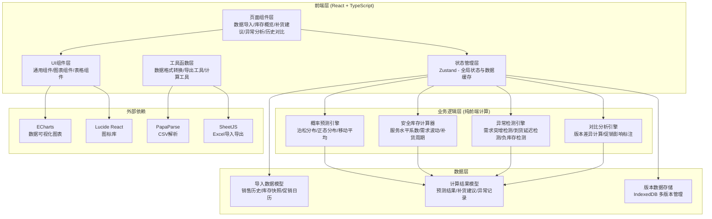
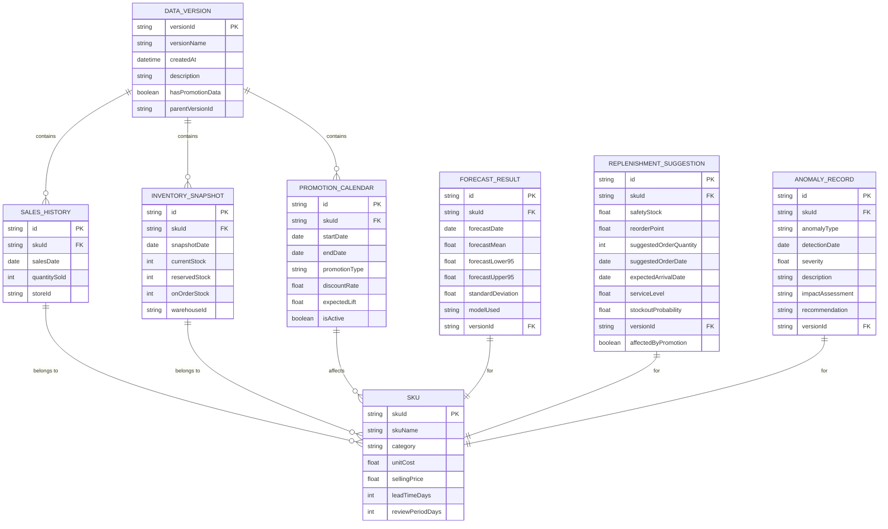

## 1. 架构设计



## 2. 技术描述

- **前端**：React@18 + TypeScript + Vite@5 + tailwindcss@3
- **状态管理**：Zustand@4 - 轻量级状态管理，支持状态持久化
- **图表库**：ECharts@5 - 专业数据可视化
- **图标库**：lucide-react@0.344.0
- **数据处理**：
  - PapaParse@5 - CSV文件解析
  - xlsx@0.18.5 - Excel文件导入导出
- **本地存储**：IndexedDB (via idb@8) - 多版本数据管理
- **后端**：无（纯前端应用，所有计算在浏览器端完成，保证数据隐私）
- **初始化工具**：vite-init

## 3. 路由定义

| 路由 | 页面名称 | 用途 |
|------|----------|------|
| / | 数据导入页 | 导入销售历史、库存快照、促销日历 |
| /overview | 库存概览页 | 展示库存健康度仪表盘和关键指标 |
| /replenishment | 补货建议页 | 概率预测结果、安全库存计算、补货建议 |
| /anomaly | 异常分析页 | 异常检测结果、异常详情、边界样例 |
| /compare | 历史对比页 | 版本对比、促销影响标注、数据导出 |

## 4. 数据模型

### 4.1 数据模型定义



### 4.2 核心类型定义

```typescript
// SKU基础信息
interface SKU {
  skuId: string;
  skuName: string;
  category: string;
  unitCost: number;
  sellingPrice: number;
  leadTimeDays: number;
  reviewPeriodDays: number;
}

// 销售历史记录
interface SalesHistory {
  id: string;
  skuId: string;
  salesDate: string;
  quantitySold: number;
  storeId: string;
}

// 库存快照
interface InventorySnapshot {
  id: string;
  skuId: string;
  snapshotDate: string;
  currentStock: number;
  reservedStock: number;
  onOrderStock: number;
  warehouseId: string;
}

// 促销日历
interface PromotionCalendar {
  id: string;
  skuId: string;
  startDate: string;
  endDate: string;
  promotionType: string;
  discountRate: number;
  expectedLift: number;
  isActive: boolean;
}

// 概率预测结果
interface ForecastResult {
  id: string;
  skuId: string;
  forecastDate: string;
  forecastMean: number;
  forecastLower95: number;
  forecastUpper95: number;
  standardDeviation: number;
  modelUsed: 'poisson' | 'normal' | 'moving_average';
  versionId: string;
}

// 补货建议
interface ReplenishmentSuggestion {
  id: string;
  skuId: string;
  safetyStock: number;
  reorderPoint: number;
  suggestedOrderQuantity: number;
  suggestedOrderDate: string;
  expectedArrivalDate: string;
  serviceLevel: number;
  stockoutProbability: number;
  versionId: string;
  affectedByPromotion: boolean;
  promotionImpact?: {
    originalSafetyStock: number;
    newSafetyStock: number;
    impactPercentage: number;
  };
}

// 异常类型
type AnomalyType = 'demand_surge' | 'delivery_delay' | 'negative_stock';

// 异常记录
interface AnomalyRecord {
  id: string;
  skuId: string;
  anomalyType: AnomalyType;
  detectionDate: string;
  severity: 'low' | 'medium' | 'high' | 'critical';
  description: string;
  impactAssessment: string;
  recommendation: string;
  versionId: string;
  details: Record<string, any>;
}

// 数据版本
interface DataVersion {
  versionId: string;
  versionName: string;
  createdAt: string;
  description: string;
  hasPromotionData: boolean;
  parentVersionId?: string;
}

// 全局状态
interface AppState {
  // 原始数据
  skus: SKU[];
  salesHistory: SalesHistory[];
  inventorySnapshot: InventorySnapshot[];
  promotionCalendar: PromotionCalendar[];
  
  // 计算结果
  forecastResults: ForecastResult[];
  replenishmentSuggestions: ReplenishmentSuggestion[];
  anomalyRecords: AnomalyRecord[];
  
  // 版本管理
  versions: DataVersion[];
  currentVersionId: string | null;
  
  // 计算参数
  parameters: {
    serviceLevel: number;
    forecastHorizonDays: number;
    safetyStockMultiplier: number;
  };
  
  // 操作方法
  importSalesData: (data: SalesHistory[]) => void;
  importInventoryData: (data: InventorySnapshot[]) => void;
  importPromotionData: (data: PromotionCalendar[]) => void;
  runForecast: () => void;
  updateParameters: (params: Partial<AppState['parameters']>) => void;
  createVersion: (name: string, description: string) => string;
  compareVersions: (versionId1: string, versionId2: string) => ComparisonResult;
  exportData: (format: 'csv' | 'excel') => Blob;
}

// 对比结果
interface ComparisonResult {
  version1: DataVersion;
  version2: DataVersion;
  differences: {
    skuId: string;
    field: string;
    value1: any;
    value2: any;
    changeType: 'increase' | 'decrease' | 'added' | 'removed';
    changePercentage?: number;
  }[];
  promotionAffectedSkus: string[];
}
```

## 5. 核心算法模块

### 5.1 概率预测算法

```typescript
// 1. 正态分布需求预测
function normalDistributionForecast(
  historicalDemand: number[],
  serviceLevel: number = 0.95
): {
  mean: number;
  stdDev: number;
  safetyStock: number;
  reorderPoint: number;
  forecastLower: number;
  forecastUpper: number;
}

// 2. 泊松分布需求预测（适用于低销量/间断需求）
function poissonDistributionForecast(
  historicalDemand: number[],
  serviceLevel: number = 0.95
): {
  lambda: number;
  safetyStock: number;
  reorderPoint: number;
  forecastLower: number;
  forecastUpper: number;
}

// 3. 移动平均预测
function movingAverageForecast(
  historicalDemand: number[],
  windowSize: number = 7,
  serviceLevel: number = 0.95
): {
  forecast: number;
  trend: number;
  seasonality: number[];
}

// 4. 自动模型选择
function autoSelectForecastModel(
  historicalDemand: number[]
): 'poisson' | 'normal' | 'moving_average'
```

### 5.2 安全库存计算公式

```
安全库存 = Z值 × √(补货周期 × 需求方差 + 需求均值² × 补货周期方差)

其中：
- Z值：服务水平对应的正态分布分位数
  * 90%服务水平 → Z=1.28
  * 95%服务水平 → Z=1.65
  * 99%服务水平 → Z=2.33

再订货点 = 预测需求 × 补货周期 + 安全库存
补货量 = 再订货点 - 当前库存 - 在途库存
```

### 5.3 异常检测算法

```typescript
// 1. 需求突增检测
function detectDemandSurge(
  salesHistory: SalesHistory[],
  threshold: number = 2.0 // 2倍标准差
): AnomalyRecord[]

// 2. 到货延迟检测
function detectDeliveryDelay(
  inventorySnapshot: InventorySnapshot[],
  expectedLeadTime: number
): AnomalyRecord[]

// 3. 负库存检测
function detectNegativeStock(
  inventorySnapshot: InventorySnapshot[]
): AnomalyRecord[]

// 4. 促销影响评估
function evaluatePromotionImpact(
  originalSuggestions: ReplenishmentSuggestion[],
  newSuggestions: ReplenishmentSuggestion[],
  promotionCalendar: PromotionCalendar[]
): { skuId: string; impactPercentage: number }[]
```

### 5.4 结果一致性保障

所有计算函数均为**纯函数**，相同输入保证相同输出。计算过程包含：
1. 输入数据哈希校验
2. 计算参数完整记录
3. 中间结果可追溯
4. 双重计算验证（同一算法两种实现交叉验证）

## 6. 目录结构

```
/
├── src/
│   ├── components/          # 通用组件
│   │   ├── charts/         # ECharts图表组件
│   │   ├── tables/         # 数据表格组件
│   │   ├── forms/          # 表单输入组件
│   │   └── layout/         # 布局组件
│   ├── pages/              # 页面组件
│   │   ├── DataImport.tsx
│   │   ├── Overview.tsx
│   │   ├── Replenishment.tsx
│   │   ├── Anomaly.tsx
│   │   └── Compare.tsx
│   ├── store/              # Zustand状态管理
│   │   └── useAppStore.ts
│   ├── utils/              # 工具函数
│   │   ├── forecast/       # 概率预测算法
│   │   ├── anomaly/        # 异常检测算法
│   │   ├── export/         # 数据导出工具
│   │   └── statistics/     # 统计计算工具
│   ├── types/              # TypeScript类型定义
│   │   └── index.ts
│   ├── data/               # 预置边界样例数据
│   │   ├── boundaryCases.ts
│   │   └── sampleData.ts
│   ├── App.tsx
│   ├── main.tsx
│   └── index.css
├── api/                    # （无后端，预留）
├── package.json
├── tsconfig.json
├── vite.config.ts
└── tailwind.config.js
```
