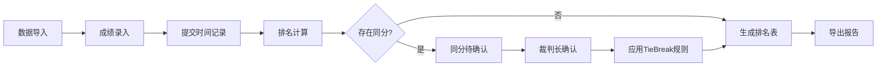
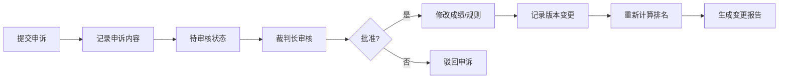

## 1. 产品概述

竞赛排名TieBreak系统是一款专为赛事裁判长设计的排名管理工具，解决同分并列处理繁琐、人工操作易遗漏、修改记录难追踪等核心问题。系统支持从样例导入到报告输出的完整流程，提供版本留痕、申诉管理和规则切换功能。

### 核心价值
- 自动处理同分并列，减少人工判断错误
- 完整记录所有修改操作，确保可追溯
- 支持多维度排名规则，灵活适配不同赛事
- 申诉流程可视化，明确责任人和处理状态

## 2. 核心功能

### 2.1 用户角色
| 角色 | 核心权限 |
|------|----------|
| 裁判长 | 数据导入、规则配置、同分确认、申诉处理、报告导出 |
| 记录员 | 成绩录入、小分项维护 |

### 2.2 功能模块
1. **数据导入模块**：样例数据导入、选手成绩录入、小分项管理、提交时间记录
2. **排名计算引擎**：多规则排名、同分并列(TieBreak)处理、待确认分支管理
3. **版本留痕系统**：修改历史记录、版本对比、操作人追踪
4. **申诉管理模块**：申诉记录、改分审批、规则切换审批
5. **报告输出模块**：排名表展示、成绩导出、审计报告生成

### 2.3 页面详情
| 页面名称 | 模块名称 | 功能描述 |
|----------|----------|----------|
| 仪表盘 | 概览卡片 | 待确认并列数、待处理申诉数、今日操作统计 |
| 数据管理 | 选手列表 | 选手信息、成绩、小分项、提交时间展示与编辑 |
| 数据管理 | 样例导入 | 批量导入样例数据，支持Excel/JSON格式 |
| 排名中心 | 排名表 | 实时排名展示，同分高亮标记 |
| 排名中心 | 规则配置 | 排名规则权重设置、TieBreak规则优先级 |
| 排名中心 | 同分确认 | 待确认并列列表、人工确认操作 |
| 申诉中心 | 申诉列表 | 申诉记录展示、状态跟踪、处理流程 |
| 版本历史 | 修改日志 | 所有操作记录、版本对比、恢复功能 |
| 报告导出 | 排名报告 | 排名表导出、审计报告、成绩复盘数据 |

## 3. 核心流程

### 3.1 排名处理主流程

### 3.2 申诉处理流程

## 4. 用户界面设计

### 4.1 设计风格
- **主色调**：深蓝色(#165DFF) - 代表专业、可信赖
- **辅助色**：橙色(#FF7D00) - 用于待确认、警告状态
- **成功色**：绿色(#00B42A) - 已确认、通过状态
- **错误色**：红色(#F53F3F) - 驳回、异常状态
- **字体**：Noto Sans SC - 清晰易读，支持中文
- **布局风格**：卡片式布局，左侧导航，顶部状态栏
- **图标风格**：线性图标，简洁专业

### 4.2 页面设计概览
| 页面名称 | 模块名称 | UI元素 |
|----------|----------|--------|
| 排名中心 | 排名表 | 斑马纹表格、同分行高亮、版本标签悬浮提示、操作按钮组 |
| 同分确认 | 并列列表 | 时间线展示、选手对比卡片、规则说明侧栏、确认/驳回按钮 |
| 版本历史 | 修改日志 | 时间轴布局、变更对比diff、操作人头像、恢复按钮 |
| 申诉中心 | 申诉卡片 | 状态标签、处理进度条、审批人选择、备注输入框 |

### 4.3 响应式设计
- Desktop-first设计，适配1280px以上分辨率
- 平板端：侧边栏折叠，卡片自适应宽度
- 移动端：底部导航，单列布局，简化操作

### 4.4 交互动效
- 排名变化时的平滑过渡动画
- 同分确认时的高亮闪烁效果
- 版本切换时的淡入淡出
- 申诉状态变更的进度动画
