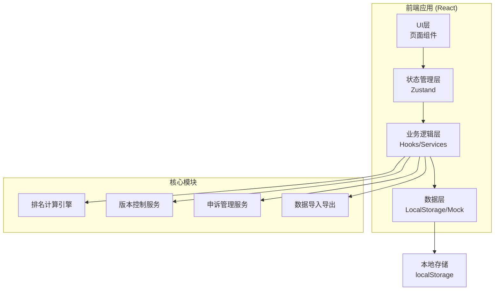
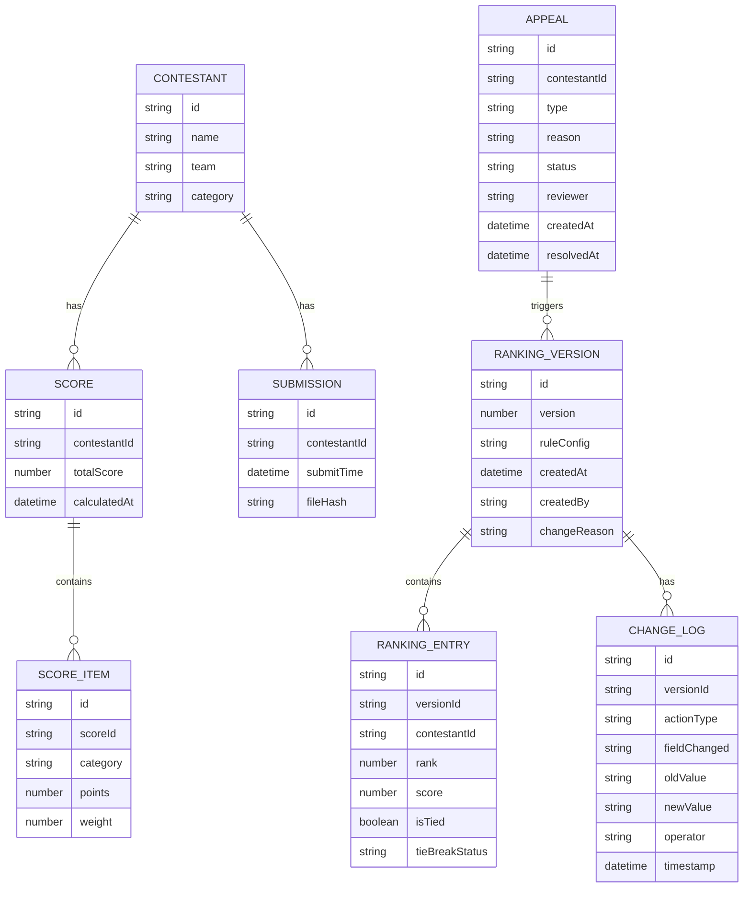

## 1. 架构设计



## 2. 技术栈说明

- **前端框架**：React@18 + TypeScript
- **构建工具**：Vite@5
- **样式方案**：TailwindCSS@3
- **状态管理**：Zustand
- **图标库**：Lucide React
- **数据持久化**：LocalStorage
- **日期处理**：date-fns

## 3. 路由定义

| 路由路径 | 页面名称 | 功能说明 |
|----------|----------|----------|
| / | 仪表盘 | 数据概览、待办事项 |
| /data | 数据管理 | 选手列表、数据导入 |
| /ranking | 排名中心 | 排名表、规则配置 |
| /tiebreak | 同分确认 | 待确认并列列表 |
| /appeal | 申诉中心 | 申诉记录、处理流程 |
| /history | 版本历史 | 修改日志、版本对比 |
| /report | 报告导出 | 排名报告、数据导出 |

## 4. 数据模型

### 4.1 数据关系图



### 4.2 排名规则配置

```typescript
interface RankingRule {
  id: string;
  name: string;
  description: string;
  scoreWeights: {
    category: string;
    weight: number;
  }[];
  tieBreakRules: {
    order: number;
    rule: 'submissionTime' | 'specificCategory' | 'headToHead' | 'manual';
    category?: string;
    ascending: boolean;
  }[];
}
```

### 4.3 版本记录格式

```typescript
interface VersionRecord {
  id: string;
  version: number;
  timestamp: string;
  operator: string;
  changeType: 'score' | 'rule' | 'appeal' | 'manual';
  description: string;
  affectedContestants: string[];
  rankingSnapshot: RankingEntry[];
}
```

## 5. 核心算法

### 5.1 排名计算算法

1. **加权总分计算**：根据规则配置的权重计算每位选手的加权总分
2. **初步排序**：按加权总分降序排序
3. **同分检测**：识别总分相同的选手组
4. **TieBreak处理**：按规则配置依次应用同分打破规则
5. **排名分配**：使用标准竞赛排名法（如1,2,2,4）

### 5.2 版本对比算法

1. 提取两个版本的排名快照
2. 对比每位选手的排名变化
3. 识别新增/移除的选手
4. 生成变更摘要和影响分析

## 6. 状态管理设计

### 6.1 Store结构

```typescript
interface AppState {
  // 选手数据
  contestants: Contestant[];
  scores: Score[];
  submissions: Submission[];
  
  // 排名数据
  currentRanking: RankingEntry[];
  rankingVersions: RankingVersion[];
  currentRule: RankingRule;
  availableRules: RankingRule[];
  
  // 同分处理
  pendingTieBreaks: TieBreakGroup[];
  
  // 申诉数据
  appeals: Appeal[];
  
  // UI状态
  currentPage: string;
  loading: boolean;
}
```
