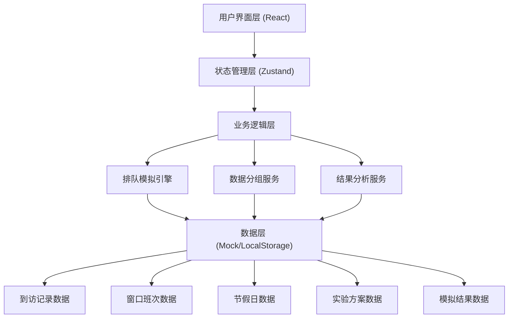
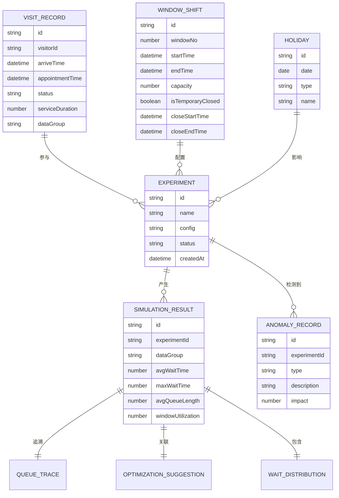

## 1. 架构设计



## 2. 技术描述

- **前端框架**: React@18 + TypeScript + Vite@5
- **状态管理**: Zustand
- **样式方案**: TailwindCSS@3
- **图表库**: Recharts
- **路由**: React Router DOM@6
- **数据存储**: LocalStorage + Mock数据（内置样例数据）
- **初始化工具**: vite-init

## 3. 路由定义

| 路由 | 页面 | 用途 |
|------|------|------|
| / | 数据输入页 | 到访记录、窗口班次、节假日管理 |
| /experiments | 批量实验页 | 实验方案管理、批量运行 |
| /results | 结果分析页 | 正常/异常结果分离展示、结果追溯 |
| /anomaly | 异常场景分析 | 爽约、时长异常、临停专项分析 |

## 4. 数据模型

### 4.1 ER图



### 4.2 核心类型定义

```typescript
// 到访记录
interface VisitRecord {
  id: string;
  visitorId: string;
  arriveTime: Date;
  appointmentTime?: Date;
  status: 'appointed' | 'walkIn' | 'noShow' | 'served';
  serviceDuration: number;
  dataGroup: 'normal' | 'boundary' | 'badInput';
  notes?: string;
}

// 窗口班次
interface WindowShift {
  id: string;
  windowNo: number;
  startTime: Date;
  endTime: Date;
  capacity: number;
  isTemporaryClosed: boolean;
  closeStartTime?: Date;
  closeEndTime?: Date;
}

// 节假日
interface Holiday {
  id: string;
  date: string;
  type: 'workday' | 'weekend' | 'holiday';
  name: string;
}

// 实验方案
interface Experiment {
  id: string;
  name: string;
  config: ExperimentConfig;
  status: 'pending' | 'running' | 'completed' | 'error';
  createdAt: Date;
  progress: number;
}

interface ExperimentConfig {
  windowCount: number;
  simulationTime: number;
  includeBoundary: boolean;
  includeBadInput: boolean;
}

// 模拟结果
interface SimulationResult {
  id: string;
  experimentId: string;
  dataGroup: 'normal' | 'boundary' | 'badInput';
  avgWaitTime: number;
  maxWaitTime: number;
  avgQueueLength: number;
  windowUtilization: number;
  totalServed: number;
  queueTrace: QueueTrace;
  optimization: OptimizationSuggestion;
  waitDistribution: WaitDistribution;
}

// 排队追溯
interface QueueTrace {
  timeline: QueueEvent[];
  windowActivity: WindowActivity[];
}

interface QueueEvent {
  time: number;
  type: 'arrive' | 'startService' | 'endService' | 'noShow';
  visitorId: string;
  windowNo?: number;
}

// 优化建议
interface OptimizationSuggestion {
  recommendedWindows: number;
  peakHourSuggestions: string[];
  costAnalysis: string;
}

// 等待分布
interface WaitDistribution {
  buckets: { range: string; count: number }[];
  percentile90: number;
  percentile95: number;
}

// 异常记录
interface AnomalyRecord {
  id: string;
  experimentId: string;
  type: 'noShow' | 'abnormalDuration' | 'temporaryClose';
  description: string;
  impact: {
    extraWaitTime: number;
    affectedCount: number;
  };
  rootCause: string;
  suggestion: string;
}
```

## 5. 核心算法模块

### 5.1 排队论模拟引擎 (M/M/c 模型)

```typescript
class QueueSimulationEngine {
  // 基于到达时间分布和服务时间分布模拟排队过程
  simulate(visits: VisitRecord[], windows: WindowShift[]): SimulationResult;
  
  // 计算窗口利用率
  calculateUtilization(windows: WindowShift[], events: QueueEvent[]): number;
  
  // 生成等待时间分布
  generateWaitDistribution(waitTimes: number[]): WaitDistribution;
}
```

### 5.2 数据分组服务

```typescript
class DataGroupingService {
  // 自动识别边界值（最大/最小到访量、极端服务时长等）
  detectBoundaryValues(visits: VisitRecord[]): VisitRecord[];
  
  // 自动识别坏输入（空值、负数、时间冲突等）
  detectBadInput(visits: VisitRecord[]): VisitRecord[];
  
  // 数据分组
  groupData(visits: VisitRecord[]): {
    normal: VisitRecord[];
    boundary: VisitRecord[];
    badInput: VisitRecord[];
  };
}
```

### 5.3 异常分析服务

```typescript
class AnomalyAnalysisService {
  // 预约爽约分析
  analyzeNoShows(visits: VisitRecord[], results: SimulationResult): AnomalyRecord[];
  
  // 服务时长异常分析
  analyzeAbnormalDuration(visits: VisitRecord[]): AnomalyRecord[];
  
  // 窗口临停分析
  analyzeTemporaryClose(windows: WindowShift[], events: QueueEvent[]): AnomalyRecord[];
}
```

### 5.4 优化建议服务

```typescript
class OptimizationService {
  // 推荐窗口数量
  recommendWindowCount(results: SimulationResult): number;
  
  // 生成高峰时段建议
  generatePeakHourSuggestions(trace: QueueTrace): string[];
  
  // 成本效益分析
  generateCostAnalysis(recommended: number, current: number): string;
}
```
