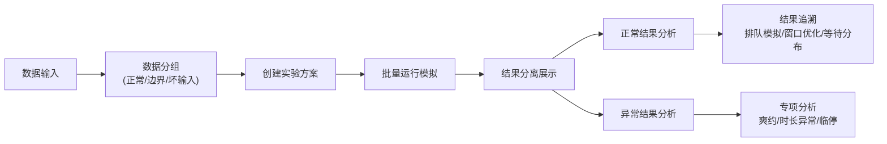

## 1. 产品概述

政务大厅排队论窗口配置实验平台，帮助管理员通过批量运行模拟实验来验证窗口配置方案的合理性。系统支持同时导入到访记录、窗口班次、节假日三类数据，自动分离边界值和异常输入，重点展示预约爽约、服务时长异常、窗口临停等业务痛点的模拟结果，支持从汇总结果追溯到排队模拟过程、窗口优化建议和等待时间分布。

## 2. 核心功能

### 2.1 用户角色

| 角色 | 注册方式 | 核心权限 |
|------|----------|----------|
| 政务大厅管理员 | 系统内置 | 数据导入、批量实验、结果追溯、异常分析 |

### 2.2 功能模块

1. **数据输入页**：到访记录管理、窗口班次配置、节假日设置、边界值/坏输入分组管理
2. **批量实验页**：实验方案管理、多组数据并行模拟、运行状态监控
3. **结果分析页**：正常结果展示、异常结果分离、结果追溯链路、可视化图表
4. **异常场景分析**：预约爽约分析、服务时长异常分析、窗口临停分析

### 2.3 页面详情

| 页面名称 | 模块名称 | 功能描述 |
|----------|----------|----------|
| 数据输入页 | 到访记录 | 批量导入/手动录入到访记录，包含预约状态、预计时间、实际时间 |
| 数据输入页 | 窗口班次 | 配置窗口数量、服务时段、服务能力、临停时段 |
| 数据输入页 | 节假日 | 标记工作日/周末/节假日，影响到访量预测 |
| 数据输入页 | 数据分组 | 将边界值、坏输入与正常数据分开展示和管理 |
| 批量实验页 | 实验配置 | 创建多组实验方案，配置不同参数组合 |
| 批量实验页 | 批量运行 | 一键运行所有实验，实时显示进度 |
| 批量实验页 | 运行状态 | 显示每组实验的运行状态、耗时、是否异常 |
| 结果分析页 | 结果概览 | 正常/异常结果分区展示，关键指标卡片 |
| 结果分析页 | 结果追溯 | 点击单条结果可查看排队模拟详情、窗口优化建议、等待分布 |
| 结果分析页 | 可视化图表 | 等待时间分布柱状图、窗口利用率折线图、队列长度变化趋势图 |
| 异常场景分析 | 预约爽约 | 爽约率统计、爽约对排队的影响分析、应对建议 |
| 异常场景分析 | 服务时长异常 | 异常时长识别、对整体效率的影响、优化建议 |
| 异常场景分析 | 窗口临停 | 临停时段队列堆积分析、补位方案模拟 |

## 3. 核心流程

用户进入数据输入页，导入或录入到访记录、窗口班次、节假日数据，系统自动识别并分组边界值与坏输入。用户创建多组实验方案并批量运行，系统分别计算正常数据和异常数据的模拟结果。用户在结果分析页查看分区展示的结果，点击任意结果可追溯查看排队模拟过程、窗口优化建议和等待时间分布。对于预约爽约、服务时长异常、窗口临停等特殊场景，提供专项分析页面。

## 4. 用户界面设计

### 4.1 设计风格
- **主色调**：政务蓝 (#1E40AF) 搭配浅灰背景，体现专业稳重
- **辅助色**：绿色 (#10B981) 标记正常结果，橙色 (#F59E0B) 标记边界值，红色 (#EF4444) 标记坏输入/异常
- **按钮风格**：圆角矩形，扁平化设计，悬停有轻微阴影
- **字体**：使用 Noto Sans SC，标题16-18px，正文14px，数据12px等宽字体
- **布局风格**：顶部导航 + 左侧功能菜单 + 右侧内容区，卡片式模块布局
- **图标风格**：使用线性图标，简洁明了

### 4.2 页面设计概述

| 页面名称 | 模块名称 | UI元素 |
|----------|----------|--------|
| 数据输入页 | 数据管理区 | Tab切换（到访/班次/节假日）、数据表格、批量导入按钮、分组筛选器 |
| 批量实验页 | 实验列表 | 卡片式实验方案、运行状态指示器、进度条、批量操作按钮 |
| 结果分析页 | 结果概览 | 分区卡片（正常/边界/异常）、指标数字、追溯按钮、图表容器 |
| 结果分析页 | 追溯面板 | 抽屉式面板、三栏布局（模拟/优化/分布）、时间轴、图表 |
| 异常场景分析 | 专项分析 | 场景切换Tab、原因分析卡片、建议列表、对比图表 |

### 4.3 响应式

桌面端优先设计，保证1280px以上分辨率体验良好。侧边栏在小屏幕可折叠，表格支持横向滚动。

### 4.4 数据验证说明

- **边界值测试**：包括最大到访量、最小窗口数、最长服务时长、最短间隔时间等
- **坏输入测试**：包括空值、负数、时间冲突、逻辑矛盾数据等
- **边界值和坏输入单独分组**，不参与正常结果计算，但会单独展示其影响
