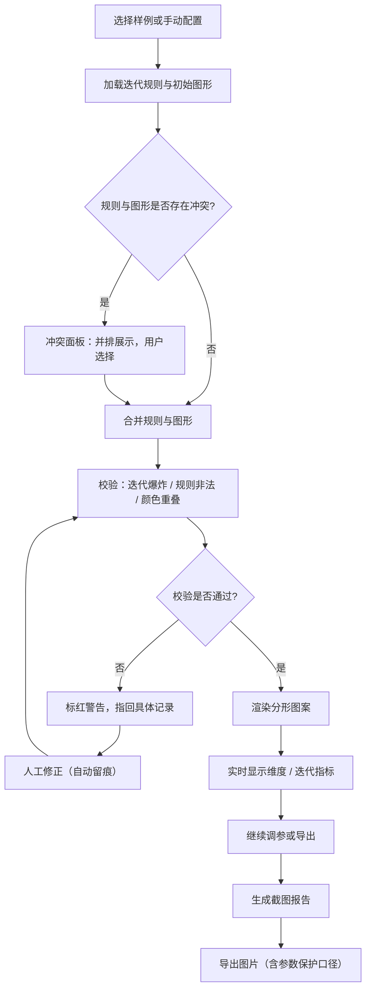
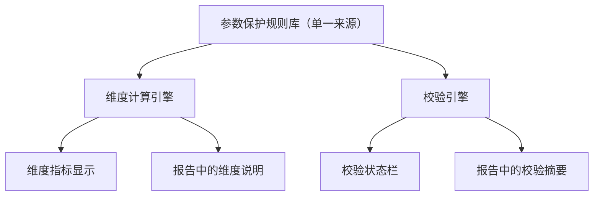

## 1. 产品概述

分形图案课堂生成器——面向数学课堂的交互式分形可视化工具，让学生通过调整迭代规则和初始图形，直观理解分形维度与迭代次数的影响；同时提供参数保护、冲突检测、修正留痕和截图报告，确保教学过程可追溯、可复盘。

- **目标用户**：数学教师（主讲）、学生（课堂操作）
- **核心价值**：把"看漂亮图片"升级为"调规则→看维度→读报告"的完整探究闭环，回答"颜色重叠到底哪层算"等尴尬问题

## 2. 核心功能

### 2.1 用户角色

| 角色 | 进入方式 | 核心权限 |
|------|----------|----------|
| 教师 | 直接访问 | 编辑迭代规则、初始图形、导出报告、查看修正日志 |
| 学生 | 直接访问 | 从样例导入、调参数、查看维度说明、导出图片 |

### 2.2 功能模块

1. **分形工作台**：分形画布、参数面板、维度/迭代实时指标
2. **样例与导入**：内置经典分形样例、外部规则导入、冲突合并面板
3. **校验与诊断**：迭代爆炸检测、规则非法检测、颜色重叠检测，错误指回具体记录
4. **修正留痕**：所有人工修正操作自动记录，含修正前/后值、操作人、时间戳
5. **报告与导出**：截图报告生成、图片导出、参数保护口径自动附注

### 2.3 页面详情

| 页面名称 | 模块名称 | 功能描述 |
|----------|----------|----------|
| 分形工作台 | 画布区 | 实时渲染分形图案，支持缩放平移 |
| 分形工作台 | 参数面板 | 编辑迭代规则、初始图形、迭代次数、配色方案 |
| 分形工作台 | 维度指标 | 实时显示分形维度（Hausdorff/盒计数）、迭代层数、图元数量 |
| 分形工作台 | 校验状态栏 | 显示当前校验结果（迭代爆炸/规则非法/颜色重叠），点击跳转到具体记录 |
| 样例与导入 | 样例库 | 内置 Sierpinski 三角、Koch 雪花、分形树等经典样例，一键加载 |
| 样例与导入 | 导入面板 | 粘贴/上传迭代规则 JSON，自动与当前初始图形合并，冲突时弹出冲突面板 |
| 样例与导入 | 冲突面板 | 并排显示迭代规则与初始图形的冲突字段，由用户手动选择，不留糊选择 |
| 校验与诊断 | 迭代爆炸检测 | 当图元数量超过阈值或迭代深度异常时，标红警告并指回触发记录 |
| 校验与诊断 | 规则非法检测 | 检查变换矩阵合法性、比例因子范围，非法时指回具体规则条目 |
| 校验与诊断 | 颜色重叠检测 | 检测同层/跨层颜色冲突，列出重叠区域与涉及的颜色记录 |
| 修正留痕 | 操作日志 | 按时间线展示所有人工修正，支持筛选（按类型/操作人/时间） |
| 修正留痕 | 修正详情 | 显示修正前值→修正后值、关联的校验规则、影响范围 |
| 报告与导出 | 截图报告 | 一键生成含画布截图、参数快照、维度说明、校验状态、修正摘要的完整报告 |
| 报告与导出 | 图片导出 | 导出 PNG/SVG 格式分形图片，附带参数保护口径注释 |
| 报告与导出 | 口径附注 | 自动在报告中附加参数保护与维度计算的来源说明，同事无需回头追问 |

## 3. 核心流程

### 3.1 主线流程：分形生成与探究

用户从样例导入或手动配置出发，调整迭代规则和参数，实时观察分形图案、维度和迭代指标变化，遇到校验问题时人工修正并留痕，最终导出截图报告供复盘或分享。

### 3.2 参数保护与维度说明流程

所有维度计算和参数保护规则来自同一套来源定义，确保报告中的口径一致。

## 4. 用户界面设计

### 4.1 设计风格

- **主色调**：深墨蓝 (#0f172a) 为底，几何翠绿 (#10b981) 为主强调，琥珀色 (#f59e0b) 为警告/冲突
- **按钮风格**：圆角微凸（rounded-lg + shadow-sm），主操作绿色，危险操作琥珀色
- **字体**：标题用 JetBrains Mono（等宽，体现数学/代码感），正文用 Noto Sans SC
- **布局风格**：左侧画布区（60%），右侧参数/指标面板（40%），顶部状态栏
- **图标风格**：线性图标（lucide-react），与代码/数学氛围匹配

### 4.2 页面设计概览

| 页面名称 | 模块名称 | UI 元素 |
|----------|----------|---------|
| 分形工作台 | 画布区 | 深色背景 Canvas，左下角缩放控件，右上角图层指示器 |
| 分形工作台 | 参数面板 | 分组卡片（迭代规则 / 初始图形 / 配色），内联编辑，实时同步 |
| 分形工作台 | 维度指标 | 等宽数字卡片，颜色区分维度类型，悬停显示计算方式 |
| 分形工作台 | 校验状态栏 | 固定顶部横条，绿色通过 / 琥珀色警告 / 红色错误，可点击跳转 |
| 样例与导入 | 冲突面板 | 模态弹窗，左右并排显示冲突字段，中间选择按钮 |
| 修正留痕 | 操作日志 | 侧滑面板，时间线布局，修正前后值 diff 高亮 |
| 报告与导出 | 截图报告 | 预览模态，含画布截图 + 参数快照 + 口径附注，一键下载 |

### 4.3 响应式策略

- 桌面优先（1280px+），画布与面板左右布局
- 平板（768-1280px），面板折叠为底部抽屉
- 手机暂不作为主要目标，确保核心操作可用即可

### 4.4 动效设计

- 画布渲染：分形逐层淡入动画，让迭代过程可视化
- 参数调整：维度数字实时跳动过渡
- 校验警告：状态栏脉冲闪烁后稳住
- 修正留痕：新增条目从顶部滑入
