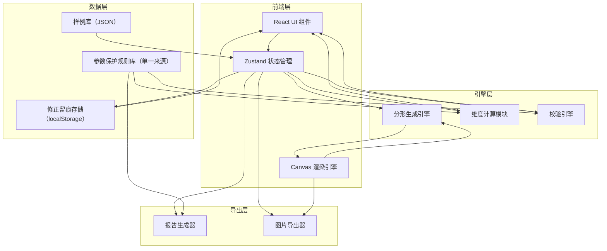

## 1. 架构设计



## 2. 技术说明

- **前端**：React@18 + TypeScript + Tailwind CSS@3 + Vite
- **初始化工具**：vite-init (react-ts 模板)
- **状态管理**：Zustand
- **路由**：react-router-dom
- **后端**：无（纯前端，数据持久化用 localStorage）
- **图标**：lucide-react
- **Canvas 渲染**：原生 Canvas API（2D）
- **导出**：html2canvas（截图报告）、Canvas toDataURL（图片导出）

## 3. 路由定义

| 路由 | 用途 |
|------|------|
| `/` | 分形工作台主页面（画布 + 参数面板 + 维度指标 + 校验状态） |
| `/samples` | 样例库与导入页面 |
| `/audit` | 修正留痕日志页面 |
| `/report` | 报告预览与导出页面 |

## 4. 核心数据模型

### 4.1 迭代规则（IterationRule）

```typescript
interface IterationRule {
  id: string;
  name: string;
  transforms: AffineTransform[];
  colorScheme: ColorScheme;
  maxIterations: number;
  createdBy: string;
  createdAt: number;
  updatedAt: number;
}

interface AffineTransform {
  a: number; b: number; c: number;
  d: number; e: number; f: number;
  probability: number;
}

interface ColorScheme {
  mode: "layer" | "gradient" | "fixed";
  colors: string[];
  layerOpacity: number;
}
```

### 4.2 初始图形（InitialShape）

```typescript
interface InitialShape {
  id: string;
  name: string;
  type: "polygon" | "line" | "point" | "custom";
  vertices: [number, number][];
  createdBy: string;
  createdAt: number;
  updatedAt: number;
}
```

### 4.3 校验结果（ValidationResult）

```typescript
interface ValidationResult {
  type: "iteration_explosion" | "rule_illegal" | "color_overlap";
  severity: "error" | "warning";
  message: string;
  sourceRecordId: string;
  sourceFieldName: string;
  details: Record<string, unknown>;
  detectedAt: number;
}
```

### 4.4 修正记录（AuditEntry）

```typescript
interface AuditEntry {
  id: string;
  targetRecordId: string;
  targetFieldName: string;
  oldValue: unknown;
  newValue: unknown;
  operator: string;
  reason: string;
  relatedValidationId?: string;
  timestamp: number;
}
```

### 4.5 参数保护规则（ParamGuardRule）

```typescript
interface ParamGuardRule {
  paramPath: string;
  min?: number;
  max?: number;
  pattern?: string;
  description: string;
  source: string;
}
```

### 4.6 冲突记录（ConflictEntry）

```typescript
interface ConflictEntry {
  field: string;
  ruleValue: unknown;
  shapeValue: unknown;
  source: "iteration_rule" | "initial_shape";
  resolved: boolean;
  resolution?: "rule" | "shape";
}
```

## 5. 状态管理结构（Zustand Store）

```typescript
interface FractalStore {
  activeRule: IterationRule | null;
  activeShape: InitialShape | null;
  iterationCount: number;
  renderData: ImageData | null;
  dimensionInfo: { hausdorff: number; boxCount: number };
  validations: ValidationResult[];
  auditLog: AuditEntry[];
  conflicts: ConflictEntry[];

  setRule: (rule: IterationRule) => void;
  setShape: (shape: InitialShape) => void;
  setIterationCount: (n: number) => void;
  generate: () => void;
  validate: () => void;
  resolveConflict: (field: string, choice: "rule" | "shape") => void;
  addAuditEntry: (entry: Omit<AuditEntry, "id" | "timestamp">) => void;
}
```

## 6. 校验规则定义

| 校验类型 | 触发条件 | 指回方式 |
|----------|----------|----------|
| 迭代爆炸 | 图元数量 > 100,000 或迭代深度 > 15 | 指回迭代规则的 maxIterations 字段 |
| 规则非法 | 变换矩阵行列式为0，或比例因子不在 [0, 1] 区间 | 指回具体 AffineTransform 条目 |
| 颜色重叠 | 同层颜色 RGB 差值 < 30 或跨层透明度叠加后色差 < 15 | 指回 ColorScheme 中具体颜色索引 |

## 7. 参数保护口径来源

所有参数保护规则统一定义在 `src/data/paramGuards.ts`，维度计算公式和参数保护描述同源，报告生成时直接引用，确保口径一致。
