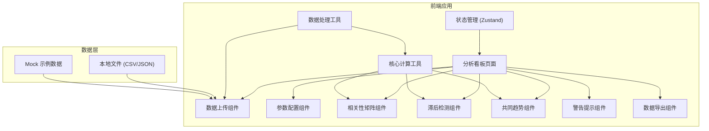

## 1. 架构设计



## 2. 技术描述

- 前端：React@18 + TypeScript + Vite
- 样式：TailwindCSS@3
- 状态管理：Zustand
- 图表：ECharts（用于热力图、趋势线图）
- 数据处理：PapaParse（CSV解析）
- 图标：Lucide React
- 后端：无（纯前端应用，所有计算在浏览器端完成）
- 数据库：无（本地文件处理）

## 3. 路由定义

| 路由 | 用途 |
|------|------|
| / | 分析看板主页面 |

## 4. 数据模型

### 4.1 核心数据类型定义

```typescript
// 原始数据行
interface DataRow {
  [key: string]: string | number | Date;
  __sourceFile: string;
  __rowIndex: number;
}

// 字段类型
type FieldType = 'time' | 'metric' | 'group' | 'unknown';

// 字段信息
interface FieldInfo {
  name: string;
  type: FieldType;
  sampleValues: (string | number)[];
}

// 上传的文件信息
interface UploadedFile {
  id: string;
  name: string;
  rows: DataRow[];
  fields: FieldInfo[];
}

// 分析参数
interface AnalysisParams {
  timeField: string;
  groupFields: string[];
  metricFields: string[];
  timeRange: { start: Date | null; end: Date | null };
  maxLag: number;
  correlationThreshold: number;
  trendThreshold: number;
}

// 相关性结果
interface CorrelationResult {
  variable1: string;
  variable2: string;
  correlation: number;
  pValue: number;
  isSignificant: boolean;
}

// 滞后检测结果
interface LagResult {
  variable1: string;
  variable2: string;
  bestLag: number;
  maxCorrelation: number;
  correlations: number[];
  warning: 'lag_detected' | 'no_lag' | 'insufficient_data';
  sourceRows: { file: string; rowIndex: number; value: number }[];
}

// 共同趋势结果
interface TrendResult {
  groupId: string;
  variables: string[];
  trendStrength: number;
  pattern: 'upward' | 'downward' | 'stable' | 'complex';
  warning: 'common_trend' | 'no_trend';
  sourceRows: { file: string; rowIndex: number; values: number[] }[];
}

// 警告信息
interface Warning {
  id: string;
  type: 'lag' | 'trend' | 'spurious_correlation';
  severity: 'error' | 'warning' | 'info';
  title: string;
  description: string;
  sourceFile: string;
  sourceRows: number[];
  relatedVariables: string[];
}

// 完整分析结果
interface AnalysisResult {
  correlationMatrix: CorrelationResult[];
  lagResults: LagResult[];
  trendResults: TrendResult[];
  warnings: Warning[];
  alignedData: DataRow[];
}
```

### 4.2 状态管理模型

```typescript
interface AppState {
  uploadedFiles: UploadedFile[];
  analysisParams: AnalysisParams;
  analysisResult: AnalysisResult | null;
  isAnalyzing: boolean;
  activeTab: 'correlation' | 'lag' | 'trend' | 'warnings';
}
```

## 5. 核心算法

### 5.1 Pearson 相关系数计算
- 用于计算两个变量间的线性相关程度
- 范围：[-1, 1]，绝对值越接近1表示相关性越强

### 5.2 滞后交叉相关 (Cross-Correlation with Lag)
- 对每个变量对，在指定滞后范围内计算交叉相关系数
- 找到最大相关系数对应的滞后阶数
- 判定是否存在显著滞后关系

### 5.3 共同趋势检测
- 使用一阶差分相关性检测变量间的共同趋势
- 聚类分析识别具有相似趋势模式的变量组
- 计算趋势强度指数

### 5.4 显著性检验
- 计算相关系数的 p 值
- 根据阈值判定是否为统计显著
