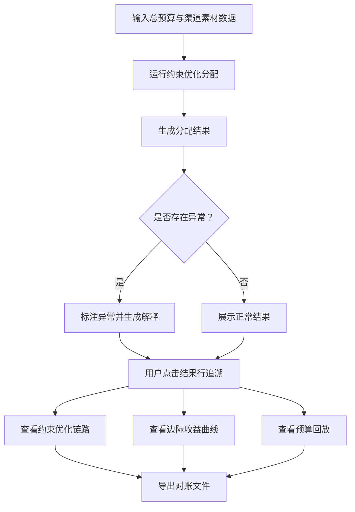

## 1. 产品概述

竞价广告预算分配系统——帮助增长分析师在多渠道、多素材的竞价广告场景下完成预算分配，并能从分配结果追溯到约束优化过程、边际收益计算和预算回放，使预算耗尽、转化延迟、素材重复等问题可解释、可对账。

- 目标用户：增长分析师、投放运营人员
- 核心价值：让预算分配过程透明可追溯，出问题时能快速定位原因并找到确认人

## 2. 核心功能

### 2.1 功能模块

1. **预算分配面板**：输入总预算、渠道数据、素材标签，一键执行分配
2. **分配结果面板**：展示各渠道/素材的分配金额、边际收益、约束状态
3. **追踪详情面板**：点击任一结果行，展开约束优化链路、边际收益曲线、预算回放时间线
4. **异常解释面板**：自动标注预算耗尽、转化延迟、素材重复，给出可读解释
5. **导出与对账**：下载 CSV/JSON，预算上限结论与界面摘要严格一致

### 2.2 页面详情

| 页面名称 | 模块名称 | 功能描述 |
|----------|----------|----------|
| 预算分配面板 | 总预算输入 | 输入总预算金额，显示剩余可分配额度 |
| 预算分配面板 | 渠道数据表 | 编辑渠道名称、日消耗上限、CPA出价、转化率、转化延迟天数 |
| 预算分配面板 | 素材标签表 | 编辑素材名称、关联渠道、标签列表（如"大促""品牌"等） |
| 预算分配面板 | 执行分配按钮 | 触发约束优化算法，生成分配结果 |
| 分配结果面板 | 结果摘要 | 各渠道分配金额、边际收益、是否触碰约束、预算剩余 |
| 分配结果面板 | 异常标记行 | 高亮预算耗尽/转化延迟/素材重复的行，悬停显示解释 |
| 追踪详情面板 | 约束优化链路 | 展示该行从初始出价到最终分配经历的每一步约束调整 |
| 追踪详情面板 | 边际收益曲线 | 展示该渠道边际收益随预算增加的变化 |
| 追踪详情面板 | 预算回放 | 按时间线展示每轮迭代中预算如何被分配和回收 |
| 导出与对账 | 下载按钮 | 导出 CSV/JSON，包含分配结果与预算上限结论 |

## 3. 核心流程

用户输入总预算和渠道/素材数据 → 系统运行约束优化算法（按边际收益递减分配，受日消耗上限和转化延迟约束）→ 生成分配结果 → 标注异常（预算耗尽/转化延迟/素材重复）→ 用户点击结果行追溯优化过程 → 导出对账文件

## 4. 用户界面设计

### 4.1 设计风格

- 主色调：深灰（zinc-900）+ 琥珀色（amber-500）强调色，传达"金融工具"的专业感
- 辅助色：翡翠绿（emerald-500）表示正常，玫瑰红（rose-500）表示异常
- 字体：JetBrains Mono（数据）+ Noto Sans SC（中文）
- 布局：桌面优先，左侧输入面板 + 右侧结果面板，底部追踪详情
- 按钮：圆角矩形，hover 时微亮，执行按钮用琥珀色实心
- 图标：lucide-react

### 4.2 页面设计概述

| 页面名称 | 模块名称 | UI 元素 |
|----------|----------|---------|
| 预算分配面板 | 总预算输入 | 输入框 + 剩余额度数字，amber 色高亮 |
| 预算分配面板 | 渠道数据表 | 可编辑表格，每行含名称/上限/出价/转化率/延迟天数 |
| 预算分配面板 | 素材标签表 | 可编辑表格，标签用 chip 样式，重复标签标红 |
| 分配结果面板 | 结果摘要 | 卡片网格，每渠道一张卡片，含金额/边际收益/约束状态 |
| 分配结果面板 | 异常标记 | 红色边框 + tooltip 解释 |
| 追踪详情面板 | 约束优化链路 | 步骤条，每步显示约束类型和调整值 |
| 追踪详情面板 | 边际收益曲线 | 简易折线图（SVG），标注拐点 |
| 追踪详情面板 | 预算回放 | 时间线组件，每轮显示分配/回收金额 |
| 导出与对账 | 下载按钮 | 琥珀色按钮，点击下载 CSV/JSON |

### 4.3 响应式

- 桌面优先：左右双栏布局，1200px 以上最优
- 平板：上下布局，输入面板在上，结果在下
- 手机：单列，可滚动

## 5. 样例数据场景

### 5.1 顺利场景
- 3个渠道，总预算充足，无约束触碰
- 所有渠道均获得足够预算，边际收益趋近于零

### 5.2 预算耗尽场景
- 总预算不足以满足所有渠道的日消耗上限
- 系统按边际收益排序截断，被截断渠道标注"预算耗尽"

### 5.3 转化延迟场景
- 某渠道转化延迟3天，当前转化率数据滞后
- 系统标注"转化延迟"，并在边际收益计算中使用调整后转化率

### 5.4 素材重复场景
- 两个素材使用相同标签组合且关联同一渠道
- 系统标注"素材重复"，提示合并或替换
