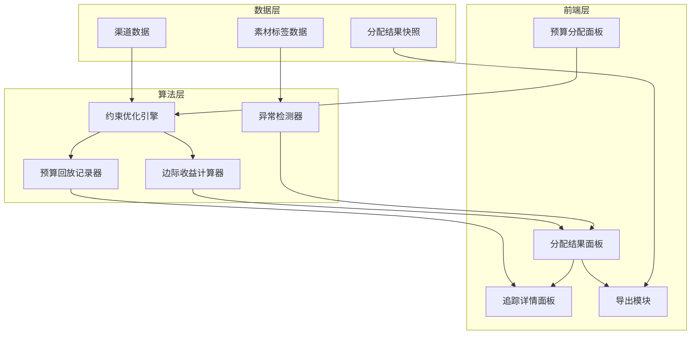
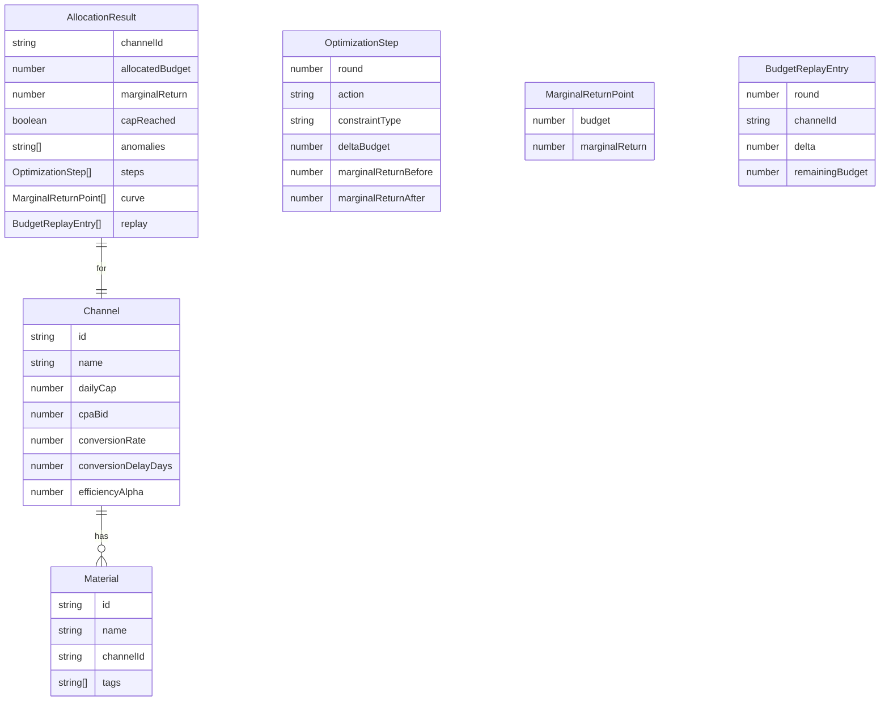

## 1. 架构设计



## 2. 技术说明

- 前端：React@18 + TypeScript + Tailwind CSS + Vite
- 状态管理：Zustand
- 图标：lucide-react
- 后端：无（纯前端，算法在浏览器端执行）
- 数据：内存中的样例数据，无数据库

## 3. 路由定义

| 路由 | 用途 |
|------|------|
| / | 主页面，包含预算分配面板、结果面板、追踪详情 |

## 4. 算法设计

### 4.1 约束优化分配算法

**目标**：在总预算约束下，最大化预期转化总量。

**边际收益定义**：某渠道每增加1元预算带来的预期转化增量。

```
边际收益(channel, 当前预算) = 转化率 × (1 - e^(-α × 当前预算)) 的导数
                            = 转化率 × α × e^(-α × 当前预算)
```

其中 α 为该渠道的效率系数，由 CPA 出价和转化率共同决定。

**算法步骤**（贪心 + 约束检查）：
1. 初始化：每个渠道分配0预算
2. 迭代：每轮将1元预算分配给当前边际收益最高的渠道
3. 约束检查：
   - 若某渠道已达日消耗上限 → 跳过，记录"预算耗尽"约束
   - 若某渠道转化延迟 > 0 → 边际收益乘以折扣因子 1/(1+延迟天数×0.1)
   - 若某渠道关联的素材存在重复标签 → 边际收益乘以重复惩罚 1/重复数
4. 终止：总预算耗尽或所有渠道均触碰约束
5. 每轮记录预算回放快照

### 4.2 异常检测

| 异常类型 | 检测条件 | 解释模板 |
|----------|----------|----------|
| 预算耗尽 | 渠道分配额 = 日消耗上限 | "渠道X已触及日消耗上限¥Y，剩余边际收益¥Z被拦住" |
| 转化延迟 | 渠道转化延迟天数 > 0 | "渠道X有N天转化延迟，边际收益已按折扣因子0.XX调整，实际转化可能更高" |
| 素材重复 | 同渠道下多个素材标签完全相同 | "渠道X下素材A与素材B标签重复[标签列表]，边际收益已按重复惩罚调整" |

### 4.3 追踪链路

每条分配结果关联：
- `optimizationSteps`：约束优化中经历的每步调整
- `marginalReturnCurve`：边际收益随预算变化的采样点
- `budgetReplay`：每轮迭代的分配/回收记录

## 5. 数据模型

### 5.1 数据模型定义



## 6. 样例数据

### 6.1 顺利场景

| 渠道 | 日消耗上限 | CPA出价 | 转化率 | 延迟天数 | 效率系数 |
|------|-----------|---------|--------|----------|----------|
| 抖音-信息流 | 5000 | 80 | 0.04 | 0 | 0.002 |
| 微信-朋友圈 | 3000 | 120 | 0.03 | 0 | 0.0015 |
| 百度-搜索 | 2000 | 60 | 0.05 | 0 | 0.0025 |

素材：

| 素材 | 渠道 | 标签 |
|------|------|------|
| 视频-A1 | 抖音-信息流 | 大促, 短视频 |
| 图片-B1 | 微信-朋友圈 | 品牌, 静态图 |
| 图文-C1 | 百度-搜索 | 大促, 图文 |

总预算：8000（充足）

### 6.2 预算耗尽场景

总预算：3000（不足），渠道数据同上

### 6.3 转化延迟场景

| 渠道 | 日消耗上限 | CPA出价 | 转化率 | 延迟天数 |
|------|-----------|---------|--------|----------|
| 抖音-信息流 | 5000 | 80 | 0.04 | 3 |
| 微信-朋友圈 | 3000 | 120 | 0.03 | 0 |

总预算：6000

### 6.4 素材重复场景

| 素材 | 渠道 | 标签 |
|------|------|------|
| 视频-A1 | 抖音-信息流 | 大促, 短视频 |
| 视频-A2 | 抖音-信息流 | 大促, 短视频 |

两个素材标签完全相同且关联同一渠道。
