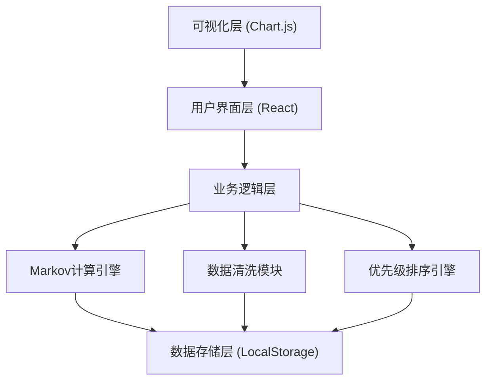
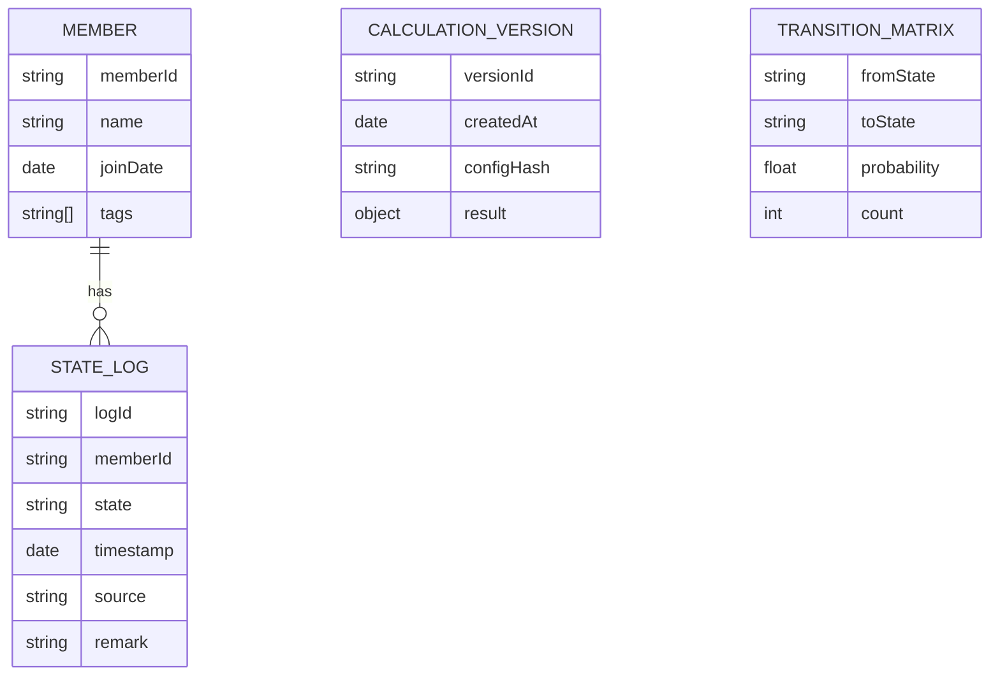

## 1. 架构设计

纯前端单页应用，所有计算在浏览器端完成，数据本地存储，无需后端服务。



## 2. 技术描述

- 前端：React@18 + TypeScript + tailwindcss@3 + vite@5
- 初始化工具：npm create vite@latest
- 可视化：chart.js + react-chartjs-2
- 状态管理：React useState/useReducer
- 数据持久化：localStorage
- CSV解析：papaparse
- 图标：lucide-react

## 3. 路由定义

| 路由 | 用途 |
|------|------|
| / | 主页面，包含所有功能模块 |

## 4. 数据模型

### 4.1 数据模型定义



### 4.2 核心类型定义

```typescript
// 会员状态枚举
type MemberState = 'active' | 'inactive' | 'dormant' | 'churned' | 'recalled';

// 会员行为记录
interface MemberBehavior {
  memberId: string;
  timestamp: string;
  state: MemberState;
  remark?: string;
  source?: string;
  isTouch?: boolean;
}

// 状态转移记录
interface Transition {
  from: MemberState;
  to: MemberState;
  count: number;
  probability: number;
}

// 计算配置
interface CalculationConfig {
  states: MemberState[];
  timeWindowDays: number;
  churnThreshold: number;
  coldStartSampleSize: number;
  weights: {
    probability: number;
    value: number;
    tenure: number;
  };
}

// 异常数据标记
interface DataAnomaly {
  type: 'missing_field' | 'invalid_transition' | 'duplicate_touch' | 'late_arrival';
  memberId: string;
  timestamp: string;
  description: string;
  suggestion: string;
}

// 召回优先级项
interface RecallPriorityItem {
  memberId: string;
  churnProbability: number;
  priorityScore: number;
  rank: number;
  currentState: MemberState;
  suggestedAction: string;
  anomalies: DataAnomaly[];
}

// 计算结果
interface CalculationResult {
  transitionMatrix: Transition[][];
  churnProbabilities: Map<string, number>;
  recallPriorities: RecallPriorityItem[];
  anomalies: DataAnomaly[];
  metadata: {
    totalMembers: number;
    validTransitions: number;
    invalidTransitions: number;
    coldStartApplied: boolean;
    calculationTime: number;
    unit: string;
    applicableScope: string;
    failureReasons: string[];
  };
}

// 版本快照
interface VersionSnapshot {
  id: string;
  name: string;
  createdAt: string;
  config: CalculationConfig;
  result: CalculationResult;
  note?: string;
}
```

## 5. 核心模块设计

### 5.1 Markov计算引擎

```typescript
class MarkovEngine {
  constructor(config: CalculationConfig);
  calculateTransitionMatrix(behaviors: MemberBehavior[]): Transition[][];
  calculateChurnProbability(initialState: MemberState, steps: number): number;
  iterateProbabilities(initialProbabilities: Map<MemberState, number>, iterations: number): Map<MemberState, number>;
  getConfidenceLevel(): number;
}
```

### 5.2 数据清洗模块

```typescript
class DataCleaner {
  validateFields(behaviors: MemberBehavior[]): DataAnomaly[];
  detectInvalidTransitions(behaviors: MemberBehavior[]): DataAnomaly[];
  detectDuplicateTouches(behaviors: MemberBehavior[]): DataAnomaly[];
  detectLateArrivals(behaviors: MemberBehavior[]): DataAnomaly[];
  applyColdStart(behaviors: MemberBehavior[], minSampleSize: number): { adjusted: MemberBehavior[]; applied: boolean };
}
```

### 5.3 优先级排序引擎

```typescript
class PriorityEngine {
  constructor(config: CalculationConfig);
  calculatePriorityScore(memberId: string, churnProb: number, behavior: MemberBehavior[]): number;
  sortByPriority(items: RecallPriorityItem[]): RecallPriorityItem[];
  suggestAction(item: RecallPriorityItem): string;
}
```

## 6. 目录结构

```
src/
├── components/
│   ├── DataInput.tsx           # 数据输入组件
│   ├── ConfigPanel.tsx         # 配置面板
│   ├── TransitionMatrix.tsx    # 转移矩阵热力图
│   ├── ChurnProbability.tsx    # 流失概率分布图
│   ├── RecallPriorityList.tsx  # 召回优先级列表
│   ├── ResultDetailPanel.tsx   # 结果详情面板
│   ├── VersionCompare.tsx      # 版本对比组件
│   └── AnomalyCard.tsx         # 异常卡片组件
├── engine/
│   ├── MarkovEngine.ts         # Markov计算引擎
│   ├── DataCleaner.ts          # 数据清洗模块
│   └── PriorityEngine.ts       # 优先级排序引擎
├── types/
│   └── index.ts                # 类型定义
├── utils/
│   ├── csvParser.ts            # CSV解析工具
│   ├── storage.ts              # 本地存储工具
│   └── mockData.ts             # Mock数据生成
├── App.tsx
├── main.tsx
└── index.css
```
