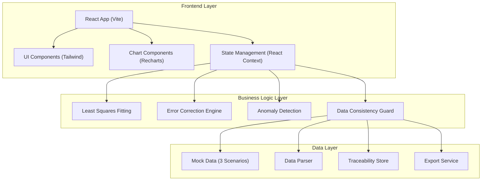

## 1. 架构设计



## 2. 技术描述

- **Frontend**: React@18 + TypeScript + tailwindcss@3 + vite
- **图表库**: Recharts（轻量级，适合工业数据可视化）
- **状态管理**: React Context + useReducer（单页应用，无需Redux）
- **数据导出**: 原生Blob + FileSaver（确保数据同源）
- **数值计算**: 原生JS实现最小二乘，无外部数学依赖
- **初始工具**: vite-init
- **后端**: None（纯前端分析工具，所有计算在浏览器端完成）
- **数据库**: None（使用内存态+Mock数据，支持文件导入）

## 3. 核心模块说明

### 3.1 最小二乘拟合模块 (`src/utils/leastSquares.ts`)
- 输入：测量点数组 {x, y, measuredValue}
- 输出：拟合曲线参数 (slope, intercept)、R² 决定系数、每个点的残差
- 算法：普通最小二乘法 (OLS)，支持线性拟合

### 3.2 误差校正引擎 (`src/utils/errorCorrection.ts`)
- 夹具偏移量计算：拟合值与设计值的系统偏差
- 校正公式：校正值 = 测量值 - 系统偏移量
- 公差判定：校正后值是否在 ±公差范围内

### 3.3 异常检测模块 (`src/utils/anomalyDetection.ts`)
- 点位缺失检测：检查requiredPoints数组中是否有缺失
- 批次混入检测：检查批次号与夹具编号的一致性规则
- 异常分级：WARNING / ERROR / CRITICAL

### 3.4 数据一致性保障 (`src/utils/dataConsistency.ts`)
- 单一数据源原则：所有图表、表格、导出共用同一个analysisResult对象
- 时间戳校验：导出时验证数据hash，确保与展示数据一致
- 数据快照：每次计算后生成不可变快照，追溯时使用快照数据

## 4. 样例数据设计

### 4.1 数据结构定义
```typescript
interface MeasurementPoint {
  id: string;
  pointName: string;       // 测量点名称，如"A-01", "B-03"
  batchNo: string;         // 批次号
  fixtureId: string;       // 夹具编号
  designSize: number;      // 设计尺寸
  measuredValue: number;   // 测量值
  tolerance: number;       // 公差 ±值
  measureTime: string;     // 测量时间
  operator: string;        // 操作员
  rawDataRef: string;      // 原始数据引用（溯源用）
  remeasureRecords?: RemeasureRecord[];  // 复测记录
  isMissing?: boolean;     // 点位缺失标记
  isContaminated?: boolean;// 批次混入标记
}

interface RemeasureRecord {
  id: string;
  measuredValue: number;
  measureTime: string;
  operator: string;
  reason: string;
}
```

### 4.2 测试样例（3组）
| 样例类型 | 批次号 | 说明 | 预期行为 |
|----------|--------|------|----------|
| 正常记录 | BATCH-2026-001 | 夹具ID=FIX-001，所有测量点完整，误差在公差内 | 正确拟合，偏移量小，无异常标记 |
| 批次混入 | BATCH-2026-001 | 夹具ID=FIX-002（与其他批次夹具冲突） | 标记为isContaminated，不参与本批次拟合 |
| 点位缺失 | BATCH-2026-001 | 缺少B-02测量点 | 标记为isMissing，在表格中高亮显示 |

## 5. 路由定义

| Route | Purpose |
|-------|---------|
| / | 分析看板主页面，包含所有功能模块 |

## 6. 数据模型（TypeScript 类型定义）

```typescript
// 分析结果快照（所有UI和导出共用此对象）
interface AnalysisSnapshot {
  timestamp: number;
  dataHash: string;
  sourceFileName: string;
  batchNo: string;
  totalPoints: number;
  validPoints: number;
  missingPoints: string[];
  contaminatedPoints: string[];
  fittingParams: {
    slope: number;
    intercept: number;
    rSquared: number;
    systematicOffset: number;  // 夹具偏移量
  };
  statistics: {
    avgErrorBefore: number;
    avgErrorAfter: number;
    passRate: number;
    failCount: number;
  };
  correctedPoints: CorrectedPoint[];
}

interface CorrectedPoint {
  pointId: string;
  pointName: string;
  designSize: number;
  measuredValue: number;
  correctedValue: number;
  residual: number;
  tolerance: number;
  isPass: boolean;
  isMissing: boolean;
  isContaminated: boolean;
  rawDataRef: string;
}
```

## 7. 文件结构

```
src/
├── components/
│   ├── Toolbar.tsx           # 顶部工具栏
│   ├── StatsCards.tsx        # 统计卡片
│   ├── FittingChart.tsx      # 拟合曲线图
│   ├── ErrorDistribution.tsx # 误差分布图
│   ├── DataTable.tsx         # 测量点明细表
│   ├── TraceabilityDrawer.tsx # 溯源抽屉
│   └── FileImport.tsx        # 文件导入组件
├── utils/
│   ├── leastSquares.ts       # 最小二乘算法
│   ├── errorCorrection.ts    # 误差校正
│   ├── anomalyDetection.ts   # 异常检测
│   ├── dataConsistency.ts    # 数据一致性校验
│   ├── exportService.ts      # 文件导出
│   └── hash.ts               # 数据哈希计算
├── data/
│   └── mockData.ts           # 3组测试样例数据
├── types/
│   └── index.ts              # TypeScript类型定义
├── context/
│   └── AnalysisContext.tsx   # 全局状态管理
├── App.tsx
├── main.tsx
└── index.css
```
