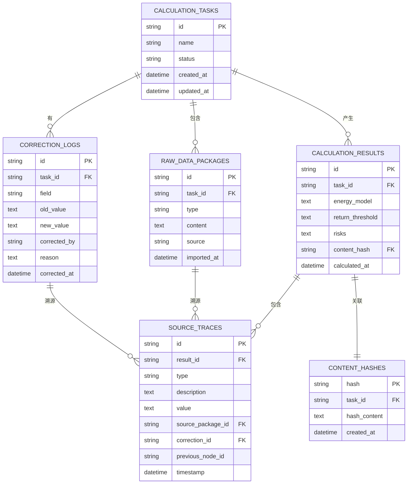

## 1. 架构设计

```mermaid
graph TD
    subgraph Frontend["前端层 (React + TypeScript)"]
        F1["任务管理页面<br/>(TaskList)
        F2["计算详情页面<br/>(CalculationDetail)"]
        F3["报告输出页面<br/>(ReportOutput)"]
        F4["历史记录页面<br/>(HistoryList)"]
        F5["组件库<br/>(EnergyChart, RiskBadge, TraceTimeline)"]
    end

    subgraph Backend["后端服务层 (Flask + Python)"]
        B1["任务管理API<br/>(TaskController)"]
        B2["计算引擎API<br/>(CalculationController)"]
        B3["报告生成API<br/>(ReportController)"]
        B4["历史记录API<br/>(HistoryController)"]
    end

    subgraph CoreEngine["核心计算引擎"]
        C1["能耗模型模块<br/>(EnergyModel)"]
        C2["返航阈值模块<br/>(ReturnThreshold)"]
        C3["风险识别模块<br/>(RiskDetector)"]
        C4["溯源追踪模块<br/>(SourceTracer)"]
        C5["去重模块<br/>(DeduplicationManager)"]
        C6["审计留痕模块<br/>(AuditTrail)"]
    end

    subgraph Data["数据持久层 (SQLite)"]
        D1["计算任务表<br/>(calculation_tasks)"]
        D2["原始数据包表<br/>(raw_data_packages)"]
        D3["计算结果表<br/>(calculation_results)"]
        D4["修正记录表<br/>(correction_logs)"]
        D5["溯源链路线<br/>(source_traces)"]
        D6["哈希去重表<br/>(content_hashes)"]
    end

    F1 --> B1
    F2 --> B2
    F3 --> B3
    F4 --> B4

    B1 --> D1
    B1 --> D2

    B2 --> C1
    B2 --> C2
    B2 --> C3
    B2 --> C4
    B2 --> C6

    C1 --> D3
    C2 --> D3
    C3 --> D3
    C4 --> D5
    C6 --> D4

    B3 --> D3
    B3 --> D4
    B3 --> D5

    B4 --> D1
    B4 --> C5

    C5 --> D6
    C5 --> D1
```

## 2. 技术选型

- **前端**: React@18 + TypeScript + tailwindcss@3 + vite
- **初始化工具**: vite-init
- **后端**: Flask@2 (Python 3.10)
- **数据库**: SQLite (零配置，适合桌面级应用，数据持久化可靠
- **数据可视化**: Chart.js + react-chartjs-2
- **哈希去重**: hashlib (SHA-256)
- **UI组件**: lucide-react (图标)

## 3. 路由定义

| 路由 | 页面 | 用途 |
|-------|------|------|
| `/` | 计算任务管理 | 任务列表、新建计算、导入样例 |
| `/calculation/:id` | 计算详情 | 能耗模型、返航阈值、风险提示、人工修正、来源溯源 |
| `/report/:id` | 报告输出 | 完整报告预览、导出 |
| `/history` | 历史记录 | 历史计算列表、去重展示、对比分析 |

## 4. API 定义

### TypeScript 类型定义

```typescript
// 原始数据包类型
interface RawDataPackage {
  id: string;
  taskId: string;
  type: 'waypoint_plan' | 'payload_weight' | 'return_report' | 'mixed';
  content: any;
  source: string;
  importedAt: string;
}

// 航点计划
interface WaypointPlan {
  waypoints: Array<{
    lat: number;
    lng: number;
    altitude: number;
    speed: number;
  }>;
  totalDistance: number;
  estimatedDuration: number;
}

// 载荷重量
interface PayloadWeight {
  payload: number; // kg
  takeoffWeight: number; // kg
  emptyWeight: number; // kg
}

// 返航报告
interface ReturnReport {
  returnPoint: { lat: number; lng: number };
  batteryRemaining: number; // %
  windSpeed: number; // m/s
  windDirection: number; // degree
}

// 计算任务
interface CalculationTask {
  id: string;
  name: string;
  status: 'pending' | 'calculating' | 'completed' | 'failed';
  createdAt: string;
  updatedAt: string;
  rawDataPackages: RawDataPackage[];
}

// 能耗模型计算结果
interface EnergyModelResult {
  basePowerConsumption: number; // W
  payloadFactor: number;
  windFactor: number;
  altitudeFactor: number;
  speedFactor: number;
  totalEnergyRequired: number; // Wh
  energyPerKm: number; // Wh/km
  curve: Array<{ distance: number; energy: number; battery: number }>;
}

// 返航阈值
interface ReturnThreshold {
  minBatteryLevel: number; // %
  maxDistance: number; // km
  maxFlightTime: number; // min
  safeReturnMargin: number; // %
  criticalBatteryLevel: number; // %
}

// 风险提示
interface RiskAlert {
  id: string;
  level: 'low' | 'medium' | 'high' | 'critical';
  type: 'headwind_sudden_change' | 'battery_aging' | 'no_fly_zone_detour' | 'insufficient_battery' | 'payload_exceed';
  message: string;
  details: any;
  sourceTraceId: string;
}

// 人工修正记录
interface CorrectionLog {
  id: string;
  taskId: string;
  field: string;
  oldValue: any;
  newValue: any;
  correctedBy: string;
  correctedAt: string;
  reason: string;
}

// 来源溯源节点
interface SourceTraceNode {
  id: string;
  type: 'raw_data' | 'calculation_step' | 'correction' | 'result';
  description: string;
  value: any;
  timestamp: string;
  sourcePackageId?: string;
  previousNodeId?: string;
}

// 计算结果
interface CalculationResult {
  taskId: string;
  energyModel: EnergyModelResult;
  returnThreshold: ReturnThreshold;
  risks: RiskAlert[];
  corrections: CorrectionLog[];
  sourceTraces: SourceTraceNode[];
  contentHash: string;
  calculatedAt: string;
}

// API请求响应
interface ApiResponse<T> {
  success: boolean;
  data: T;
  message?: string;
}
```

### 后端API接口

| 方法 | 路径 | 功能 |
|------|------|------|
| POST | `/api/tasks` | 创建新计算任务 |
| GET | `/api/tasks` | 获取任务列表 |
| GET | `/api/tasks/:id` | 获取任务详情 |
| POST | `/api/tasks/:id/import` | 导入样例数据包 |
| POST | `/api/tasks/:id/calculate` | 发起计算 |
| GET | `/api/tasks/:id/result` | 获取计算结果 |
| POST | `/api/tasks/:id/correct` | 人工修正参数 |
| GET | `/api/tasks/:id/trace` | 获取溯源链路 |
| GET | `/api/tasks/:id/report` | 生成报告 |
| GET | `/api/history` | 获取历史记录（自动去重） |
| GET | `/api/tasks/:id/duplicates` | 检查重复计算 |

## 5. 服务器架构图

```mermaid
graph TD
    Client["前端应用"] --> API["API Gateway (Flask)"]

    subgraph Application["应用层"]
        API --> TC["TaskController<br/>任务管理
        API --> CC["CalculationController<br/>计算控制"]
        API --> RC["ReportController<br/>报告生成"]
        API --> HC["HistoryController<br/>历史管理"]
    end

    subgraph Service["服务层"]
        TC --> TS["TaskService<br/>任务业务逻辑"]
        CC --> CS["CalculationService<br/>计算业务逻辑"]
        RC --> RS["ReportService<br/>报告业务逻辑"]
        HC --> HS["HistoryService<br/>历史业务逻辑"]

        CS --> EMS["EnergyModelService<br/>能耗模型服务"]
        CS --> RTS["ReturnThresholdService<br/>返航阈值服务"]
        CS --> RDS["RiskDetectionService<br/>风险识别服务"]
        CS --> STS["SourceTraceService<br/>溯源服务"]
        CS --> ATS["AuditTrailService<br/>审计留痕服务"]
        HS --> DMS["DeduplicationService<br/>去重服务"]
    end

    subgraph Repository["数据访问层"]
        TS --> TR["TaskRepository"]
        EMS --> EMR["EnergyModelRepository"]
        RTS --> RTR["ReturnThresholdRepository"]
        RDS --> RDR["RiskDetectionRepository"]
        STS --> STR["SourceTraceRepository"]
        ATS --> ATR["AuditTrailRepository"]
        DMS --> DMR["DeduplicationRepository"]
        RS --> RR["ReportRepository"]
    end

    subgraph Database["SQLite 数据库"]
        TR --> DB["SQLite DB"]
        EMR --> DB
        RTR --> DB
        RDR --> DB
        STR --> DB
        ATR --> DB
        DMR --> DB
        RR --> DB
    end
```

## 6. 数据模型

### 6.1 ER图



### 6.2 DDL 语句

```sql
-- 计算任务表
CREATE TABLE IF NOT EXISTS calculation_tasks (
    id TEXT PRIMARY KEY,
    name TEXT NOT NULL,
    status TEXT NOT NULL DEFAULT 'pending',
    created_at DATETIME DEFAULT CURRENT_TIMESTAMP,
    updated_at DATETIME DEFAULT CURRENT_TIMESTAMP
);

-- 原始数据包表
CREATE TABLE IF NOT EXISTS raw_data_packages (
    id TEXT PRIMARY KEY,
    task_id TEXT NOT NULL,
    type TEXT NOT NULL CHECK(type IN ('waypoint_plan', 'payload_weight', 'return_report', 'mixed')),
    content TEXT NOT NULL,
    source TEXT,
    imported_at DATETIME DEFAULT CURRENT_TIMESTAMP,
    FOREIGN KEY (task_id) REFERENCES calculation_tasks(id) ON DELETE CASCADE
);

-- 计算结果表
CREATE TABLE IF NOT EXISTS calculation_results (
    id TEXT PRIMARY KEY,
    task_id TEXT NOT NULL,
    energy_model TEXT NOT NULL,
    return_threshold TEXT NOT NULL,
    risks TEXT NOT NULL,
    content_hash TEXT,
    calculated_at DATETIME DEFAULT CURRENT_TIMESTAMP,
    FOREIGN KEY (task_id) REFERENCES calculation_tasks(id) ON DELETE CASCADE
);

-- 修正记录表
CREATE TABLE IF NOT EXISTS correction_logs (
    id TEXT PRIMARY KEY,
    task_id TEXT NOT NULL,
    field TEXT NOT NULL,
    old_value TEXT,
    new_value TEXT,
    corrected_by TEXT NOT NULL,
    reason TEXT,
    corrected_at DATETIME DEFAULT CURRENT_TIMESTAMP,
    FOREIGN KEY (task_id) REFERENCES calculation_tasks(id) ON DELETE CASCADE
);

-- 来源溯源表
CREATE TABLE IF NOT EXISTS source_traces (
    id TEXT PRIMARY KEY,
    result_id TEXT,
    type TEXT NOT NULL CHECK(type IN ('raw_data', 'calculation_step', 'correction', 'result')),
    description TEXT NOT NULL,
    value TEXT,
    source_package_id TEXT,
    correction_id TEXT,
    previous_node_id TEXT,
    timestamp DATETIME DEFAULT CURRENT_TIMESTAMP,
    FOREIGN KEY (result_id) REFERENCES calculation_results(id) ON DELETE CASCADE,
    FOREIGN KEY (source_package_id) REFERENCES raw_data_packages(id),
    FOREIGN KEY (correction_id) REFERENCES correction_logs(id)
);

-- 内容哈希去重表
CREATE TABLE IF NOT EXISTS content_hashes (
    hash TEXT PRIMARY KEY,
    task_id TEXT NOT NULL,
    hash_content TEXT NOT NULL,
    created_at DATETIME DEFAULT CURRENT_TIMESTAMP,
    FOREIGN KEY (task_id) REFERENCES calculation_tasks(id)
);

-- 索引
CREATE INDEX IF NOT EXISTS idx_tasks_status ON calculation_tasks(status);
CREATE INDEX IF NOT EXISTS idx_packages_task_id ON raw_data_packages(task_id);
CREATE INDEX IF NOT EXISTS idx_results_task_id ON calculation_results(task_id);
CREATE INDEX IF NOT EXISTS idx_corrections_task_id ON correction_logs(task_id);
CREATE INDEX IF NOT EXISTS idx_traces_result_id ON source_traces(result_id);
CREATE INDEX IF NOT EXISTS idx_hashes_task_id ON content_hashes(task_id);
```

### 6.3 初始化测试数据

```sql
-- 插入一条逆风突变脏样例测试任务
INSERT INTO calculation_tasks (id, name, status) VALUES 
('task-001', '逆风突变测试任务', 'pending');

-- 插入混合数据包
INSERT INTO raw_data_packages (id, task_id, type, content, source) VALUES 
('pkg-001', 'task-001', 'mixed', 
 '{"waypoint_plan": {"waypoints": [{"lat": 31.2304, "lng": 121.4737, "altitude": 100, "speed": 15}], "totalDistance": 12.5, "estimatedDuration": 45}, "payload_weight": {"payload": 2.5, "takeoffWeight": 15.0, "emptyWeight": 12.5}, "wind_field": {"baseWindSpeed": 5, "suddenChange": {"point": 5.2, "windSpeed": 12, "windDirection": 180}}}', 
 '航测队-2024-05-15-上海区域');

-- 插入电池老化测试数据
INSERT INTO raw_data_packages (id, task_id, type, content, source) VALUES 
('pkg-002', 'task-001', 'payload_weight',
 '{"battery": {"initialCapacity": 16000, "currentCapacity": 12800, "cycleCount": 156, "agingFactor": 0.8}}',
 '电池管理系统导出');

-- 插入禁飞区绕行测试数据
INSERT INTO raw_data_packages (id, task_id, type, content, source) VALUES 
('pkg-003', 'task-001', 'waypoint_plan',
 '{"no_fly_zones": [{"id": "nfz-001", "center": {"lat": 31.24, "lng": 121.48}, "radius": 1000, "detourDistance": 3.2}]}',
 '民航局禁飞区数据库');
```
