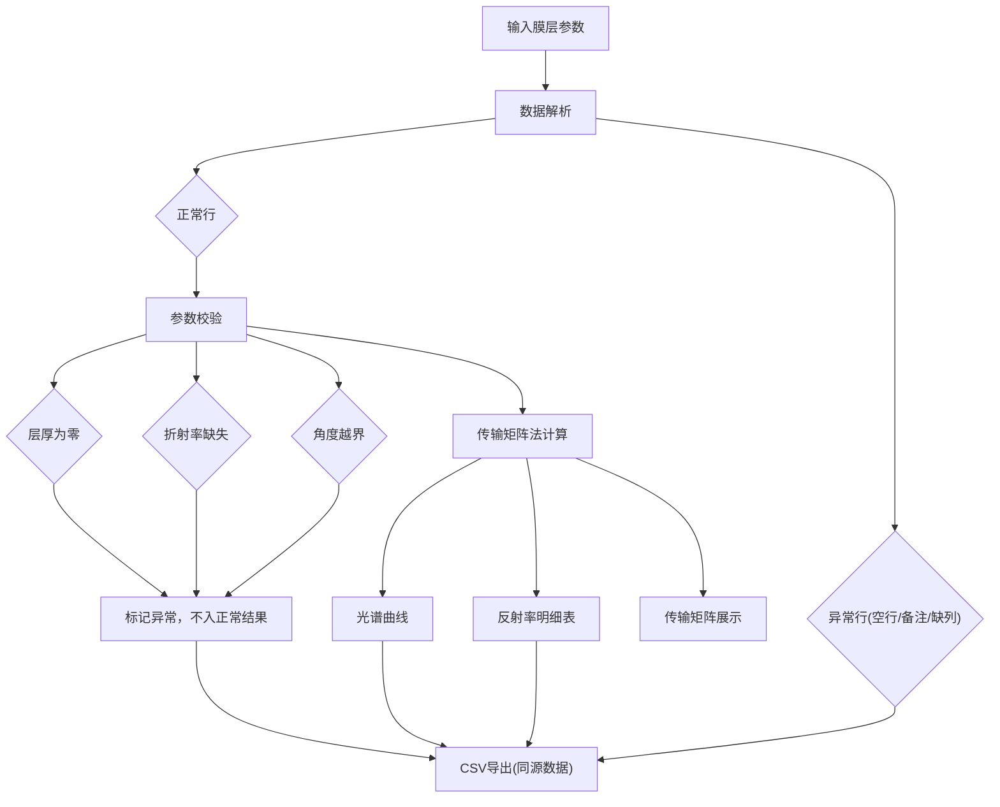

## 1. 产品概述

光学薄膜反射试算——面向材料实验员的多层膜反射率预估工具。基于传输矩阵法（TMM），从膜层参数直接计算不同波长/入射角下的反射率，支持脏数据容错、参数校验和全链路可追溯，避免手算多层膜漏界面的风险。

- 目标用户：材料实验员、光学工程师
- 核心价值：手算易漏界面 → 系统化试算，结果可追溯、异常可复核

## 2. 核心功能

### 2.1 用户角色

| 角色 | 使用方式 | 核心权限 |
|------|----------|----------|
| 材料实验员 | 直接使用，无需注册 | 输入参数、查看结果、导出数据 |

### 2.2 功能模块

1. **参数输入页**：膜层结构表（材料/折射率/层厚/备注）、入射角、波长范围、环境折射率
2. **结果看板页**：光谱曲线图、反射率明细表、传输矩阵中间量、参数校验结果、异常行清单
3. **导出页**：CSV 下载（明细+异常行同源数据）

### 2.3 页面详情

| 页面 | 模块 | 功能描述 |
|------|------|----------|
| 参数输入页 | 膜层结构表 | 逐行输入材料名、折射率n、消光系数k、层厚d；支持空行/备注行/缺列；粘贴批量导入 |
| 参数输入页 | 入射条件 | 入射角（0-90°）、波长范围（起止+步长）、环境折射率 |
| 参数输入页 | 数据解析提示 | 实时标注空行、备注行、缺列行；层厚为零单独标出 |
| 结果看板页 | 光谱曲线图 | 反射率 vs 波长折线图；支持 hover 显示具体数值与对应膜层参数来源 |
| 结果看板页 | 反射率明细表 | 每条波长对应的反射率、透射率、吸收率、层间相位 |
| 结果看板页 | 传输矩阵展示 | 选中某波长后展示各层的 2×2 传输矩阵和累积矩阵 |
| 结果看板页 | 参数校验结果 | 折射率缺失标记、角度越界标记、层厚为零标记；可点击定位到输入行 |
| 结果看板页 | 异常行清单 | 脏行（空行/备注/缺列）单独列表，标注原因 |
| 导出页 | CSV 下载 | 导出同源数据：反射率明细 + 异常行 + 参数校验，一次下载 |

## 3. 核心流程

材料实验员打开工具 → 粘贴/输入膜层参数（含空行、备注、缺列） → 系统解析数据，分离正常行与异常行 → 对异常行标注原因（空行/备注/缺列/层厚为零/折射率缺失/角度越界）→ 点击"试算"→ 传输矩阵法逐波长计算 → 生成光谱曲线 + 明细表 + 传输矩阵 + 校验结果 → 实验员从任一结果可追查到输入参数来源 → 下载 CSV（图表、明细、异常行同源数据）

## 4. 用户界面设计

### 4.1 设计风格

- **主色调**：深蓝灰底(#1a1f2e) + 光谱渐变强调色（青→品红→琥珀，模拟可见光谱）
- **辅助色**：琥珀色(#f59e0b)用于警告/异常标记，青色(#06b6d4)用于正常数据高亮
- **按钮风格**：圆角(8px)，微投影，hover 态光谱渐变边框
- **字体**：标题用 JetBrains Mono（科学仪器感），正文用 Noto Sans SC
- **布局**：左侧输入面板(40%) + 右侧结果看板(60%)，桌面优先
- **图标**：Lucide 图标库，线性风格

### 4.2 页面设计概览

| 页面 | 模块 | UI 元素 |
|------|------|----------|
| 参数输入页 | 膜层结构表 | 表格，行号高亮，异常行红底标记，备注行灰斜体 |
| 参数输入页 | 入射条件 | 滑块+数字输入，波长范围双滑块 |
| 参数输入页 | 解析提示 | 右侧浮层，实时统计正常/异常行数 |
| 结果看板页 | 光谱曲线 | SVG折线图，光谱渐变背景网格，hover tooltip 含参数来源 |
| 结果看板页 | 明细表 | 虚拟滚动长表，斑马纹，点击行高亮传输矩阵 |
| 结果看板页 | 传输矩阵 | 2×2矩阵卡片，层名标签，累积矩阵折叠展开 |
| 结果看板页 | 校验结果 | 标签式：⚠层厚为零 / ⚠折射率缺失 / ⚠角度越界，可点击跳转 |
| 结果看板页 | 异常行清单 | 抽屉面板，表格列：行号、原始内容、异常原因 |
| 导出页 | 下载按钮 | 主按钮"下载CSV"，预览区展示将导出的数据概览 |

### 4.3 响应式策略

- 桌面优先（≥1280px）：左右分栏
- 平板（768-1279px）：上下堆叠
- 移动端（<768px）：Tab 切换输入/结果

## 5. 数据可追溯性设计

每条计算结果包含唯一 `traceId`，可沿以下链路回溯：
1. **光谱曲线某点** → `traceId` → 对应波长 → 该波长的传输矩阵
2. **传输矩阵某层** → `traceId` → 对应输入行号 → 原始参数
3. **校验异常** → `traceId` → 对应输入行号 → 原始参数 + 异常原因
4. **CSV 导出** → 包含 `traceId` 列，可反向关联

所有展示（图表、明细、矩阵、校验）均从同一 `CalculationBatch` 对象派生，不依赖后台变量或隐状态。
