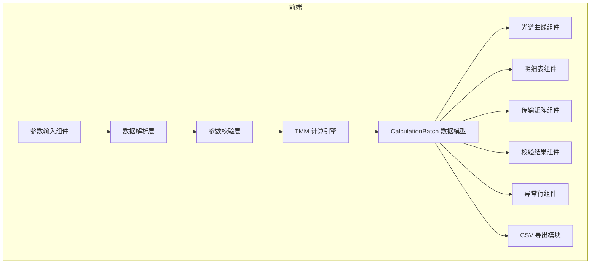
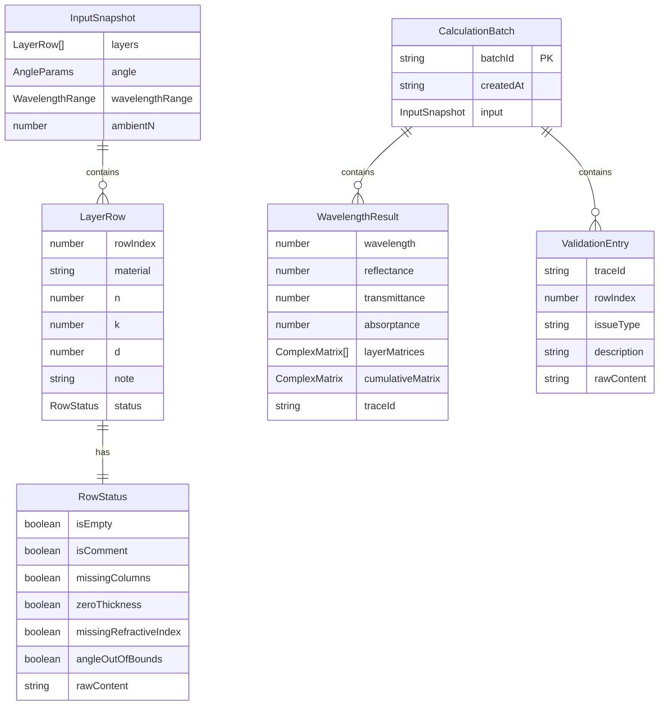

## 1. 架构设计



纯前端应用，所有计算在浏览器端完成，无需后端服务。

## 2. 技术说明

- **前端**：React@18 + TypeScript + Tailwind CSS@3 + Vite
- **初始化工具**：vite-init（react-ts 模板）
- **状态管理**：Zustand
- **图表**：Recharts（轻量 SVG 图表库）
- **后端**：无（纯前端计算）
- **数据库**：无（浏览器内存 + 下载文件）

## 3. 路由定义

| 路由 | 用途 |
|------|------|
| / | 主页面：参数输入 + 结果看板（单页左右分栏） |

单页应用，不使用多路由，所有功能在同一页面完成。

## 4. 核心数据模型

### 4.1 数据模型定义



### 4.2 核心类型定义

```typescript
interface ComplexNumber {
  re: number;
  im: number;
}

interface ComplexMatrix {
  m11: ComplexNumber;
  m12: ComplexNumber;
  m21: ComplexNumber;
  m22: ComplexNumber;
}

interface LayerRow {
  rowIndex: number;
  material: string;
  n: number | null;
  k: number | null;
  d: number | null;
  note: string;
  status: RowStatus;
}

interface RowStatus {
  isEmpty: boolean;
  isComment: boolean;
  missingColumns: boolean;
  zeroThickness: boolean;
  missingRefractiveIndex: boolean;
  angleOutOfBounds: boolean;
  rawContent: string;
}

interface WavelengthResult {
  wavelength: number;
  reflectance: number;
  transmittance: number;
  absorptance: number;
  layerMatrices: ComplexMatrix[];
  cumulativeMatrix: ComplexMatrix;
  traceId: string;
}

interface ValidationEntry {
  traceId: string;
  rowIndex: number;
  issueType: 'zero_thickness' | 'missing_n' | 'angle_oob' | 'missing_column' | 'empty_row' | 'comment_row';
  description: string;
  rawContent: string;
}

interface CalculationBatch {
  batchId: string;
  createdAt: string;
  input: InputSnapshot;
  results: WavelengthResult[];
  validations: ValidationEntry[];
  badRows: LayerRow[];
}
```

## 5. TMM 计算引擎设计

传输矩阵法（Transfer Matrix Method）核心算法：

1. 每层膜的传输矩阵：
   - 相位厚度：δ = 2π·n·d·cos(θ) / λ
   - 2×2 矩阵：M = [[cos(δ), i·sin(δ)/η], [i·η·sin(δ), cos(δ)]]
   - 其中 η = n·cos(θ)（s偏振）或 η = n/cos(θ)（p偏振）

2. 累积矩阵：M_total = M1 · M2 · ... · Mn

3. 反射系数：r = (η0·M11 + η0·ηs·M12 - M21 - ηs·M22) / (η0·M11 + η0·ηs·M12 + M21 + ηs·M22)

4. 反射率：R = |r|²

5. 透射率：T = (4·η0·ηs) / |η0·M11 + η0·ηs·M12 + M21 + ηs·M22|²

每层保留中间矩阵，供传输矩阵展示模块使用。

## 6. 文件结构规划

```
src/
├── components/
│   ├── LayerInput.tsx          # 膜层参数输入表格
│   ├── AngleInput.tsx          # 入射角和波长范围输入
│   ├── SpectrumChart.tsx       # 光谱曲线图
│   ├── ResultTable.tsx         # 反射率明细表
│   ├── MatrixDisplay.tsx       # 传输矩阵展示
│   ├── ValidationPanel.tsx     # 参数校验结果面板
│   ├── BadRowsDrawer.tsx       # 异常行抽屉
│   └── ExportButton.tsx        # CSV 导出按钮
├── hooks/
│   └── useCalculation.ts       # 计算触发与状态管理 hook
├── utils/
│   ├── tmm.ts                  # 传输矩阵法核心计算
│   ├── complex.ts              # 复数运算工具
│   ├── parser.ts               # 数据解析（脏行处理）
│   ├── validator.ts            # 参数校验
│   └── exporter.ts             # CSV 导出
├── store/
│   └── useFilmStore.ts         # Zustand 全局状态
├── types/
│   └── index.ts                # 类型定义
└── pages/
    └── Home.tsx                # 主页面
```
