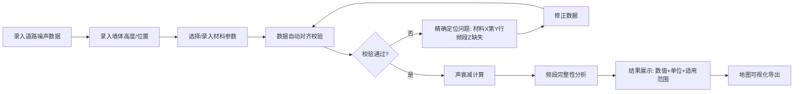

## 1. 产品概述

声学隔音墙评估计算工具，专为城市环保工程师设计。解决道路噪声评估中频段缺失、数据对齐难、失败原因不明确等痛点，提供声衰减计算、频段完整性分析、地图导出三大核心功能。

- **目标用户**：城市环保工程师、环境影响评价人员
- **核心价值**：将道路噪声、墙体高度、材料参数自动对齐，计算结果附带单位、适用范围和详细失败原因
- **差异化**：精确定位问题来源（如"材料参数表第3行频段63Hz缺失"），而非笼统的"处理失败"

## 2. 核心 Features

### 2.1 用户角色
| 角色 | 注册方式 | 核心权限 |
|------|----------|----------|
| 工程师 | 无需注册，本地使用 | 全部功能：参数录入、计算、分析、导出 |

### 2.2 功能模块
1. **声衰减计算页**：参数输入区、实时计算结果区、单位标注区
2. **频段分析页**：频段覆盖热力图、缺失频段定位、居民点重复检测
3. **材料管理页**：材料参数录入、数据对齐校验、问题溯源
4. **地图导出页**：GIS可视化、评估结果图层导出

### 2.3 页面详情
| 页面名称 | 模块名称 | 功能描述 |
|----------|----------|----------|
| 声衰减计算页 | 参数输入区 | 道路噪声源强、墙体高度、距离、材料参数录入，带实时校验 |
| 声衰减计算页 | 结果展示区 | 计算结果+单位(dB)、适用范围说明、失败原因追溯 |
| 频段分析页 | 频段覆盖热力图 | 63Hz~8kHz共9个频段的覆盖情况可视化 |
| 频段分析页 | 问题定位面板 | 精确定位缺失频段、重复居民点，标注具体数据行号 |
| 材料管理页 | 参数对齐校验 | 自动对齐道路噪声、墙体参数、材料声学数据 |
| 材料管理页 | 问题溯源 | 显示哪份材料哪一行数据有问题，提供修正建议 |
| 地图导出页 | GIS可视化 | 展示隔音墙位置、噪声影响范围、评估结果分布 |
| 地图导出页 | 导出功能 | 支持PNG、GeoJSON格式导出 |

## 3. 核心流程

**流程说明**：
1. 工程师按顺序录入三类核心数据：道路噪声源强、墙体参数、材料声学参数
2. 系统自动进行数据对齐校验，检查频段完整性、居民点唯一性
3. 校验失败时，精确定位到具体材料文件和数据行，如"材料-混凝土板 第5行 频段250Hz数据缺失"
4. 校验通过后执行声衰减计算，结果附带单位(dB)、适用场景说明
5. 频段分析检测9个标准频段覆盖情况，可视化展示缺失频段
6. 最终支持地图格式导出评估结果

## 4. 用户界面设计

### 4.1 设计风格
- **主色调**：专业深蓝 `#0f172a`（代表专业、严谨）
- **辅助色**：警告橙 `#f97316`（缺失提示）、成功绿 `#10b981`（校验通过）、错误红 `#ef4444`（计算失败）
- **字体**：标题用 `Space Grotesk`，正文用 `JetBrains Mono`（等宽字体便于数据对比）
- **布局**：左侧导航 + 右侧内容区，卡片式模块，数据网格对齐
- **按钮**：直角方角按钮，2px边框，hover时有微妙的背景色变化
- **图标**：Lucide图标库，线条风格，与专业调性一致

### 4.2 页面设计概述
| 页面名称 | 模块名称 | UI元素 |
|----------|----------|----------|
| 声衰减计算页 | 参数输入区 | 三列网格布局，每类参数一个卡片，输入框带下划线校验状态 |
| 声衰减计算页 | 结果展示区 | 大字号结果数值，右上角单位标注，下方适用范围标签 |
| 频段分析页 | 热力图 | 9个频段×N个测点的彩色方格，红色=缺失，绿色=完整 |
| 频段分析页 | 问题列表 | 时间线样式，每项问题带行号、材料名、修正建议按钮 |
| 材料管理页 | 参数表格 | 可编辑数据表格，实时校验，错误单元格高亮显示 |
| 材料管理页 | 对齐面板 | 三列竖向对比：道路噪声、墙体、材料，对齐线可视化 |
| 地图导出页 | GIS视图 | 简化地图，隔音墙用橙色线条，噪声范围用渐变圆环 |
| 地图导出页 | 导出控制 | 格式选择按钮，预览缩略图，导出进度条 |

### 4.3 响应式
- 桌面端优先设计，1440px为基准
- 平板端：左侧导航收起为图标，内容区自适应
- 移动端：单列布局，卡片堆叠，表格横向滚动
- 触摸优化：按钮最小高度44px，表格支持双指缩放

### 4.4 关键交互细节
- **错误定位**：点击问题列表项，自动跳转到对应材料表格并高亮错误行
- **实时计算**：参数修改后200ms防抖，自动重新计算
- **频段复现**：提供"复现频段缺失"按钮，自动构造测试数据复现问题场景
- **单位标注**：所有输入输出字段旁均有固定单位标签，如 `[dB]` `[m]` `[Hz]`
