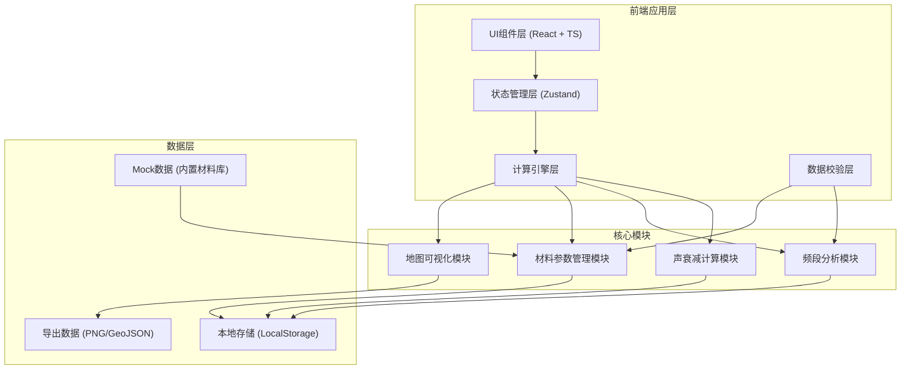

## 1. 架构设计



## 2. 技术描述
- **前端**：React@18 + TypeScript + Vite@5
- **样式**：TailwindCSS@3
- **状态管理**：Zustand
- **图表可视化**：Recharts（频段热力图）
- **地图可视化**：Leaflet（简化GIS地图）
- **图标**：Lucide React
- **后端**：无（纯前端应用，数据本地存储）
- **数据库**：LocalStorage（本地持久化）

## 3. 路由定义
| 路由 | 用途 |
|------|------|
| / | 声衰减计算页（默认首页） |
| /frequency | 频段分析页 |
| /materials | 材料管理页 |
| /map | 地图导出页 |
| /guide | 使用说明页 |

## 4. 数据模型

### 4.1 核心类型定义
```typescript
// 频段定义 (63Hz ~ 8kHz 共9个倍频程)
type FrequencyBand = 63 | 125 | 250 | 500 | 1000 | 2000 | 4000 | 8000;

// 道路噪声源强
interface RoadNoiseSource {
  id: string;
  name: string;
  trafficVolume: number; // 车流量 [辆/小时]
  speedLimit: number; // 限速 [km/h]
  heavyVehicleRatio: number; // 重型车比例 [%]
  spectrum: Record<FrequencyBand, number | null>; // 各频段声压级 [dB]
}

// 隔音墙参数
interface SoundBarrier {
  id: string;
  name: string;
  height: number; // 高度 [m]
  length: number; // 长度 [m]
  distanceFromRoad: number; // 距路中心线距离 [m]
  materialId: string;
  position: { lat: number; lng: number };
}

// 材料声学参数
interface AcousticMaterial {
  id: string;
  name: string;
  sourceFile?: string; // 来源文件名，用于问题定位
  sourceLine?: number; // 来源行号，用于问题定位
  // 各频段隔声量 [dB]
  transmissionLoss: Record<FrequencyBand, number | null>;
  // 各频段吸声系数
  absorptionCoefficient: Record<FrequencyBand, number | null>;
}

// 居民点
interface ResidentPoint {
  id: string;
  name: string;
  position: { lat: number; lng: number };
  distanceFromRoad: number; // [m]
  receiverHeight: number; // 接收点高度 [m]
}

// 计算结果
interface CalculationResult {
  residentPointId: string;
  barrierId: string;
  // 各频段插入损失 [dB]
  insertionLoss: Record<FrequencyBand, number | null>;
  // 各频段降噪后声级 [dB]
  reducedLevel: Record<FrequencyBand, number | null>;
  totalAttenuation: number; // 总声衰减量 [dB(A)]
  unit: string; // 固定为 'dB(A)'
  applicableScope: string; // 适用范围说明
  calculationMethod: string; // 计算方法说明
}

// 校验错误
interface ValidationError {
  id: string;
  type: 'frequency_missing' | 'duplicate_point' | 'material_incomplete' | 'alignment_error';
  severity: 'error' | 'warning';
  message: string;
  source?: {
    fileName?: string;
    lineNumber?: number;
    materialId?: string;
    frequencyBand?: FrequencyBand;
    field?: string;
  };
  suggestion: string;
}
```

### 4.2 频段标准
| 频段 (Hz) | 说明 |
|-----------|------|
| 63 | 低频段 |
| 125 | 中低频段 |
| 250 | 中频段 |
| 500 | 中频段 |
| 1000 | 中高频段 |
| 2000 | 高频段 |
| 4000 | 高频段 |
| 8000 | 超高频段 |

## 5. 核心计算算法

### 5.1 声衰减计算 (ISO 9613-2 简化模型)
```
插入损失 IL = A_barrier + A_ground + A_air
其中：
  A_barrier = 10 * log10(3 + (2 * π * δ) / λ)  [dB]
  δ = 声程差 [m]
  λ = c / f  [m], c=340m/s(声速)
  A_ground = 地面效应衰减
  A_air = 空气吸收衰减
```

### 5.2 数据对齐校验规则
1. 道路噪声谱必须包含全部8个频段数据
2. 材料参数的隔声量和吸声系数频段必须与道路噪声对齐
3. 居民点经纬度不可重复（偏差<0.0001度视为重复）
4. 墙体高度必须 > 0 且 < 30m
5. 所有数值字段必须在合理范围内

## 6. Mock 数据
- 内置5种常用隔音材料（混凝土、金属板、透明亚克力、木屑板、吸声棉）的完整声学参数
- 3条典型道路的噪声源强数据
- 2个示例居民点
- 1组完整的样例评估数据（用于演示和测试）
