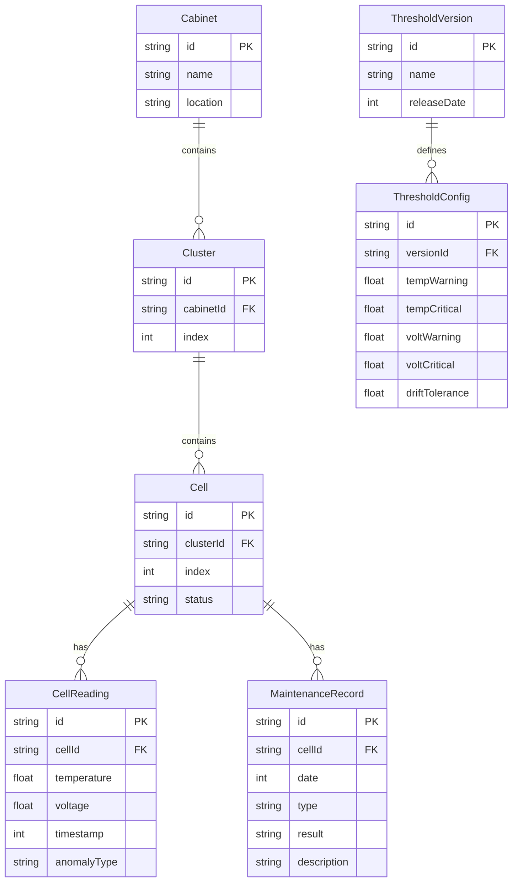

## 1. 架构设计

```mermaid
graph TB
    "前端 React 应用" --> "3D 可视化层"
    "前端 React 应用" --> "面板组件层"
    "前端 React 应用" --> "状态管理层"
    "3D 可视化层" --> "Three.js / R3F"
    "面板组件层" --> "趋势监测"
    "面板组件层" --> "阈值校验"
    "面板组件层" --> "维修记录"
    "面板组件层" --> "时间轴"
    "状态管理层" --> "Zustand Store"
    "Zustand Store" --> "Mock 数据层"
```

## 2. 技术说明

- **前端**：React@18 + Tailwind CSS@3 + Vite
- **初始化工具**：Vite (react-ts template)
- **3D 引擎**：three + @react-three/fiber + @react-three/drei + @react-three/postprocessing
- **图表**：recharts（趋势折线图）
- **状态管理**：Zustand（轻量，联动更新）
- **后端**：无，纯前端 Mock 数据
- **数据库**：无，内存 Mock 数据集

## 3. 路由定义

| 路由 | 用途 |
|------|------|
| / | 预警总览页（唯一页面，所有功能集成） |

## 4. 数据模型

### 4.1 数据模型定义



### 4.2 Mock 数据设计

- 2 个电池柜，每柜 2 簇，每簇 16 电芯（共 64 电芯）
- 时间范围：模拟 72 小时，5 分钟采样间隔
- 预设异常场景：
  - **正常电芯**：温度/电压在阈值内
  - **传感器漂移**：温度读数逐渐偏移，趋势图标注漂移区间，阈值校验面板给出漂移说明
  - **阈值版本错**：某电芯按旧版本阈值计算未超标，按新版本已超标，校验面板对比说明
  - **缺采样**：某时段无采样数据，趋势图断点，校验面板标注缺失

## 5. 组件结构

```
src/
├── App.tsx                          # 主布局
├── store/
│   └── useStore.ts                  # Zustand 全局状态
├── data/
│   └── mockData.ts                  # Mock 数据生成
├── components/
│   ├── Scene3D.tsx                  # 3D 电池柜场景
│   ├── CabinetModel.tsx             # 电池柜 3D 模型
│   ├── CellMesh.tsx                 # 电芯网格（着色/高亮）
│   ├── FilterBar.tsx                # 筛选栏
│   ├── TrendChart.tsx               # 趋势监测面板
│   ├── ThresholdPanel.tsx           # 阈值校验面板
│   ├── MaintenancePanel.tsx         # 维修记录面板
│   └── Timeline.tsx                 # 时间轴
└── types/
    └── index.ts                     # TypeScript 类型定义
```

## 6. 联动机制

- **Zustand Store** 存储全局状态：selectedCellId, selectedCabinetId, currentTime, thresholdVersionId, filters
- **3D 场景** 订阅 selectedCellId / currentTime，更新电芯着色和选中高亮
- **趋势监测** 订阅 selectedCellId / currentTime / thresholdVersionId，更新曲线和标注
- **阈值校验** 订阅 selectedCellId / thresholdVersionId，更新校验结果和说明
- **维修记录** 订阅 selectedCellId / currentTime，更新高亮事件
- **时间轴** 拖动/播放更新 store.currentTime，所有面板自动响应
- **筛选栏** 更新 store.filters / store.thresholdVersionId，所有面板自动响应
