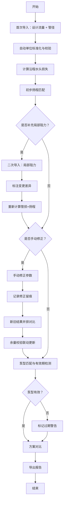

## 1. 产品概述

水泵扬程选型器是面向给排水设计师的专业工具，解决管损计算与水泵扬程选型中因数据分批到达、人工修正导致的计算不一致问题。核心价值：支持增量导入、修正留痕、结果幂等、方案对比，确保从样例导入到报告输出的全链路可追溯。

## 2. 核心功能

### 2.1 用户角色

| 角色 | 使用方式 | 核心权限 |
|------|----------|----------|
| 给排水设计师 | 直接使用 | 导入参数、手动修正、查看对比、导出报告 |

### 2.2 功能模块

1. **选型工作台**：参数输入与增量导入、管损计算、扬程匹配、余量校验、方案对比
2. **修正留痕面板**：修正记录时间线、新旧结果并排对比
3. **报告输出页**：汇总报告生成与导出

### 2.3 页面详情

| 页面名称 | 模块名称 | 功能描述 |
|----------|----------|----------|
| 选型工作台 | 增量导入区 | 第一次导入设计流量+管径，第二次补局部阻力，系统自动标注前后差异 |
| 选型工作台 | 管损计算区 | 沿程水头损失+局部水头损失实时计算，参数变化后自动重算 |
| 选型工作台 | 扬程匹配区 | 根据管损+高差+余量计算所需扬程，匹配泵型库 |
| 选型工作台 | 余量校验区 | 扬程匹配变化后，余量校验联动更新 |
| 选型工作台 | 方案对比区 | 多方案并排对比（含手动修正后的方案） |
| 选型工作台 | 手动修正入口 | 允许修改管径等参数，修正后新旧结果并排展示 |
| 修正留痕面板 | 修正时间线 | 按时间排列所有修正操作，标注修正字段、旧值→新值 |
| 修正留痕面板 | 新旧对比视图 | 左右并排展示修正前后的计算结果 |
| 报告输出页 | 报告生成 | 汇总参数、计算过程、修正记录、泵型匹配结果 |
| 报告输出页 | 报告导出 | 支持打印/PDF导出 |

## 3. 核心流程

给排水设计师打开选型工作台后，可分批次导入参数：首次仅导入设计流量和管径，系统基于已有数据计算沿程损失并给出初步结果；二次补充局部阻力数据后，系统自动标注变更项并重新计算。设计师可随时通过手动修正入口修改管径等参数，系统记录修正操作并生成新旧结果对比。泵型库匹配时，自动检测泵型有效期，过期泵型标记警告。最终可导出包含完整修正记录的选型报告。

## 4. 用户界面设计

### 4.1 设计风格

- 主色调：深蓝 #1B3A5C（专业工程感），辅助色：琥珀 #E5A100（警告/高亮）
- 按钮风格：圆角8px，主操作实心填充，次操作描边
- 字体：标题用 Noto Sans SC Bold，正文用 Noto Sans SC Regular，数据用 JetBrains Mono
- 布局：左侧参数输入面板，右侧计算结果区，底部修正留痕时间线
- 图标：Lucide Icons，工程/仪表盘风格

### 4.2 页面设计概览

| 页面名称 | 模块名称 | UI元素 |
|----------|----------|--------|
| 选型工作台 | 增量导入区 | 卡片式分区，导入步骤指示器(1→2)，变更项黄色高亮标记 |
| 选型工作台 | 管损计算区 | 数值卡片展示沿程/局部损失，公式折叠展开，单位标签 |
| 选型工作台 | 扬程匹配区 | 泵型列表，匹配度进度条，过期标签红色警告 |
| 选型工作台 | 余量校验区 | 校验结果指示灯(绿/黄/红)，余量百分比仪表盘 |
| 选型工作台 | 方案对比区 | 双列并排表格，差异项背景色标记 |
| 选型工作台 | 手动修正入口 | 行内编辑控件，修改后弹出确认对话框 |
| 修正留痕面板 | 修正时间线 | 竖向时间轴，每节点显示时间、操作人、字段、旧值→新值 |
| 修正留痕面板 | 新旧对比视图 | 左右分栏，同步滚动，差异高亮 |
| 报告输出页 | 报告生成 | 打印友好排版，修正记录附录 |
| 报告输出页 | 报告导出 | 导出按钮，支持PDF打印 |

### 4.3 响应式设计

- 桌面优先设计，最小宽度1280px
- 方案对比区在窄屏时切换为纵向堆叠
- 修正时间线自适应宽度

### 4.4 边界样例处理

| 边界场景 | 处理策略 |
|----------|----------|
| 单位混用（mm/m、L/s/m³/h） | 导入时自动识别并标准化为SI单位，标注原始单位 |
| 阻力漏项 | 缺失字段标红提示，计算时用0占位并警告 |
| 泵型过期 | 泵型卡片标记"已过期"红色标签，阻止选型但允许查看 |
| 重复运行幂等性 | 相同输入→相同输出，计算纯函数化，状态不依赖执行顺序 |
