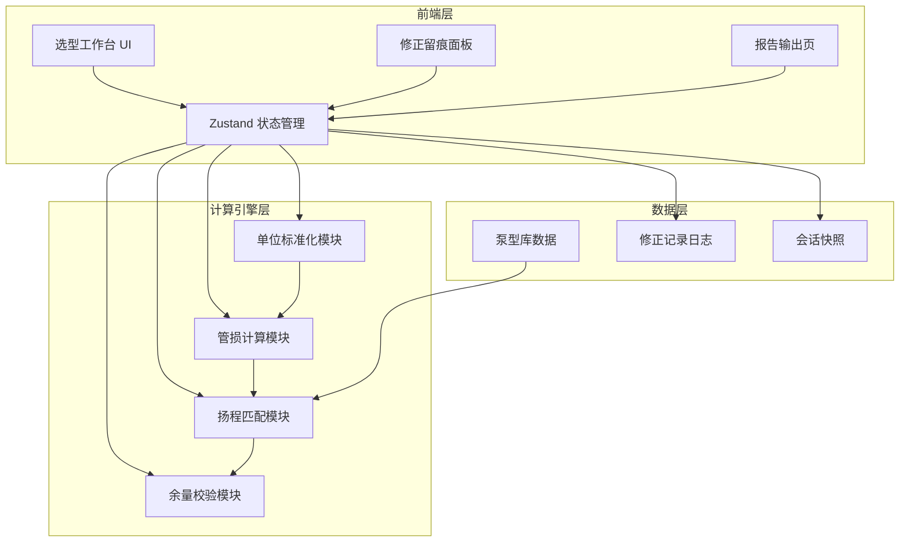
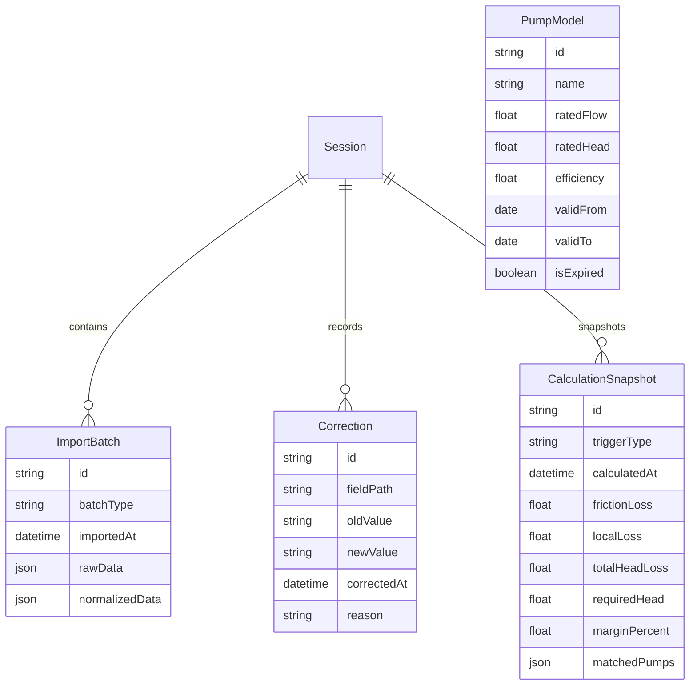

## 1. 架构设计

## 2. 技术说明

- 前端：React@18 + Tailwind CSS@3 + Vite + TypeScript
- 初始化工具：vite-init
- 后端：无（纯前端应用，泵型库为内置JSON数据）
- 数据库：无（使用 localStorage 持久化会话数据）

## 3. 路由定义

| 路由 | 用途 |
|------|------|
| / | 选型工作台主页面（含增量导入、计算、修正、对比） |
| /report | 报告输出页面 |

## 4. 数据模型

### 4.1 数据模型定义

### 4.2 核心计算逻辑

**沿程水头损失（Darcy-Weisbach）**：
- hf = λ × (L/D) × (v²/2g)
- λ 由雷诺数和相对粗糙度查表

**局部水头损失**：
- hj = Σ ξ × (v²/2g)

**所需扬程**：
- H = hf + hj + Δz + H_margin
- H_margin = H × 余量系数（默认10%）

**余量校验**：
- 余量 = (泵额定扬程 - 所需扬程) / 所需扬程 × 100%
- 绿灯 ≥ 10%，黄灯 5%-10%，红灯 < 5%

### 4.3 幂等性保证

- 所有计算函数为纯函数：`calcResult = f(params)` 
- 参数标准化在导入时一次性完成
- 修正操作生成新快照而非覆盖旧数据
- 相同参数输入，无论执行次数，输出完全一致

### 4.4 增量导入与变更追踪

- 每次导入生成 ImportBatch 记录
- 新旧数据对比，变更字段自动标注
- 修正操作生成 Correction 记录，含旧值→新值
- 每次计算生成 CalculationSnapshot，关联触发类型（导入/修正）
