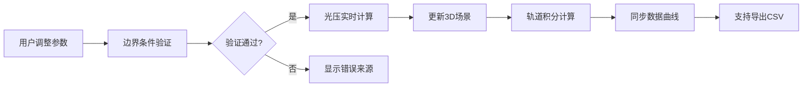

## 1. 产品概述
太阳帆轨道加速器是一款航天科普交互产品，通过3D可视化和实时计算演示，帮助用户理解帆面积、航天器质量和姿态角如何影响光压计算和轨道演化。

- 核心目标：让航天科普产品用户直观理解光压物理原理
- 解决问题：参数混杂、计算过程不透明、边界条件难以验证
- 目标用户：航天科普从业者、教育工作者、航天爱好者

## 2. 核心功能

### 2.1 功能模块
1. **3D可视化场景**：太阳帆航天器、太阳光源、轨道演化动画
2. **参数控制面板**：帆面积、航天器质量、姿态角滑块/输入
3. **实时计算面板**：光压计算过程、轨道积分说明、数值结果
4. **数据验证系统**：边界条件检测、错误追溯、质量验证
5. **时间轴控制**：播放/暂停、时间步调整、数据筛选
6. **曲线导出功能**：轨道数据图表、CSV导出

### 2.2 页面详情
| 页面名称 | 模块名称 | 功能描述 |
|-----------|-------------|---------------------|
| 主页面 | 3D场景区域 | 实时渲染太阳帆航天器，支持旋转缩放查看 |
| 主页面 | 参数控制区 | 拖动滑块调整帆面积、质量、姿态角，实时反馈 |
| 主页面 | 计算说明区 | 分步显示光压计算公式、轨道积分过程 |
| 主页面 | 数据验证区 | 显示每条判断的来源、检测边界条件异常 |
| 主页面 | 时间轴控制 | 播放轨道演化动画，支持时间步调整和筛选 |
| 主页面 | 曲线图表区 | 显示轨道参数变化曲线，支持CSV导出 |

## 3. 核心流程
用户调整参数 → 系统验证边界条件 → 实时计算光压 → 更新3D场景 → 同步轨道积分 → 生成数据曲线

## 4. 用户界面设计

### 4.1 设计风格
- 主色调：深空蓝(#0a1628) + 科技橙(#ff6b35) + 数据绿(#00d4aa)
- 按钮风格：圆角矩形，科技感边框，悬停发光效果
- 字体：Display字体Orbitron用于标题，JetBrains Mono用于数据显示
- 布局：左侧3D大场景，右侧控制面板堆叠式布局
- 图标风格：Lucide线性图标，科技感极简风格

### 4.2 页面设计概述
| 页面名称 | 模块名称 | UI Elements |
|-----------|-------------|-------------|
| 主页面 | 3D场景 | 深色星空背景，太阳光晕，太阳帆金色材质，轨道轨迹线 |
| 主页面 | 参数滑块 | 渐变轨道样式，拖动时实时数值显示 |
| 主页面 | 计算面板 | 代码编辑器风格，语法高亮公式，分步展开说明 |
| 主页面 | 验证区域 | 时间线样式，每条记录带来源追溯链接 |
| 主页面 | 曲线图表 | 交互式折线图，多数据系列对比 |

### 4.3 响应性
- 桌面端：左右分栏布局(3D场景70%，控制面板30%)
- 平板端：上下堆叠布局，支持手势旋转3D场景
- 移动端：简化视图，核心参数控制优先

### 4.4 3D场景指导
- 环境：深空HDRI，星空粒子背景，太阳光晕效果
- 光照：主光源(太阳) + 环境光，强调金属质感
- 相机：轨道控制器，默认45度俯视角
- 动画：帆面轻微摆动，轨道平滑运动，参数过渡动画
- 后期处理：Bloom光晕，轻微色差，胶片颗粒
