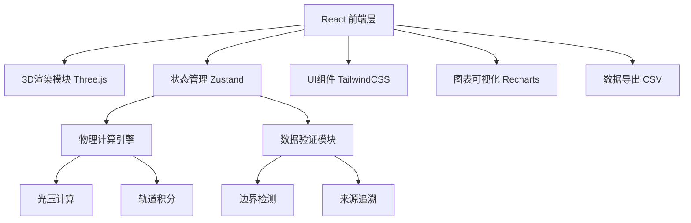

## 1. 架构设计


## 2. 技术描述
- 前端：React@18 + TypeScript + Vite
- 3D渲染：Three.js + @react-three/fiber + @react-three/drei
- 状态管理：Zustand
- 样式：TailwindCSS@3
- 图表：Recharts
- 图标：Lucide React
- 后端：无（纯前端计算）

## 3. 路由定义
| 路由 | 用途 |
|-------|---------|
| / | 主页面 - 太阳帆轨道加速器 |

## 4. 数据模型

### 4.1 太阳帆参数状态
```typescript
interface SolarSailState {
  sailArea: number;           // 帆面积 (m²)
  spacecraftMass: number;     // 航天器质量 (kg)
  attitudeAngle: number;      // 姿态角 (度)
  timeStep: number;           // 时间步长 (s)
  currentTime: number;        // 当前时间 (s)
  isPlaying: boolean;         // 是否播放中
}
```

### 4.2 计算结果
```typescript
interface CalculationResult {
  radiationPressure: number;  // 光压 (Pa)
  force: number;              // 推力 (N)
  acceleration: number;       // 加速度 (m/s²)
  velocity: number;           // 速度 (m/s)
  position: Vector3;          // 位置向量
  orbitData: OrbitPoint[];    // 轨道数据点
}
```

### 4.3 验证记录
```typescript
interface ValidationRecord {
  id: string;
  timestamp: number;
  type: 'normal' | 'warning' | 'error';
  parameter: string;
  value: number;
  message: string;
  source: string;             // 来源追溯
  isValid: boolean;
}
```

### 4.4 轨道数据点
```typescript
interface OrbitPoint {
  time: number;
  x: number;
  y: number;
  z: number;
  velocity: number;
  radiationPressure: number;
}
```

## 5. 核心模块结构

### 5.1 物理计算模块
- `src/physics/radiationPressure.ts` - 光压计算
- `src/physics/orbitIntegration.ts` - 轨道积分
- `src/physics/validation.ts` - 数据验证

### 5.2 3D场景模块
- `src/components/Scene.tsx` - 主场景
- `src/components/SolarSail.tsx` - 太阳帆模型
- `src/components/Sun.tsx` - 太阳光源
- `src/components/OrbitLine.tsx` - 轨道线

### 5.3 UI组件模块
- `src/components/ControlPanel.tsx` - 参数控制面板
- `src/components/CalculationPanel.tsx` - 计算说明
- `src/components/ValidationPanel.tsx` - 数据验证
- `src/components/Timeline.tsx` - 时间轴控制
- `src/components/ChartPanel.tsx` - 曲线图表

## 6. 边界条件验证规则
1. **姿态角越界**：0° ≤ θ ≤ 90°，超出范围标记错误
2. **时间步过大**：Δt > 3600s 标记警告
3. **质量为零或负数**：m ≤ 0 标记致命错误
4. **帆面积为零**：A ≤ 0 标记警告
5. **所有计算结果可追溯到原始参数**
