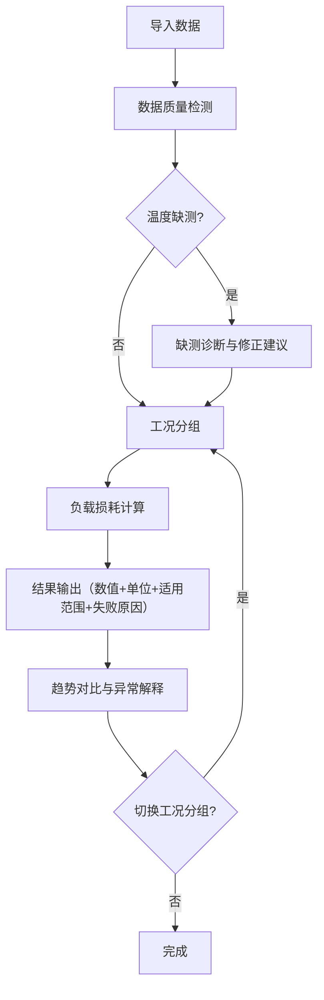

## 1. 产品概述

变压器负载损耗核算计算工具，面向电力运维工程师，解决月底报表和上课前手工判断温度缺测、负载损耗计算费时费力的问题。工具自动处理脏数据（备注混入、温度缺字段、参数晚到），给出带单位、适用范围和失败原因的计算结果，对温度缺测提供可操作的修正建议，支持工况分组变化后异常解释与趋势对比联动。

- 目标用户：电力运维工程师、变电运维班组
- 核心价值：将原本需要逐条手工判断的温度缺测与损耗核算流程，变成数据导入即可出结果的自动化工具

## 2. 核心功能

### 2.1 功能模块

1. **核算工作台**：数据导入区（负载曲线、环境温度、设备参数）、一键核算按钮、结果总览面板
2. **损耗结果面板**：负载损耗数值 + 单位 + 适用范围 + 失败原因标签；工况分组切换后结果联动刷新
3. **温度缺测诊断**：缺测位置标注、修正建议（插值/替代/排除）、负载尖峰与参数过期的操作建议
4. **趋势对比视图**：多时段损耗对比图、工况分组变化趋势、异常解释随分组联动

### 2.2 页面详情

| 页面名称 | 模块名称 | 功能描述 |
|---------|---------|---------|
| 核算工作台 | 数据导入区 | 支持粘贴/上传负载曲线CSV、环境温度JSON、设备参数表；自动识别备注行、缺失字段、参数时间戳 |
| 核算工作台 | 一键核算按钮 | 触发损耗计算，自动跳过/标记异常数据，执行温度缺测检测 |
| 核算工作台 | 结果总览面板 | 显示本次核算统计：总记录数、有效记录数、缺测数、异常数、计算成功率 |
| 损耗结果面板 | 损耗数值卡 | 负载损耗值(kW) + 单位 + 适用温度范围 + 失败原因标签（红色/黄色/灰色分级） |
| 损耗结果面板 | 工况分组选择器 | 按负载率区间/时间段/温度段分组，切换后结果与异常解释联动刷新 |
| 温度缺测诊断 | 缺测位置表 | 列出每个缺测点的位置、持续时间、影响范围 |
| 温度缺测诊断 | 修正建议卡 | 对每个缺测点给出具体建议：线性插值/邻近站替代/排除该时段，附推荐理由 |
| 温度缺测诊断 | 尖峰与过期提示 | 负载尖峰处温度缺测 → 建议用最高温保守估计；参数过期 → 建议更新至最近校验值 |
| 趋势对比视图 | 多时段对比图 | 折线图展示不同时段负载损耗趋势，叠加温度曲线 |
| 趋势对比视图 | 异常解释联动 | 工况分组变化后，异常解释文本和趋势标注同步更新 |

## 3. 核心流程

用户导入负载曲线、环境温度、设备参数数据 → 系统自动识别数据质量问题（备注行、缺字段、参数时间戳）→ 执行温度缺测检测 → 按工况分组计算负载损耗 → 输出结果（含单位、适用范围、失败原因）→ 对缺测和异常给出可操作修正建议 → 用户切换工况分组 → 异常解释与趋势对比联动刷新

## 4. 用户界面设计

### 4.1 设计风格

- 主色调：深灰底(#1a1a2e) + 琥珀色强调(#f59e0b) + 青色正常态(#06b6d4)
- 按钮风格：圆角矩形，琥珀色主按钮，灰色次要按钮
- 字体：数据区使用等宽字体 JetBrains Mono，正文使用 Noto Sans SC
- 布局风格：单页仪表盘式，左侧导航栏，右侧主内容区
- 图标风格：线性图标 (lucide-react)

### 4.2 页面设计概览

| 页面名称 | 模块名称 | UI元素 |
|---------|---------|--------|
| 核算工作台 | 数据导入区 | 卡片式分区，拖拽上传区域，粘贴文本框，识别状态指示灯 |
| 核算工作台 | 结果总览 | 四宫格统计卡，数字大字号 + 标签小字号 |
| 损耗结果面板 | 损耗数值卡 | 大字号数值 + 单位标签，适用范围折叠，失败原因色标标签 |
| 损耗结果面板 | 工况分组选择器 | 下拉选择 + 可视化分组条 |
| 温度缺测诊断 | 缺测位置表 | 表格行，缺测行红色高亮，悬停显示详情 |
| 温度缺测诊断 | 修正建议卡 | 卡片列表，建议操作按钮可一键应用 |
| 趋势对比视图 | 多时段对比图 | SVG折线图，双Y轴（损耗+温度），分组色带背景 |
| 趋势对比视图 | 异常解释 | 文本气泡，随分组变化淡入淡出 |

### 4.3 响应式

桌面优先设计，1280px 以下自适应收缩趋势图，768px 以下切换为纵向堆叠布局

### 4.4 3D场景

不适用
