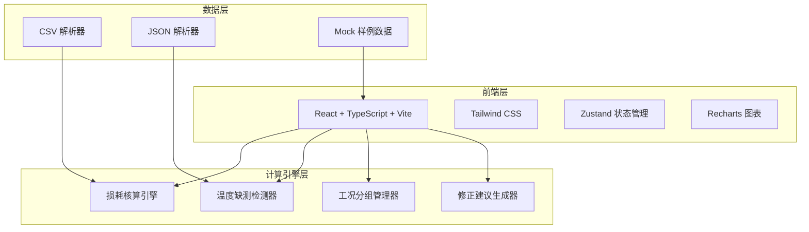
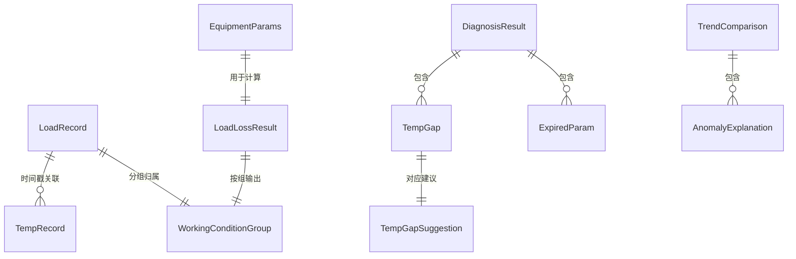

## 1. 架构设计



## 2. 技术说明

- 前端：React@18 + TypeScript + Tailwind CSS@3 + Vite
- 初始化工具：vite-init
- 后端：无（纯前端计算）
- 数据库：无（使用本地 Mock 数据和用户导入数据）
- 图表库：Recharts
- 状态管理：Zustand

## 3. 路由定义

| 路由 | 用途 |
|-----|------|
| / | 核算工作台主页，包含数据导入、结果总览 |
| /results | 损耗结果面板，工况分组切换 |
| /diagnosis | 温度缺测诊断页，修正建议 |
| /trends | 趋势对比视图 |

## 4. API 定义

无后端 API，所有计算在前端完成。核心函数接口：

```typescript
interface LoadLossInput {
  loadCurve: LoadRecord[];
  ambientTemp: TempRecord[];
  equipmentParams: EquipmentParams;
}

interface LoadRecord {
  timestamp: string;
  loadKW: number;
  remark?: string;
}

interface TempRecord {
  timestamp: string;
  tempC: number | null;
}

interface EquipmentParams {
  ratedCapacityKVA: number;
  ratedVoltageKV: number;
  noLoadLossKW: number;
  loadLossKW: number;
  paramDate: string;
}

interface LoadLossResult {
  totalLossKW: number;
  unit: "kW";
  applicableRange: string;
  failureReason?: string;
  severity: "ok" | "warning" | "error";
}

interface TempGap {
  startIndex: number;
  endIndex: number;
  durationHours: number;
  affectedRecords: number;
  suggestion: TempGapSuggestion;
}

interface TempGapSuggestion {
  method: "linear_interpolation" | "nearby_station" | "exclude" | "conservative_max";
  reason: string;
  actionLabel: string;
}

interface WorkingConditionGroup {
  id: string;
  label: string;
  filterFn: (record: LoadRecord & { tempC: number | null }) => boolean;
}

interface DiagnosisResult {
  gaps: TempGap[];
  peakGaps: TempGap[];
  expiredParams: { paramDate: string; daysExpired: number; suggestion: string }[];
}

interface TrendComparison {
  groups: { label: string; data: { time: string; lossKW: number }[] }[];
  anomalyExplanations: { groupId: string; text: string }[];
}
```

## 5. 服务器架构图

不适用（纯前端项目）

## 6. 数据模型

### 6.1 数据模型定义



### 6.2 数据定义

不适用（无数据库，使用前端 TypeScript 类型定义和本地 Mock 数据）
