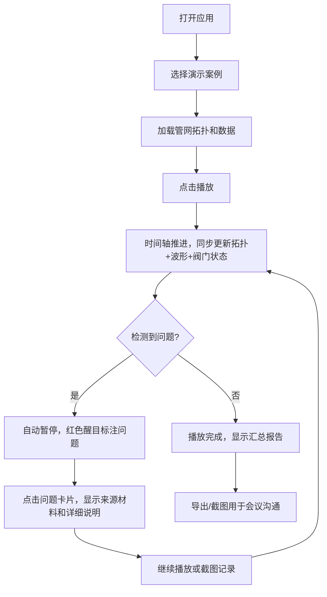

## 1. 产品概述

市政水务管网瞬变水锤模拟演示工具，专为市政水务工程师设计，用于开会、培训和课堂演示。核心价值在于将管网拓扑、阀门动作、管径长度等关键信息直观对齐，并醒目标注阀门时间错误、传感器漂移、管径缺失等常见问题，而非仅展示漂亮的模型。

- **核心问题解决**：阀门时间错误与传感器漂移叠加时的故障定位，管径缺失的数据追溯
- **目标用户**：市政水务工程师、管网运维人员、水利专业师生
- **产品价值**：让截图能"说话"，明确标注问题位置和来源材料，减少沟通争执

## 2. 核心功能

### 2.1 用户角色

| 角色 | 注册方式 | 核心权限 |
|------|----------|----------|
| 水务工程师 | 无需注册，直接使用 | 完整使用所有模拟、标注、导出功能 |

### 2.2 功能模块

1. **管网拓扑可视化**：节点-管线拓扑图，实时标注管径、长度、材质
2. **阀门动作时间轴**：多阀门动作时序对比，标注设计值与实际值偏差
3. **水锤计算波形图**：压力波形随时间变化，叠加标注关键事件点
4. **问题追踪面板**：醒目展示阀门时间错、管径缺失、传感器漂移等问题
5. **材料溯源标注**：每个数据点关联来源材料，异常数据高亮显示来源
6. **演示播放控制**：时间轴播放、步进、暂停，关键节点自动停顿标注

### 2.3 页面详情

| 页面名称 | 模块名称 | 功能描述 |
|----------|----------|----------|
| 主演示页 | 管网拓扑图 | 交互式SVG拓扑图，节点显示压力/流量，管线标注管径长度，异常管线醒目边框 |
| 主演示页 | 阀门动作时间轴 | 甘特图式阀门开关时序，设计值与实测值对比，时间偏差用红色区间标注 |
| 主演示页 | 水锤压力波形图 | 多测点压力曲线，阀门动作时刻竖线标注，极值点数字标注 |
| 主演示页 | 问题追踪面板 | 固定在右侧，红色醒目卡片列出所有问题，点击定位到对应位置 |
| 主演示页 | 播放控制栏 | 底部时间轴，播放/暂停/步进，速度调节，关键问题点自动暂停 |
| 主演示页 | 材料溯源层 | 鼠标悬停显示数据来源材料，异常数据弹出红色来源卡片 |

## 3. 核心流程

用户打开应用 → 选择预设案例（阀门时间错案例/管径缺失案例/传感器漂移案例）→ 播放模拟 → 问题自动高亮弹出 → 点击问题查看详情和来源材料 → 截图或导出演示记录

## 4. 用户界面设计

### 4.1 设计风格

- **设计调性**：工业/工程实用风格，朴素但重点突出。拒绝花哨，功能优先。
- **主色调**：深蓝 (#1e3a5f) 作为专业底色，白色背景，灰色辅助
- **强调色**：
  - 错误警示：鲜红 (#dc2626) 用于阀门时间错、管径缺失等严重问题
  - 警告提示：橙黄 (#f59e0b) 用于传感器漂移等次要问题
  - 正常状态：深绿 (#059669) 用于正常运行
- **字体**：
  - 标题：Noto Sans SC Bold，清晰有力的工程字体
  - 正文：JetBrains Mono，数字和字母等宽，便于数据对比
  - 标注：固定宽度字体，确保数值对齐
- **按钮风格**：直角矩形，2px边框，点击有明显按压感，工业风
- **布局风格**：三栏式固定布局
  - 左侧：管网拓扑图（占60%宽度）
  - 右上：水锤波形图
  - 右下：问题追踪面板
  - 底部：贯穿全宽的播放控制栏
- **图标风格**：纯线条图标，无渐变，工程图纸风格

### 4.2 页面设计概述

| 页面名称 | 模块名称 | UI元素 |
|----------|----------|--------|
| 主演示页 | 管网拓扑图 | SVG绘制的节点和管线，节点为圆形，管线为粗细不同的线条（对应管径），异常管线3px红色虚线边框，悬停显示管径/长度/材质标签 |
| 主演示页 | 阀门时间轴 | 水平甘特图，每个阀门一行，绿色块为设计值，黑色轮廓为实际值，偏差部分红色填充，数字标注偏差秒数 |
| 主演示页 | 水锤波形图 | 折线图，多色曲线区分测点，阀门动作时刻红色竖虚线，极值点带数值标签，Y轴有红色警戒线 |
| 主演示页 | 问题追踪面板 | 卡片列表，红色卡片带感叹号图标，显示问题类型、位置、偏差值、来源材料文件名，点击跳动动画 |
| 主演示页 | 播放控制栏 | 进度条带刻度，播放/暂停/步进按钮，速度选择（0.5x/1x/2x），当前时间数字显示，关键问题点在进度条上用红色三角标记 |
| 主演示页 | 材料溯源层 | 弹出卡片，灰色背景，显示"来源：2024-03-15阀门调试记录.xlsx 第12行"，异常数据红色边框 |

### 4.3 响应式

- 桌面端优先设计，最小支持1280px宽度
- 窗口缩小时按比例缩放各模块，保持布局比例
- 不做移动端适配，专注于桌面演示场景

### 4.4 交互细节

- **问题自动暂停**：当播放到阀门时间错误或水锤峰值时，自动暂停并弹出问题说明
- **点击联动**：点击问题卡片，管网图中对应位置闪烁，波形图中对应区间高亮
- **数值对齐**：所有数字采用等宽字体，小数点对齐，便于对比
- **边界标注**：阀门设计时间范围用淡绿色背景标注，超出即红色
- **来源可追溯**：每个异常数据点右下角有小角标"[1]"，悬停显示来源材料详情
