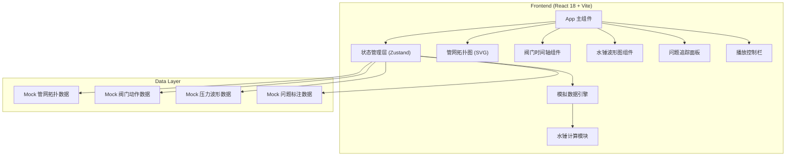
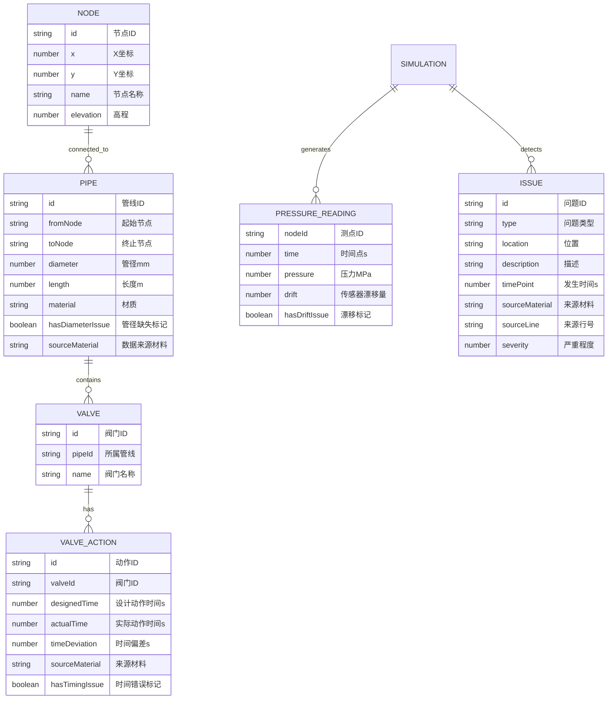

## 1. 架构设计



## 2. 技术描述

- **前端框架**：React@18 + TypeScript
- **构建工具**：Vite@5
- **样式方案**：TailwindCSS@3
- **状态管理**：Zustand（轻量级，适合单页应用）
- **图表绘制**：原生 SVG + Canvas 2D（无需额外图表库，便于精确控制标注）
- **后端**：无，纯前端应用，所有数据使用 Mock 数据
- **数据库**：无，数据存储在前端 JSON 文件中

## 3. 目录结构

```
src/
├── components/
│   ├── PipeNetwork/       # 管网拓扑图组件
│   ├── ValveTimeline/     # 阀门时间轴组件
│   ├── PressureChart/     # 水锤压力波形图
│   ├── IssuePanel/        # 问题追踪面板
│   └── PlaybackControls/  # 播放控制栏
├── store/
│   └── simulationStore.ts # Zustand 状态管理
├── data/
│   ├── network.ts         # 管网拓扑 Mock 数据
│   ├── valves.ts          # 阀门动作 Mock 数据
│   ├── pressure.ts        # 压力波形 Mock 数据
│   └── issues.ts          # 问题标注 Mock 数据
├── engine/
│   └── waterHammer.ts     # 水锤计算引擎
├── types/
│   └── index.ts           # TypeScript 类型定义
├── App.tsx
├── main.tsx
└── index.css
```

## 4. 路由定义

| 路由 | 用途 |
|------|------|
| / | 主演示页面，包含所有组件 |

单页应用，无需多路由。

## 5. 数据模型

### 5.1 数据模型定义



### 5.2 TypeScript 类型定义

```typescript
// 管网节点
interface Node {
  id: string;
  x: number;
  y: number;
  name: string;
  elevation: number;
}

// 管线
interface Pipe {
  id: string;
  fromNode: string;
  toNode: string;
  diameter: number | null; // null 表示管径缺失
  length: number;
  material: string;
  sourceMaterial: string;
  sourceLine?: string;
}

// 阀门
interface Valve {
  id: string;
  pipeId: string;
  name: string;
  position: number; // 0-1，在管线上的位置
}

// 阀门动作记录
interface ValveAction {
  id: string;
  valveId: string;
  designedTime: number;
  actualTime: number;
  action: 'open' | 'close';
  sourceMaterial: string;
  sourceLine: string;
}

// 压力读数
interface PressureReading {
  time: number;
  [nodeId: string]: number;
}

// 问题记录
interface Issue {
  id: string;
  type: 'valve_timing' | 'diameter_missing' | 'sensor_drift';
  location: string;
  description: string;
  timePoint: number;
  deviation?: number;
  sourceMaterial: string;
  sourceLine: string;
  severity: 1 | 2 | 3;
}

// 模拟状态
interface SimulationState {
  currentTime: number;
  isPlaying: boolean;
  speed: number;
  selectedIssueId: string | null;
  network: { nodes: Node[]; pipes: Pipe[]; valves: Valve[] };
  valveActions: ValveAction[];
  pressureData: PressureReading[];
  issues: Issue[];
}
```

## 6. 核心算法

### 6.1 水锤简化计算

使用特征线法（Method of Characteristics）的简化版本，用于演示：

```typescript
// 基本水锤压力计算公式
function calculateWaterHammer(
  velocity: number,      // 流速 m/s
  waveSpeed: number,     // 水锤波速 m/s
  timeStep: number,      // 时间步长 s
  pipeLength: number,    // 管长 m
  closureTime: number    // 阀门关闭时间 s
): PressureReading[] {
  // Joukowsky 公式：ΔP = ρ * a * ΔV
  const rho = 1000; // 水密度 kg/m³
  const deltaP = rho * waveSpeed * velocity; // 最大水锤压力
  
  // 根据关闭时间生成压力波形
  const result: PressureReading[] = [];
  const totalTime = pipeLength / waveSpeed * 4 + closureTime;
  const steps = totalTime / timeStep;
  
  for (let i = 0; i < steps; i++) {
    const t = i * timeStep;
    // 叠加反射波，生成振荡衰减波形
    const pressure = deltaP * Math.exp(-t * 0.1) * Math.sin(2 * Math.PI * t / (pipeLength / waveSpeed * 2));
    result.push({ time: t, pressure });
  }
  
  return result;
}
```

### 6.2 阀门时间错误检测

```typescript
function detectValveTimingIssues(actions: ValveAction[]): Issue[] {
  const issues: Issue[] = [];
  const tolerance = 0.5; // 允许偏差 0.5 秒
  
  actions.forEach(action => {
    const deviation = Math.abs(action.actualTime - action.designedTime);
    if (deviation > tolerance) {
      issues.push({
        id: `issue-${action.id}`,
        type: 'valve_timing',
        location: action.valveId,
        description: `阀门动作时间偏差 ${deviation.toFixed(2)}s`,
        timePoint: action.actualTime,
        deviation,
        sourceMaterial: action.sourceMaterial,
        sourceLine: action.sourceLine,
        severity: deviation > 2 ? 3 : deviation > 1 ? 2 : 1,
      });
    }
  });
  
  return issues;
}
```

## 7. 性能优化

- 使用 `requestAnimationFrame` 进行动画更新
- 波形图数据使用离屏 Canvas 预渲染
- 状态更新采用批处理，避免频繁重渲染
- SVG 元素使用 CSS transforms 而非频繁重绘
- 模拟数据使用 TypedArray 存储，提高计算效率
