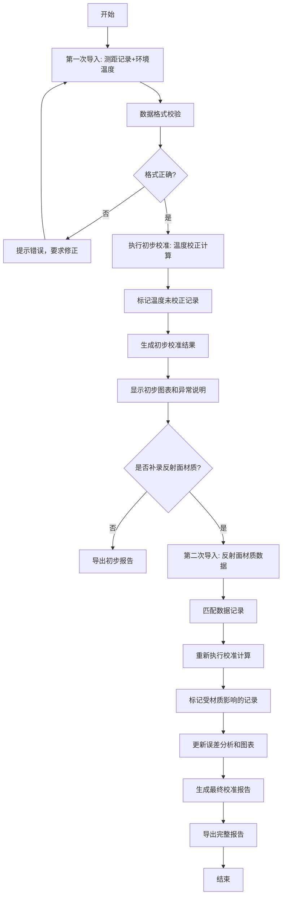
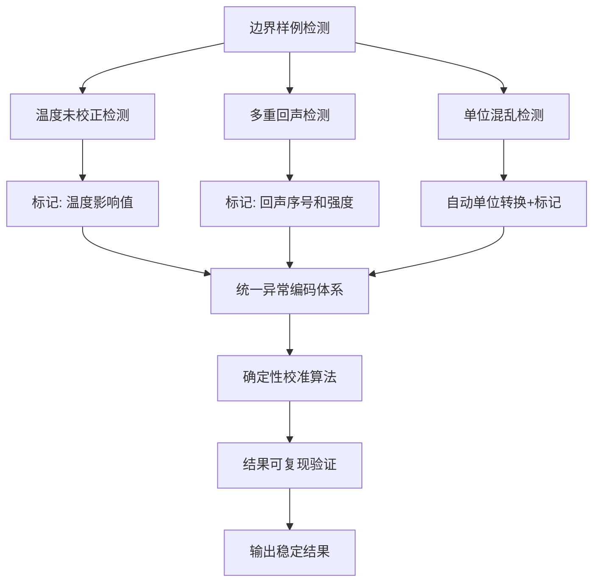

## 1. 产品概述

声波测距校准器是一款专业实验室数据处理工具，用于校准声波测距实验数据，解决温度未校正、多重回声、单位混乱等常见问题，确保实验结果的准确性和可追溯性。

- **核心目标**: 提供标准化的声波测距数据校准流程，自动识别并标注数据异常
- **目标用户**: 实验室管理员、科研人员、工程实验人员
- **核心价值**: 消除人工计算误差，提供可复现的校准结果，清晰展示数据变化轨迹

## 2. 核心功能

### 2.1 用户角色

| 角色 | 注册方式 | 核心权限 |
|------|----------|----------|
| 实验室管理员 | 无需注册 | 数据导入、校准计算、结果导出、异常分析 |

### 2.2 功能模块

1. **数据导入模块**: 支持两次导入流程（测距记录+环境温度 → 补录反射面材质）
2. **校准计算模块**: 声速温度校正、异常数据剔除、误差分析
3. **数据可视化模块**: 校准前后对比图表、误差分布图表
4. **结果导出模块**: 支持CSV/Excel格式导出，包含完整校准说明
5. **样本回看模块**: 支持单条记录详细查看，追踪数据变化历史

### 2.3 页面详情

| 页面名称 | 模块名称 | 功能描述 |
|----------|----------|----------|
| 主工作台 | 数据导入区 | 支持拖拽上传、粘贴导入，显示导入进度和数据预览 |
| 主工作台 | 校准控制面板 | 显示当前校准状态、温度校正参数、异常检测阈值设置 |
| 主工作台 | 数据明细表格 | 展示所有记录，高亮异常数据，支持筛选和排序 |
| 主工作台 | 图表展示区 | 校准前后对比图、误差分布图、温度-声速关系曲线 |
| 主工作台 | 异常说明面板 | 自动生成异常原因说明，支持手动添加备注 |
| 主工作台 | 结果导出区 | 选择导出格式、内容范围，一键导出完整报告 |
| 记录详情 | 单条记录详情 | 展示完整数据历史、校准轨迹、影响因素分析 |

## 3. 核心流程

### 3.1 两次导入校准流程

用户首次导入测距记录和环境温度数据，系统执行初步校准并标记温度未校正记录；用户二次导入反射面材质数据，系统重新计算并高亮受材质影响的记录；最终生成完整校准报告。

### 3.2 边界样例处理流程

系统内置边界样例库，包括温度未校正、多重回声、单位混乱等典型场景；重复运行校准时，算法保持确定性，确保结果一致性。

## 4. 用户界面设计

### 4.1 设计风格

- **主色调**: 深蓝科技感 (#0A2463)，代表专业和精确
- **辅助色**: 青绿色 (#3E92CC) 用于正常状态，橙红色 (#D8315B) 用于异常警告
- **按钮风格**: 圆角矩形，轻微阴影，悬停时有颜色渐变效果
- **字体**: 标题使用 Orbitron（科技感字体），正文使用 Roboto Mono（等宽字体，便于数据展示）
- **布局风格**: 左侧导航+右侧分栏工作区，卡片式模块设计
- **图标风格**: 线性科技感图标，统一使用24px尺寸

### 4.2 页面设计概览

| 页面名称 | 模块名称 | UI元素 |
|----------|----------|--------|
| 主工作台 | 数据导入区 | 拖拽区域虚线边框、文件图标、进度条动画 |
| 主工作台 | 校准控制面板 | 滑块控件、开关按钮、实时参数显示 |
| 主工作台 | 数据明细表格 | 斑马纹行、异常行红色高亮、悬浮详情提示 |
| 主工作台 | 图表展示区 | 交互式折线图、可点击数据点、图例切换 |
| 主工作台 | 异常说明面板 | 时间线布局、彩色异常标签、可折叠详情 |
| 主工作台 | 结果导出区 | 格式选择卡片、预览按钮组、下载动效 |
| 记录详情 | 单条记录详情 | 左右分栏对比、变化轨迹连线、影响因素热力图 |

### 4.3 响应式设计

- **桌面端优先**: 针对1920×1080分辨率优化，支持多面板并排展示
- **平板适配**: 自动折叠为上下布局，保持核心功能可用
- **移动端**: 简化为单页滚动，保留数据查看和导出核心功能
- **触控优化**: 所有可点击元素最小尺寸48×48px，支持手势缩放图表

### 4.4 动效设计

- **页面加载**: 模块淡入动画，错开0.1s依次显示
- **数据更新**: 表格行高亮闪烁，图表数据平滑过渡
- **异常发现**: 警告图标脉冲动画，吸引注意力但不过于干扰
- **导出成功**: 下载按钮变为对勾，配合轻微弹跳效果
