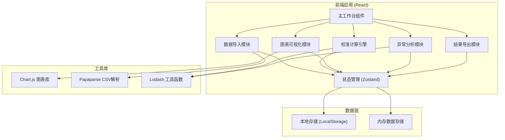
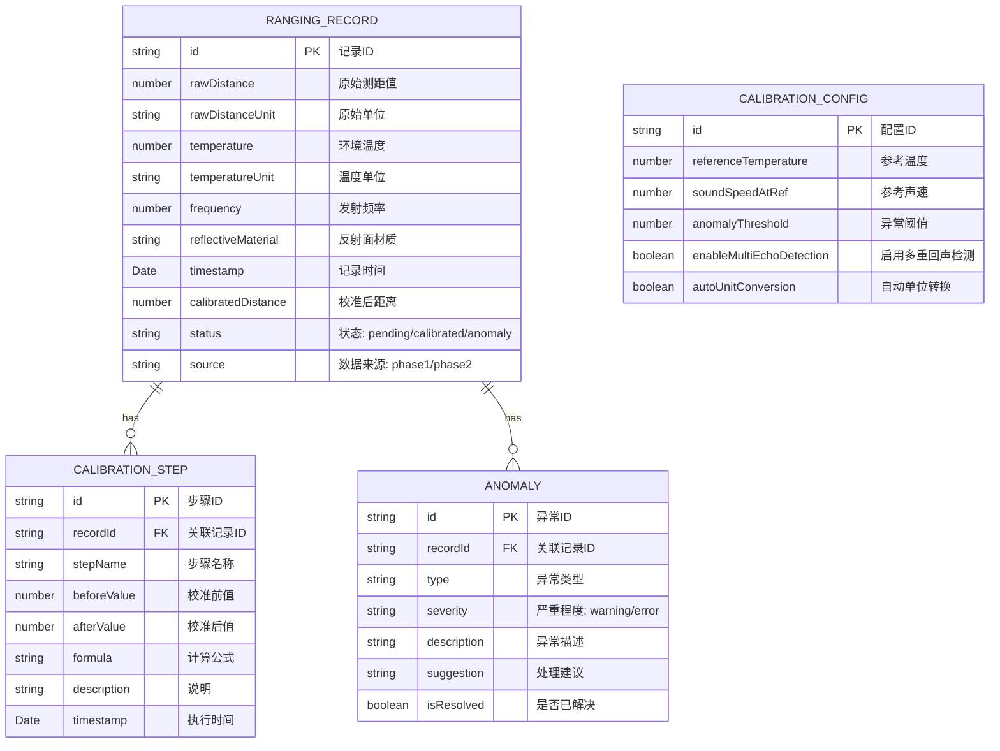

## 1. 架构设计



## 2. 技术选型说明

- **前端框架**: React@18 + TypeScript + Vite
- **状态管理**: Zustand (轻量级，适合单页应用)
- **样式方案**: TailwindCSS@3 + CSS Variables
- **图表库**: Chart.js + react-chartjs-2
- **数据解析**: Papaparse (CSV解析)
- **工具函数**: Lodash-es
- **导出功能**: 原生Blob + FileSaver
- **图标**: Lucide React
- **初始化工具**: Vite 官方模板

## 3. 路由定义

| 路由路径 | 页面组件 | 功能说明 |
|----------|----------|----------|
| `/` | MainWorkspace | 主工作台（唯一页面） |

**说明**: 本系统为单页应用，所有功能模块在主工作台内通过组件切换实现，无需多页面路由。

## 4. 数据模型定义

### 4.1 核心数据模型



### 4.2 TypeScript 类型定义

```typescript
// 测距记录
interface RangingRecord {
  id: string;
  rawDistance: number;
  rawDistanceUnit: 'm' | 'cm' | 'mm' | 'ft';
  temperature: number;
  temperatureUnit: 'C' | 'F' | 'K';
  frequency: number;
  reflectiveMaterial?: string;
  timestamp: Date;
  calibratedDistance?: number;
  status: 'pending' | 'calibrated' | 'anomaly';
  source: 'phase1' | 'phase2';
  calibrationSteps: CalibrationStep[];
  anomalies: Anomaly[];
  affectedByMaterial?: boolean;
}

// 校准步骤
interface CalibrationStep {
  id: string;
  stepName: string;
  beforeValue: number;
  afterValue: number;
  formula: string;
  description: string;
  timestamp: Date;
}

// 异常信息
interface Anomaly {
  id: string;
  type: 'temperature_uncorrected' | 'multiple_echo' | 'unit_confusion' | 'outlier' | 'material_missing';
  severity: 'warning' | 'error';
  description: string;
  suggestion: string;
  isResolved: boolean;
  value?: number;
  expectedRange?: [number, number];
}

// 校准配置
interface CalibrationConfig {
  referenceTemperature: number;
  soundSpeedAtRef: number;
  anomalyThreshold: number;
  enableMultiEchoDetection: boolean;
  autoUnitConversion: boolean;
  materialCorrectionFactors: Record<string, number>;
}

// 校准结果汇总
interface CalibrationSummary {
  totalRecords: number;
  calibratedCount: number;
  anomalyCount: number;
  averageError: number;
  maxError: number;
  temperatureImpact: number;
  materialImpact: number;
}
```

## 5. 核心算法设计

### 5.1 声速温度校正算法

```
声速计算公式: v = v0 * sqrt(T / T0)
其中:
- v: 实际声速 (m/s)
- v0: 0°C时的声速 = 331.3 m/s
- T: 绝对温度 (K) = t + 273.15
- T0: 参考温度 = 273.15 K

简化公式: v = 331.3 * sqrt(1 + t/273.15) ≈ 331.3 + 0.606 * t
```

### 5.2 多重回声检测算法

```
检测逻辑:
1. 按时间排序所有记录
2. 计算相邻记录的时间差和距离差
3. 如果多条记录满足:
   - 时间差 < 阈值 (如100ms)
   - 距离值呈倍数关系 (d2 ≈ 2*d1, d3 ≈ 3*d1)
4. 则标记为多重回声，保留第一条为主波
```

### 5.3 异常数据剔除算法

```
采用IQR (四分位距) 方法:
1. 计算所有校准后距离的Q1和Q3
2. IQR = Q3 - Q1
3. 正常范围: [Q1 - k*IQR, Q3 + k*IQR], k=1.5
4. 超出范围的数据标记为异常值

注: 算法具有确定性，相同输入产生相同输出
```

### 5.4 反射面材质校正

```
材质影响系数:
- 光滑金属: 1.00 (无衰减)
- 混凝土: 0.98
- 木材: 0.95
- 布料: 0.85
- 泡沫: 0.70

校正公式: 校正距离 = 温度校正距离 * 材质系数
```

## 6. 模块划分与文件结构

```
src/
├── components/
│   ├── DataImport/           # 数据导入模块
│   │   ├── FileUploader.tsx
│   │   ├── DataPreview.tsx
│   │   └── PhaseIndicator.tsx
│   ├── CalibrationPanel/     # 校准控制面板
│   │   ├── ConfigSlider.tsx
│   │   ├── CalibrateButton.tsx
│   │   └── ProgressBar.tsx
│   ├── DataTable/            # 数据明细表格
│   │   ├── RangingTable.tsx
│   │   ├── TableRow.tsx
│   │   └── FilterBar.tsx
│   ├── Charts/               # 图表模块
│   │   ├── ComparisonChart.tsx
│   │   ├── ErrorChart.tsx
│   │   └── TempSoundSpeedChart.tsx
│   ├── AnomalyPanel/         # 异常说明面板
│   │   ├── AnomalyList.tsx
│   │   ├── AnomalyItem.tsx
│   │   └── Timeline.tsx
│   ├── ExportPanel/          # 导出模块
│   │   ├── ExportOptions.tsx
│   │   └── ReportGenerator.ts
│   └── RecordDetail/         # 记录详情
│       ├── DetailModal.tsx
│       ├── CalibrationTrail.tsx
│       └── ImpactHeatmap.tsx
├── store/                    # 状态管理
│   └── useCalibrationStore.ts
├── utils/                    # 工具函数
│   ├── calibration.ts        # 校准算法
│   ├── anomalyDetection.ts   # 异常检测
│   ├── unitConversion.ts     # 单位转换
│   └── export.ts             # 导出工具
├── types/                    # 类型定义
│   └── index.ts
├── constants/                # 常量配置
│   ├── materials.ts          # 材质系数
│   └── anomalies.ts          # 异常类型定义
├── App.tsx
├── main.tsx
└── index.css
```

## 7. 状态管理设计

### 7.1 Zustand Store 结构

```typescript
interface CalibrationState {
  // 数据
  records: RangingRecord[];
  config: CalibrationConfig;
  phase: 'phase1' | 'phase2' | 'complete';
  
  // UI 状态
  isCalibrating: boolean;
  selectedRecordId: string | null;
  activeFilters: string[];
  
  // Actions
  importRecords: (records: RangingRecord[]) => void;
  importMaterialData: (materialMap: Record<string, string>) => void;
  calibrate: () => void;
  updateConfig: (config: Partial<CalibrationConfig>) => void;
  selectRecord: (id: string | null) => void;
  setFilter: (filter: string) => void;
  exportResults: (format: 'csv' | 'json') => Blob;
  reset: () => void;
}
```

### 7.2 关键状态流转

```
phase1 (测距+温度导入) 
    ↓ 执行校准
phase1_calibrated (初步校准完成)
    ↓ 补录材质数据
phase2 (材质数据导入)
    ↓ 重新校准
phase2_calibrated (最终校准完成)
    ↓ 导出报告
complete
```

## 8. 性能与可靠性设计

1. **计算性能**: 大量数据校准采用 requestIdleCallback 分块处理
2. **内存管理**: 大图数据采用虚拟滚动，避免一次性渲染
3. **数据持久化**: 自动保存到 LocalStorage，刷新不丢失
4. **异常处理**: 所有计算过程包裹 try-catch，提供降级方案
5. **结果可复现**: 所有算法使用纯函数，相同输入产生相同输出
6. **版本兼容**: 数据模型包含版本号，支持后续升级迁移
