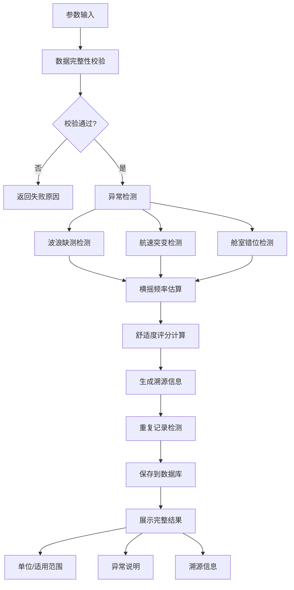

## 1. 产品概述

船舶横摇舒适度计算工具，为船舶设计师提供量化的横摇舒适度分析。解决客船改装后横摇频率变化导致的晕船投诉问题，帮助设计师向船东和乘客解释技术原因。

### 核心价值
- 将船体参数、波浪条件、航速、舱室位置等多源数据转化为可解释的舒适度评分
- 每条计算结论附带单位、适用范围和失败原因，而非单纯数字输出
- 支持数据溯源，每条判断可关联到原始输入数据来源
- 自动检测数据异常（波浪缺测、航速突变、舱室错位），避免错误合并
- 历史记录持久化，重启不丢失且不产生重复结论

### 目标用户
- 船舶设计师（主要用户）
- 船舶改装项目工程师
- 客船运营方技术负责人

---

## 2. 核心功能

### 2.1 用户角色

| 角色 | 注册方式 | 核心权限 |
|------|----------|----------|
| 设计师 | 无需注册，本地工具 | 执行计算、查看历史、管理数据来源 |

### 2.2 功能模块

1. **计算主页面**：参数输入、横摇估算、舒适度评分、异常检测、结果展示
2. **历史记录页面**：历史查询、结果对比、重复检测
3. **数据溯源面板**：原始数据查看、判断依据追溯

### 2.3 页面详情

| 页面名称 | 模块名称 | 功能描述 |
|----------|----------|----------|
| 计算主页 | 参数输入区 | 船体参数（排水量、初稳心高、横摇惯性半径）、波浪条件（有义波高、波浪周期）、航行参数（航速、航向角）、舱室位置（纵向位置、垂向位置） |
| 计算主页 | 计算结果区 | 横摇频率（单位：rad/s）、横摇幅值（单位：°）、舒适度评分（1-10级）、适用范围说明、失败原因（如计算失败） |
| 计算主页 | 异常检测区 | 波浪缺测警告、航速突变检测、舱室错位警告、错误合并预防 |
| 计算主页 | 溯源面板 | 每条评分依据对应原始参数来源、计算公式引用、行业标准参考 |
| 历史记录 | 历史列表 | 按时间排序的计算记录、船舶名称筛选、重复记录标记 |
| 历史记录 | 详情查看 | 单条记录完整参数、计算过程复现、与当前参数对比 |

---

## 3. 核心流程

用户输入船体参数、波浪条件、航行参数和舱室位置 → 系统校验数据完整性 → 检测异常值（波浪缺测、航速突变、舱室错位） → 计算横摇固有频率和受迫横摇幅值 → 基于ISO 2631标准计算舒适度评分 → 生成溯源信息 → 检查是否为重复计算 → 保存结果到数据库 → 展示结果（含单位、适用范围、异常说明、溯源信息）

---

## 4. 用户界面设计

### 4.1 设计风格
- **主色调**：深海蓝（#0A2463），代表海事行业专业感
- **辅助色**：警示橙（#E63946）用于异常警告，成功绿（#2A9D8F）用于正常状态
- **中性色**：冷灰系列（#F8F9FA, #E9ECEF, #DEE2E6, #495057, #212529）
- **字体**：标题使用 "Playfair Display"  serif字体体现专业质感，正文使用 "Inter" 保障可读性
- **布局风格**：卡片式布局，左侧输入区、右侧结果区，顶部导航
- **按钮风格**：圆角8px，悬停有微妙阴影变化，点击有按压反馈
- **图标风格**：使用线性图标，保持简洁专业

### 4.2 页面设计概览

| 页面名称 | 模块名称 | UI元素 |
|----------|----------|--------|
| 计算主页 | 导航栏 | Logo、页面切换、历史记录入口 |
| 计算主页 | 参数输入卡片 | 分组表单、标签+输入框、单位标注、数据来源选择 |
| 计算主页 | 计算结果卡片 | 大号数值显示、单位标注、适用范围说明框、失败原因红色警告框 |
| 计算主页 | 异常检测卡片 | 三栏布局分别展示波浪/航速/舱室检测结果，异常时橙色高亮 |
| 计算主页 | 溯源面板 | 可折叠面板，每条评分对应参数来源和计算公式 |
| 历史记录 | 列表卡片 | 表格展示记录，重复记录行浅红色背景标记 |
| 历史记录 | 详情弹窗 | 左右对比布局，左侧历史数据、右侧当前数据 |

### 4.3 响应式
- 桌面端（>1200px）：左右双栏布局，输入区40%、结果区60%
- 平板端（768px-1200px）：上下布局，输入区在上、结果区在下
- 移动端（<768px）：单列流式布局，卡片全宽显示，关键信息优先展示

### 4.4 动效设计
- 页面加载：卡片依次淡入，延迟50ms错开
- 计算过程：进度条动画，配合状态文字提示
- 异常警告：红色边框脉冲动画，吸引注意
- 结果数字：从0滚动到目标值的数字动画
- 悬停效果：卡片上浮2px，阴影加深
