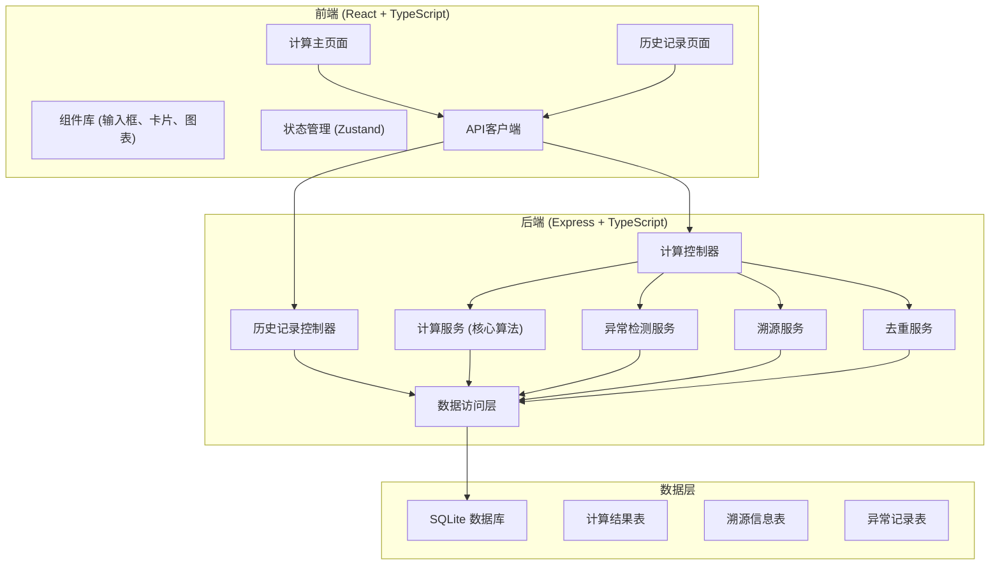
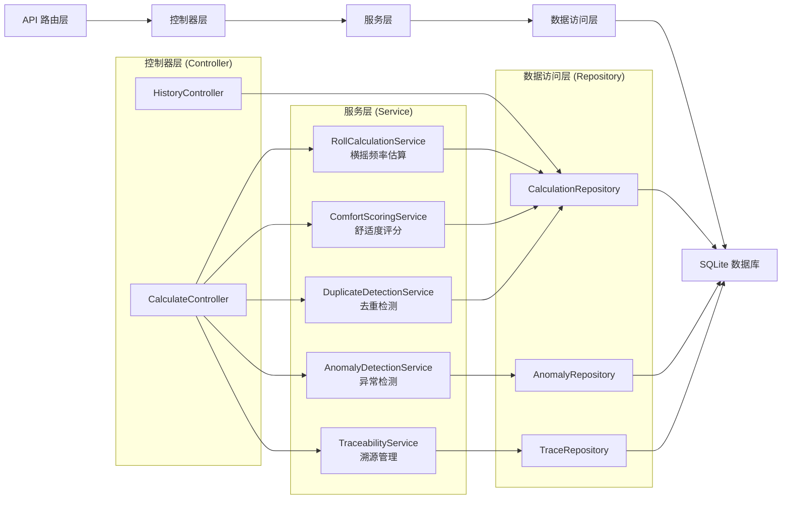
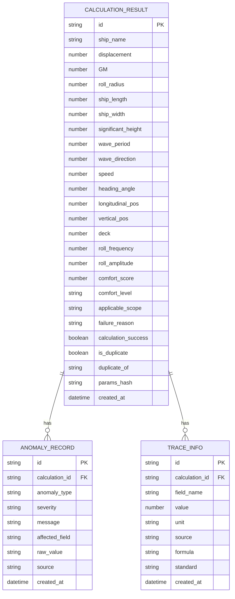

## 1. 架构设计



## 2. 技术描述

- **前端框架**：React@18 + TypeScript
- **构建工具**：Vite@5
- **样式方案**：TailwindCSS@3
- **状态管理**：Zustand@4
- **路由管理**：React Router DOM@6
- **图标库**：Lucide React
- **后端框架**：Express@4 + TypeScript
- **数据库**：SQLite3 + better-sqlite3
- **ORM**：无，直接使用参数化查询保证性能
- **包管理器**：npm

### 核心算法依赖
- 横摇频率估算：基于船舶静力学公式
- 舒适度评分：ISO 2631-1 标准
- 异常检测：统计过程控制（SPC）方法

## 3. 路由定义

| 路由 | 页面/接口 | 用途 |
|------|----------|------|
| / | 计算主页 | 参数输入、计算执行、结果展示 |
| /history | 历史记录页 | 历史查询、结果对比 |
| /api/calculate | POST 接口 | 执行横摇舒适度计算 |
| /api/history | GET 接口 | 查询历史记录列表 |
| /api/history/:id | GET 接口 | 获取单条历史记录详情 |
| /api/history/:id | DELETE 接口 | 删除单条历史记录 |

## 4. API 定义

### 4.1 计算请求类型

```typescript
interface DataSource {
  name: string;
  file?: string;
  timestamp: string;
}

interface HullParams {
  displacement: number;      // 排水量，单位：吨
  GM: number;                // 初稳心高，单位：m
  rollRadius: number;        // 横摇惯性半径，单位：m
  shipLength: number;        // 船长，单位：m
  shipWidth: number;         // 船宽，单位：m
  source: DataSource;
}

interface WaveParams {
  significantHeight: number | null;  // 有义波高，单位：m（可能缺测）
  wavePeriod: number | null;         // 波浪周期，单位：s（可能缺测）
  waveDirection: number | null;      // 浪向角，单位：°（可能缺测）
  source: DataSource;
}

interface NavigationParams {
  speed: number;             // 航速，单位：节
  speedHistory?: number[];   // 历史航速序列，用于突变检测
  headingAngle: number;      // 航向角，单位：°
  source: DataSource;
}

interface CabinParams {
  longitudinalPos: number;   // 纵向位置，距船舯，单位：m
  verticalPos: number;       // 垂向位置，距基线，单位：m
  deck: number;              // 甲板层
  source: DataSource;
}

interface CalculateRequest {
  shipName: string;
  hullParams: HullParams;
  waveParams: WaveParams;
  navigationParams: NavigationParams;
  cabinParams: CabinParams;
}
```

### 4.2 计算响应类型

```typescript
interface AnomalyInfo {
  type: 'wave_missing' | 'speed_jump' | 'cabin_misalignment';
  severity: 'warning' | 'error';
  message: string;
  affectedField: string;
  rawValue: any;
  source: string;
}

interface TraceInfo {
  field: string;
  value: number;
  unit: string;
  source: string;
  formula: string;
  standard: string;
}

interface CalculateResult {
  rollFrequency: number;           // 横摇固有频率，单位：rad/s
  rollAmplitude: number;           // 横摇幅值，单位：°
  comfortScore: number;            // 舒适度评分，1-10
  comfortLevel: string;            // 舒适度等级描述
  rollFrequencyUnit: string;
  rollAmplitudeUnit: string;
  comfortScoreUnit: string;
  applicableScope: string;         // 适用范围说明
  failureReason?: string;          // 失败原因（如果计算失败）
  calculationSuccess: boolean;
  anomalies: AnomalyInfo[];        // 检测到的异常
  traceability: TraceInfo[];       // 溯源信息
  isDuplicate: boolean;            // 是否为重复计算
  duplicateOf?: string;            // 重复记录ID
  createdAt: string;
  id: string;
}
```

## 5. 服务器架构图



## 6. 数据模型

### 6.1 数据模型定义



### 6.2 数据定义语言

```sql
-- 计算结果表
CREATE TABLE IF NOT EXISTS calculation_results (
    id TEXT PRIMARY KEY,
    ship_name TEXT NOT NULL,
    displacement REAL NOT NULL,
    GM REAL NOT NULL,
    roll_radius REAL NOT NULL,
    ship_length REAL NOT NULL,
    ship_width REAL NOT NULL,
    significant_height REAL,
    wave_period REAL,
    wave_direction REAL,
    speed REAL NOT NULL,
    heading_angle REAL NOT NULL,
    longitudinal_pos REAL NOT NULL,
    vertical_pos REAL NOT NULL,
    deck INTEGER NOT NULL,
    roll_frequency REAL,
    roll_amplitude REAL,
    comfort_score REAL,
    comfort_level TEXT,
    applicable_scope TEXT,
    failure_reason TEXT,
    calculation_success INTEGER NOT NULL DEFAULT 0,
    is_duplicate INTEGER NOT NULL DEFAULT 0,
    duplicate_of TEXT,
    params_hash TEXT NOT NULL,
    created_at TEXT NOT NULL DEFAULT CURRENT_TIMESTAMP
);

CREATE INDEX IF NOT EXISTS idx_calc_ship_name ON calculation_results(ship_name);
CREATE INDEX IF NOT EXISTS idx_calc_params_hash ON calculation_results(params_hash);
CREATE INDEX IF NOT EXISTS idx_calc_created_at ON calculation_results(created_at);

-- 异常记录表
CREATE TABLE IF NOT EXISTS anomaly_records (
    id TEXT PRIMARY KEY,
    calculation_id TEXT NOT NULL,
    anomaly_type TEXT NOT NULL,
    severity TEXT NOT NULL,
    message TEXT NOT NULL,
    affected_field TEXT NOT NULL,
    raw_value TEXT,
    source TEXT,
    created_at TEXT NOT NULL DEFAULT CURRENT_TIMESTAMP,
    FOREIGN KEY (calculation_id) REFERENCES calculation_results(id) ON DELETE CASCADE
);

CREATE INDEX IF NOT EXISTS idx_anomaly_calc_id ON anomaly_records(calculation_id);

-- 溯源信息表
CREATE TABLE IF NOT EXISTS trace_info (
    id TEXT PRIMARY KEY,
    calculation_id TEXT NOT NULL,
    field_name TEXT NOT NULL,
    value REAL NOT NULL,
    unit TEXT NOT NULL,
    source TEXT NOT NULL,
    formula TEXT NOT NULL,
    standard TEXT,
    created_at TEXT NOT NULL DEFAULT CURRENT_TIMESTAMP,
    FOREIGN KEY (calculation_id) REFERENCES calculation_results(id) ON DELETE CASCADE
);

CREATE INDEX IF NOT EXISTS idx_trace_calc_id ON trace_info(calculation_id);
```
