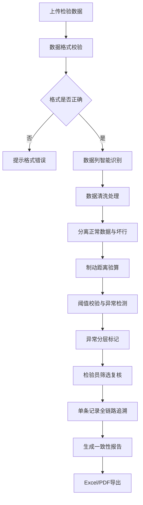

## 1. 产品概述

电梯制动距离验算系统是面向特种设备检验员的专业数据处理工具，用于解决电梯检验数据中载荷、速度、制动时间分散导致的手工计算误差问题，特别是速度缺口环节的偏差风险。系统实现从电梯档案导入、数据清洗、制动距离计算、异常检测到报告导出的全链路追溯，确保异常说明、图表和导出结果的数据一致性。

- 核心目标：自动化处理电梯检验原始数据，准确计算制动距离，智能识别速度缺口、制动延迟、载荷超限等异常
- 目标用户：特种设备检验员、电梯安全检测人员
- 市场价值：提升检验数据处理效率，降低人工计算错误率，建立可追溯的数据质量保障体系

## 2. 核心功能

### 2.1 用户角色

| 角色 | 注册方式 | 核心权限 |
|------|----------|----------|
| 特种设备检验员 | 系统登录 | 数据导入、验算、异常复核、报告导出、数据追溯 |
| 系统管理员 | 系统登录 | 用户管理、阈值配置、系统维护 |

### 2.2 功能模块

1. **数据导入模块**：支持 Excel/CSV 导入，处理空行、备注、缺列等非标准化数据
2. **数据清洗模块**：自动识别坏行，单独列表展示，保留原始数据痕迹
3. **制动距离验算模块**：基于载荷、速度、制动时间进行科学计算
4. **异常检测模块**：速度缺口检测、制动延迟检测、载荷超限检测
5. **阈值校验模块**：多层级异常分层（正常/警告/严重/超限）
6. **数据追溯模块**：电梯档案→计算过程→阈值校验→异常结果的全链路追踪
7. **图表展示模块**：速度曲线、制动距离趋势、异常分布图表
8. **报告导出模块**：Excel/PDF 导出，确保数据一致性
9. **筛选复核模块**：按异常类型、电梯编号、检验日期等多维度筛选

### 2.3 页面详情

| 页面名称 | 模块名称 | 功能描述 |
|-----------|-------------|---------------------|
| 首页仪表盘 | 数据概览 | 今日检验量、异常统计、处理进度概览 |
| 数据导入页 | 文件上传 | 拖拽上传、格式校验、原始数据预览 |
| 数据清洗页 | 清洗处理 | 数据列映射、空行处理、坏行识别与隔离 |
| 验算结果页 | 核心计算 | 制动距离计算、阈值校验、异常标记 |
| 异常复核页 | 异常处理 | 速度缺口/制动延迟/载荷超限筛选、复核标记 |
| 数据追溯页 | 链路追踪 | 单条记录全链路追溯视图 |
| 图表分析页 | 可视化 | 速度曲线对比、制动距离趋势、异常分布饼图 |
| 报告导出页 | 导出配置 | 导出格式选择、数据范围选择、报告预览 |
| 系统设置页 | 阈值配置 | 制动距离阈值、速度缺口阈值、载荷限值配置 |

## 3. 核心流程

### 3.1 主业务流程

检验员上传电梯检验原始数据文件，系统自动识别数据列并进行清洗，分离正常数据与坏行。对正常数据执行制动距离验算，同时进行阈值校验和异常检测。检验员可通过多维度筛选器定位异常记录（特别是速度缺口和制动延迟），支持单条记录的全链路追溯。确认无误后导出一致性报告，确保异常说明、图表数据与导出结果完全匹配。

### 3.2 数据追溯流程

## 4. 用户界面设计

### 4.1 设计风格

- **主色调**：专业工业蓝 (#1E3A8A)，代表专业、可靠、安全
- **辅助色**：
  - 正常：深绿 (#065F46)
  - 警告：琥珀色 (#92400E)
  - 严重：橙红 (#C2410C)
  - 超限：深红 (#991B1B)
- **字体**：
  - 标题：Noto Sans SC Bold，专业稳重
  - 正文：Noto Sans SC Regular，清晰可读
  - 数据表格：JetBrains Mono，数字对齐精确
- **布局风格**：
  - 顶部导航 + 左侧菜单 + 主内容区三栏布局
  - 数据密集型表格设计，支持固定列、横向滚动
  - 卡片式模块分隔，层次分明
- **图标风格**：线性图标，专业简洁，符合工业软件调性

### 4.2 页面设计概述

| 页面名称 | 模块名称 | UI 元素 |
|-----------|-------------|----------|
| 首页仪表盘 | 数据概览 | 统计卡片、趋势折线图、异常分布饼图、实时进度条 |
| 数据导入页 | 文件上传 | 拖拽上传区、文件信息卡、原始数据预览表、格式说明 |
| 数据清洗页 | 清洗处理 | 列映射配置器、正常数据/坏行双栏对比、清洗规则配置 |
| 验算结果页 | 核心计算 | 分页数据表格、行内计算详情、异常标记徽章、批量操作 |
| 异常复核页 | 异常处理 | 多维度筛选器、异常分类标签、复核状态切换、备注输入 |
| 数据追溯页 | 链路追踪 | 时间轴式追溯视图、各环节数据卡片、计算过程公式展示 |
| 图表分析页 | 可视化 | 速度曲线对比图、制动距离趋势图、异常分布热力图 |
| 报告导出页 | 导出配置 | 导出选项表单、报告实时预览、下载进度条 |

### 4.3 响应式设计

- 桌面端优先设计，支持 1920px 及以上宽屏显示
- 数据表格支持横向滚动，适配小屏幕设备
- 移动端简化布局，保留核心数据查看功能
- 触摸操作优化，按钮最小尺寸 44px

### 4.4 专业数据展示规范

- 所有数值保留 4 位有效数字，制动距离精确到 0.001m
- 速度曲线图表必须标注理论速度线与实际速度线的差值
- 异常记录必须用背景色高亮，异常等级用不同颜色边框区分
- 数据追溯链路中的每一步都必须显示原始值、计算值、阈值对比
