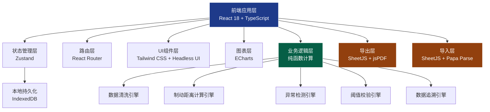
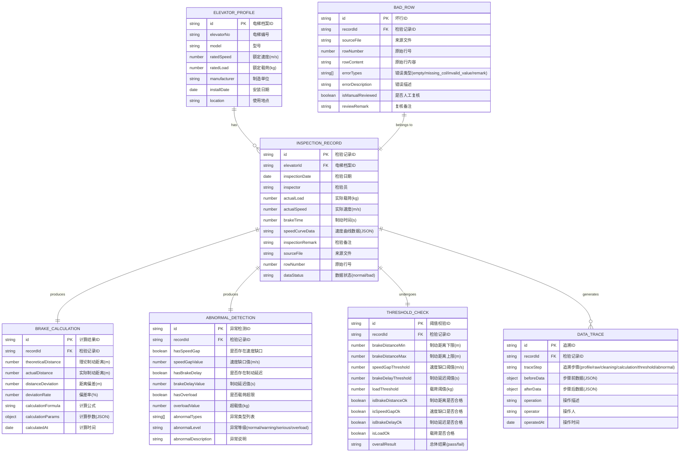

## 1. 架构设计



## 2. 技术描述

- **前端框架**：React 18 + TypeScript 5，类型安全的组件开发
- **构建工具**：Vite 5，快速开发构建
- **状态管理**：Zustand 4，轻量可预测的状态管理，避免依赖后台变量
- **路由**：React Router 6，单页应用路由管理
- **样式方案**：Tailwind CSS 3，原子化 CSS，结合 CSS 变量实现主题系统
- **UI 组件**：Headless UI + Radix UI Primitives，无障碍组件
- **数据表格**：TanStack Table 8，高性能虚拟化表格
- **图表可视化**：ECharts 5，专业科学图表
- **文件导入**：SheetJS (xlsx) + Papa Parse，支持 Excel/CSV 解析
- **文件导出**：SheetJS (xlsx) + jsPDF + autoTable，Excel/PDF 导出
- **本地存储**：IndexedDB (Dexie.js)，大容量本地数据持久化
- **表单处理**：React Hook Form + Zod，类型安全表单验证
- **日期处理**：date-fns，轻量日期工具库
- **数据 Mock**：内置 Mock 数据生成器，提供电梯检验样本数据

## 3. 路由定义

| 路由路径 | 页面组件 | 用途 |
|---------|---------|------|
| `/` | DashboardPage | 首页仪表盘 - 数据概览与统计 |
| `/import` | ImportPage | 数据导入 - 文件上传与预览 |
| `/cleaning` | CleaningPage | 数据清洗 - 坏行识别与处理 |
| `/calculation` | CalculationPage | 验算结果 - 制动距离计算列表 |
| `/review` | ReviewPage | 异常复核 - 异常筛选与标记 |
| `/trace/:id` | TracePage | 数据追溯 - 单条记录全链路 |
| `/charts` | ChartsPage | 图表分析 - 可视化图表展示 |
| `/export` | ExportPage | 报告导出 - 报告生成与下载 |
| `/settings` | SettingsPage | 系统设置 - 阈值配置管理 |

## 4. 核心数据模型

### 4.1 数据模型定义



### 4.2 核心类型定义

```typescript
// 电梯档案
interface ElevatorProfile {
  id: string;
  elevatorNo: string;
  model: string;
  ratedSpeed: number;
  ratedLoad: number;
  manufacturer: string;
  installDate: string;
  location: string;
}

// 检验记录（原始数据）
interface InspectionRecord {
  id: string;
  elevatorId: string;
  inspectionDate: string;
  inspector: string;
  actualLoad: number;
  actualSpeed: number;
  brakeTime: number;
  speedCurveData: SpeedPoint[];
  inspectionRemark: string;
  sourceFile: string;
  rowNumber: number;
  dataStatus: 'normal' | 'bad';
}

// 速度曲线点
interface SpeedPoint {
  time: number;
  speed: number;
}

// 制动距离计算结果
interface BrakeCalculation {
  id: string;
  recordId: string;
  theoreticalDistance: number;
  actualDistance: number;
  distanceDeviation: number;
  deviationRate: number;
  calculationFormula: string;
  calculationParams: CalculationParams;
  calculatedAt: string;
}

// 计算参数
interface CalculationParams {
  ratedSpeed: number;
  actualLoad: number;
  ratedLoad: number;
  brakeTime: number;
  frictionCoefficient: number;
  gravityAcceleration: number;
}

// 异常检测结果
interface AbnormalDetection {
  id: string;
  recordId: string;
  hasSpeedGap: boolean;
  speedGapValue: number;
  hasBrakeDelay: boolean;
  brakeDelayValue: number;
  hasOverload: boolean;
  overloadValue: number;
  abnormalTypes: string[];
  abnormalLevel: 'normal' | 'warning' | 'serious' | 'overload';
  abnormalDescription: string;
}

// 阈值校验结果
interface ThresholdCheck {
  id: string;
  recordId: string;
  brakeDistanceMin: number;
  brakeDistanceMax: number;
  speedGapThreshold: number;
  brakeDelayThreshold: number;
  loadThreshold: number;
  isBrakeDistanceOk: boolean;
  isSpeedGapOk: boolean;
  isBrakeDelayOk: boolean;
  isLoadOk: boolean;
  overallResult: 'pass' | 'fail';
}

// 数据追溯节点
interface DataTrace {
  id: string;
  recordId: string;
  traceStep: 'profile' | 'raw' | 'cleaning' | 'calculation' | 'threshold' | 'abnormal';
  beforeData: Record<string, any>;
  afterData: Record<string, any>;
  operation: string;
  operator: string;
  operatedAt: string;
}

// 坏行记录
interface BadRow {
  id: string;
  recordId: string;
  sourceFile: string;
  rowNumber: number;
  rowContent: string;
  errorTypes: Array<'empty' | 'missing_col' | 'invalid_value' | 'remark'>;
  errorDescription: string;
  isManualReviewed: boolean;
  reviewRemark: string;
}

// 系统阈值配置
interface ThresholdConfig {
  brakeDistance: {
    warningMinRate: number;
    warningMaxRate: number;
    seriousMinRate: number;
    seriousMaxRate: number;
  };
  speedGap: {
    warningThreshold: number;
    seriousThreshold: number;
  };
  brakeDelay: {
    warningThreshold: number;
    seriousThreshold: number;
  };
  load: {
    warningRate: number;
    overloadRate: number;
  };
}

// 导出报告数据
interface ExportReport {
  reportId: string;
  generatedAt: string;
  generatedBy: string;
  summary: ReportSummary;
  records: ExportRecord[];
  badRows: BadRow[];
  charts: ChartData[];
}

interface ReportSummary {
  totalRecords: number;
  normalCount: number;
  warningCount: number;
  seriousCount: number;
  overloadCount: number;
  badRowCount: number;
  passRate: number;
}

interface ExportRecord {
  elevatorNo: string;
  inspectionDate: string;
  ratedSpeed: number;
  ratedLoad: number;
  actualLoad: number;
  actualSpeed: number;
  brakeTime: number;
  theoreticalDistance: number;
  actualDistance: number;
  deviationRate: number;
  abnormalLevel: string;
  abnormalDescription: string;
  overallResult: string;
}
```

## 5. 核心算法说明

### 5.1 制动距离计算公式

根据 GB 7588-2003《电梯制造与安装安全规范》：

```
理论制动距离 S = (v²) / (2 × g × f)

其中：
- v：电梯额定速度 (m/s)
- g：重力加速度 (9.8 m/s²)
- f：摩擦系数（根据载荷修正）

载荷修正系数：
f = f0 × (1 + k × (Wrated - Wactual) / Wrated)

其中：
- f0：基准摩擦系数（通常取 0.08~0.12）
- k：载荷影响系数
- Wrated：额定载荷
- Wactual：实际载荷
```

### 5.2 速度缺口检测算法

```
1. 从速度曲线数据中提取制动阶段
2. 计算理论减速度 a_theoretical = v0 / t_brake
3. 对速度曲线进行分段线性拟合
4. 检测实际速度曲线与理论减速曲线的差值
5. 当差值超过阈值时标记为速度缺口

速度缺口值 = max(|v_actual(t) - v_theoretical(t)|)  for t ∈ [0, t_brake]
```

### 5.3 制动延迟检测算法

```
1. 检测制动指令发出时间点 t0
2. 检测速度开始下降的时间点 t1
3. 制动延迟 = t1 - t0
4. 当制动延迟 > 阈值时标记异常
```

### 5.4 数据一致性保障机制

```
1. 所有计算结果与原始数据绑定，存储完整计算过程
2. 异常说明、图表数据、导出结果使用同一数据源
3. 导出时进行数据哈希校验，确保数据未被篡改
4. 每次修改阈值配置后自动重新计算所有相关记录
5. 数据追溯链路采用不可变数据结构，防止中途修改
```

## 6. 状态管理设计

### 6.1 Store 分层设计

```typescript
// elevatorStore.ts - 电梯档案管理
// inspectionStore.ts - 检验记录管理
// calculationStore.ts - 计算结果管理
// thresholdStore.ts - 阈值配置管理
// traceStore.ts - 数据追溯管理
// exportStore.ts - 报告导出管理
// uiStore.ts - UI 状态管理
```

### 6.2 数据流动原则

- **单向数据流**：所有数据修改通过 action 进行，状态变更可追踪
- **计算派生**：制动距离、异常检测等结果从原始数据派生，不手动修改
- **本地持久化**：核心数据自动持久化到 IndexedDB，刷新不丢失
- **版本记录**：每次阈值修改、数据重新计算都保留版本记录
