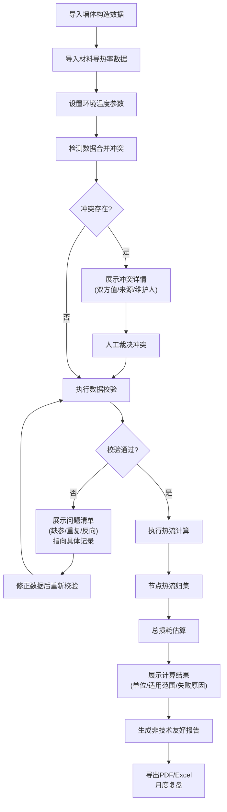

## 1. 产品概述

建筑热桥损耗分析计算工具，专为建筑节能顾问设计，解决墙体构造数据与材料导热率维护分离导致的计算延迟问题。工具围绕热流计算主线，提供完整的节点归集、损耗估算、数据校验和报告导出能力，让计算过程透明可追溯，结果对非技术人员友好。

- **核心价值**：消除数据合并冲突黑盒，让缺参、重复、反向温差等问题可定位可追溯，计算结果附带完整上下文信息
- **目标用户**：建筑节能顾问、建筑物理分析师、项目管理者

## 2. 核心功能

### 2.1 用户角色

| 角色 | 核心权限 |
|------|----------|
| 节能顾问 | 数据录入、热桥计算、查看结果、导出报告 |
| 材料管理员 | 维护材料导热率数据库 |
| 构造设计师 | 维护墙体构造节点库 |

### 2.2 功能模块

1. **数据输入面板**：墙体构造导入、材料导热率导入、室内外温度参数设置
2. **冲突检测中心**：构造与材料数据合并冲突可视化、人工裁决界面
3. **数据校验引擎**：材料缺参检测、节点重复检测、温差反向检测
4. **热桥计算引擎**：热流密度计算、节点热流归集、总损耗估算
5. **结果展示面板**：计算结果展示（含单位、适用范围、失败原因）
6. **报告导出模块**：月度复盘报告、非技术友好说明

### 2.3 页面详情

| 页面名称 | 模块名称 | 功能描述 |
|-----------|-------------|---------------------|
| 首页仪表盘 | 数据概览 | 待处理冲突数、待校验记录、本月计算统计、快速操作入口 |
| 数据输入页 | 构造数据导入 | 支持Excel/JSON导入墙体构造，显示来源记录标识 |
| 数据输入页 | 材料数据导入 | 支持Excel/JSON导入材料导热率，显示维护人信息 |
| 数据输入页 | 环境参数设置 | 室内温度、室外温度、计算周期设置 |
| 冲突检测页 | 冲突列表 | 列出所有数据合并冲突，显示双方值、来源、维护人 |
| 冲突检测页 | 冲突裁决 | 人工选择采用值，或输入自定义值，保留裁决记录 |
| 数据校验页 | 校验结果 | 缺参材料列表（指向具体记录）、重复节点列表（指向具体记录）、温差反向列表（指向具体记录） |
| 计算中心页 | 热流计算 | 启动计算，显示进度，各节点热流密度实时更新 |
| 计算中心页 | 结果展示 | 分项结果带单位标注、适用范围说明、失败原因追溯 |
| 报告导出页 | 报告预览 | 可视化预览报告，非技术友好解释区 |
| 报告导出页 | 导出功能 | 支持PDF/Excel导出，月度复盘数据汇总 |

## 3. 核心流程

用户导入墙体构造数据和材料导热率数据 → 系统自动检测合并冲突并展示 → 用户裁决冲突或自动处理 → 系统执行数据校验（缺参/重复/反向） → 校验通过后执行热桥计算 → 展示带完整上下文的计算结果 → 生成并导出非技术友好报告。

## 4. 用户界面设计

### 4.1 设计风格
- **主色调**：专业工程蓝 (#1e3a5f) 作为主色，传达可靠性和专业感
- **辅助色**：警戒橙 (#e67e22) 标记冲突，警告红 (#c0392b) 标记错误，通过绿 (#27ae60) 标记正常
- **中性色**：深灰 (#2c3e50) 用于文字，浅灰灰阶用于背景分层
- **字体**：标题使用 Inter（现代专业），正文使用 Source Han Sans SC（中文清晰可读），数值使用 JetBrains Mono（等宽易比对）
- **按钮风格**：直角微圆角 (3px)，边框清晰，悬停有微妙阴影变化，工程软件质感
- **布局风格**：卡片式布局，左侧导航 + 右侧内容区，表格为核心展示方式，数据密度适中
- **图标风格**：线性细边图标 (lucide-react)，保持工程图纸的简洁感

### 4.2 页面设计概览

| 页面名称 | 模块名称 | UI元素 |
|-----------|-------------|-------------|
| 首页仪表盘 | 数据概览 | 统计卡片（带小趋势图）、快捷操作按钮、待办事项列表、最近计算记录 |
| 冲突检测页 | 冲突列表 | 对比表格（构造值 vs 材料值）、来源标签、维护人标签、裁决按钮、冲突严重度标识 |
| 数据校验页 | 校验结果 | 问题分类标签页、问题列表带定位链接、一键修复按钮、修正前后对比 |
| 计算中心页 | 结果展示 | 结果卡片（大字体数值+单位）、适用范围折叠面板、失败原因时间线追溯、数据来源链展示 |
| 报告导出页 | 报告预览 | 分区展示（技术数据区 + 人话解释区）、材料缺参专项说明、可视化图表、导出格式选择 |

### 4.3 响应式
- Desktop-first 设计，断点 1280px / 1024px / 768px
- 平板端：左侧导航收起为图标菜单
- 移动端：底部Tab导航，表格横向滚动支持
- 所有数据表格支持列宽拖拽调整

### 4.4 动效设计
- 数据加载：骨架屏逐行显示，模拟计算进度
- 冲突标记：发现冲突时橙色边框脉冲提示
- 计算进度：进度条配合节点逐个点亮动画
- 页面切换：淡入 + 轻微上移动画，时长 200ms
- 数值变化：结果数值从0滚动到最终值，增强计算完成感
