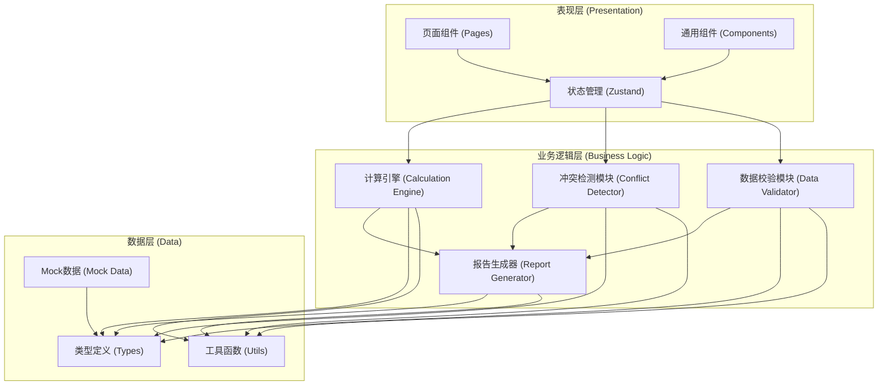
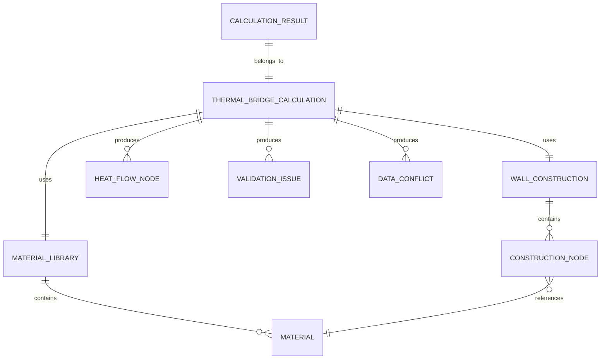

## 1. 架构设计

纯前端应用架构，数据处理和计算全部在浏览器端完成，无需后端服务支持。采用分层架构确保计算逻辑与UI展示分离，便于维护和扩展。



## 2. 技术描述

- **前端框架**：React@18 + TypeScript@5
- **构建工具**：Vite@5
- **样式方案**：Tailwind CSS@3
- **状态管理**：Zustand@4
- **路由管理**：React Router DOM@6
- **图标库**：lucide-react@0.344
- **图表库**：recharts@2（用于报告可视化）
- **导出库**：jspdf@2 + jspdf-autotable@3（PDF导出）, xlsx@0.18（Excel导出）
- **初始化模板**：react-ts（纯前端，无后端）
- **数据方案**：本地Mock数据 + localStorage持久化

## 3. 路由定义

| 路由 | 页面组件 | 用途 |
|-------|---------|------|
| / | Dashboard | 首页仪表盘，数据概览与快速操作 |
| /data-input | DataInput | 数据输入页，构造与材料数据导入 |
| /conflicts | ConflictDetection | 冲突检测与裁决中心 |
| /validation | DataValidation | 数据校验结果与问题定位 |
| /calculation | CalculationCenter | 热桥计算中心与结果展示 |
| /reports | ReportExport | 报告预览与导出 |

## 4. 数据模型

### 4.1 实体关系图



### 4.2 核心数据类型定义

```typescript
// 材料定义
interface Material {
  id: string;
  name: string;
  thermalConductivity: number | null; // W/(m·K)
  thickness: number | null; // m
  density: number | null; // kg/m³
  specificHeat: number | null; // J/(kg·K)
  maintainedBy: string;
  lastUpdated: Date;
  sourceRecord: string;
}

// 墙体构造节点
interface ConstructionNode {
  id: string;
  nodeCode: string;
  name: string;
  layerOrder: number;
  materialId: string;
  thickness: number; // m
  area: number; // m²
  isThermalBridge: boolean;
  bridgeType?: 'linear' | 'point' | 'planar';
  psiValue?: number; // W/(m·K) - 线性热桥系数
  chiValue?: number; // W/K - 点状热桥系数
  maintainedBy: string;
  sourceRecord: string;
}

// 墙体构造
interface WallConstruction {
  id: string;
  name: string;
  nodes: ConstructionNode[];
  maintainedBy: string;
  lastUpdated: Date;
}

// 材料库
interface MaterialLibrary {
  id: string;
  name: string;
  materials: Material[];
  maintainedBy: string;
  lastUpdated: Date;
}

// 环境参数
interface EnvironmentParams {
  indoorTemperature: number; // °C
  outdoorTemperature: number; // °C
  calculationPeriod: number; // days
  relativeHumidity?: number; // %
}

// 数据冲突
interface DataConflict {
  id: string;
  type: 'material_thickness' | 'thermal_conductivity' | 'material_assignment';
  fieldName: string;
  nodeId: string;
  materialId: string;
  constructionValue: number | string;
  materialValue: number | string;
  constructionSource: string;
  materialSource: string;
  constructionMaintainer: string;
  materialMaintainer: string;
  resolved: boolean;
  resolvedValue?: number | string;
  resolvedBy?: string;
  resolvedAt?: Date;
  resolutionNote?: string;
}

// 校验问题
interface ValidationIssue {
  id: string;
  type: 'missing_parameter' | 'duplicate_node' | 'reversed_temperature';
  severity: 'error' | 'warning';
  message: string;
  humanReadableExplanation: string;
  sourceRecordId: string;
  sourceRecordType: 'node' | 'material' | 'environment';
  fieldName?: string;
  expectedValue?: number | string;
  actualValue?: number | string;
}

// 热流节点计算结果
interface HeatFlowNode {
  nodeId: string;
  nodeName: string;
  heatFlowDensity: number; // W/m²
  heatFlowRate: number; // W
  thermalResistance: number; // m²·K/W
  temperatureDrop: number; // K
  calculationDetails: {
    formula: string;
    inputs: Record<string, number>;
  };
}

// 计算结果
interface CalculationResult {
  id: string;
  calculationId: string;
  status: 'success' | 'failed' | 'partial';
  totalHeatLoss: number; // W
  totalHeatLossMonthly: number; // kWh/month
  averageUValue: number; // W/(m²·K)
  heatFlowNodes: HeatFlowNode[];
  thermalBridgeLoss: number; // W
  thermalBridgeLossRatio: number; // %
  applicableScope: string;
  failureReasons: string[];
  dataSourceChain: Array<{
    type: 'construction' | 'material' | 'environment';
    id: string;
    name: string;
    maintainer: string;
  }>;
  calculatedAt: Date;
  units: {
    [key: string]: string;
  };
}

// 计算任务
interface ThermalBridgeCalculation {
  id: string;
  name: string;
  wallConstruction: WallConstruction;
  materialLibrary: MaterialLibrary;
  environmentParams: EnvironmentParams;
  conflicts: DataConflict[];
  validationIssues: ValidationIssue[];
  result?: CalculationResult;
  status: 'draft' | 'conflict_pending' | 'validation_failed' | 'ready' | 'calculating' | 'completed' | 'failed';
  createdAt: Date;
  updatedAt: Date;
}
```

## 5. 核心算法

### 5.1 热流密度计算

```
q = ΔT / R_total

其中:
- q: 热流密度 (W/m²)
- ΔT: 室内外温差 (K)
- R_total: 总热阻 (m²·K/W) = Σ(thickness_i / λ_i)
- thickness_i: 第i层材料厚度 (m)
- λ_i: 第i层材料导热率 (W/(m·K))
```

### 5.2 热桥损耗计算

```
线性热桥: Φ_linear = ψ × L × ΔT
点状热桥: Φ_point = χ × ΔT

其中:
- Φ: 热桥热流量 (W)
- ψ: 线性热桥系数 (W/(m·K))
- χ: 点状热桥系数 (W/K)
- L: 热桥长度 (m)
- ΔT: 室内外温差 (K)
```

### 5.3 月度损耗估算

```
Q_monthly = Φ_total × t / 1000

其中:
- Q_monthly: 月度热损耗 (kWh/month)
- Φ_total: 总热流量 (W)
- t: 计算周期时长 (小时) = 计算天数 × 24
```

## 6. 目录结构

```
src/
├── components/           # 通用组件
│   ├── layout/          # 布局组件 (Sidebar, Header, etc.)
│   ├── ui/              # 基础UI组件 (Button, Table, Card, etc.)
│   ├── conflict/        # 冲突相关组件
│   ├── validation/      # 校验相关组件
│   ├── calculation/     # 计算相关组件
│   └── report/          # 报告相关组件
├── pages/               # 页面组件
│   ├── Dashboard.tsx
│   ├── DataInput.tsx
│   ├── ConflictDetection.tsx
│   ├── DataValidation.tsx
│   ├── CalculationCenter.tsx
│   └── ReportExport.tsx
├── store/               # Zustand状态管理
│   ├── useCalculationStore.ts
│   ├── useMaterialStore.ts
│   └── useUIStore.ts
├── utils/               # 工具函数
│   ├── calculationEngine.ts    # 热桥计算引擎
│   ├── conflictDetector.ts     # 冲突检测
│   ├── dataValidator.ts        # 数据校验
│   ├── reportGenerator.ts      # 报告生成
│   ├── exportUtils.ts          # 导出工具
│   ├── formatters.ts           # 数值格式化
│   └── constants.ts            # 常量定义
├── types/               # TypeScript类型定义
│   ├── index.ts
│   ├── materials.ts
│   ├── construction.ts
│   ├── calculation.ts
│   └── report.ts
├── mock/                # Mock数据
│   ├── materials.ts
│   ├── constructions.ts
│   └── calculations.ts
├── hooks/               # 自定义Hooks
│   ├── useCalculation.ts
│   ├── useValidation.ts
│   └── useConflictResolution.ts
├── App.tsx
├── main.tsx
└── index.css
```
