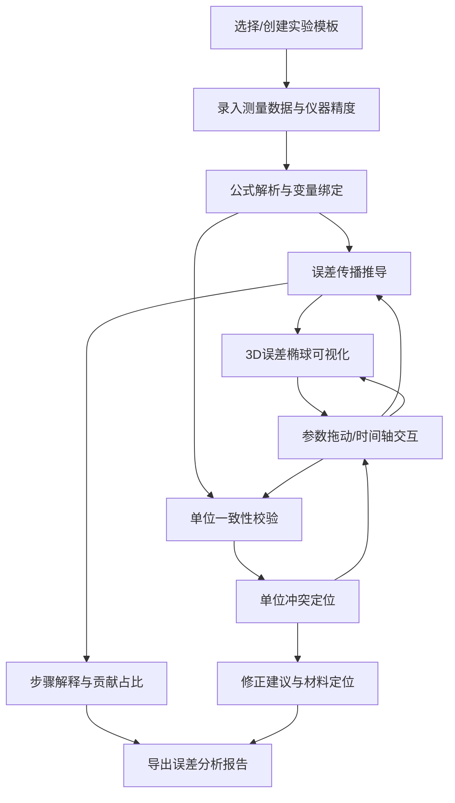

## 1. 产品概述

物理实验误差传播可视化工具，面向大学物理助教和学生。解决核心痛点：学生提交实验报告仅写平均值，无法追溯仪器误差如何传播至最终结果；助教难以快速定位单位不一致和公式变量缺失等问题的出处。通过3D可视化、实时误差传播推导和单位校验联动，让测量数据、仪器精度、公式表达式三方对齐。

- 目标用户：大学物理实验助教、本科生
- 核心价值：拖动参数即刻看到误差传播路径、单位冲突定位到具体材料，而非仅报"处理失败"

## 2. 核心功能

### 2.1 用户角色

| 角色 | 使用方式 | 核心权限 |
|------|----------|----------|
| 助教 | 直接使用 | 录入/编辑实验模板、校验学生报告、导出误差分析 |
| 学生 | 直接使用 | 录入测量数据、查看误差传播推导、理解仪器误差影响 |

### 2.2 功能模块

1. **工作台页面**：3D误差可视化 + 参数控制面板 + 误差传播推导 + 单位校验结果，四区联动
2. **实验管理页面**：实验模板库（预设经典实验）、测量数据表、导入导出

### 2.3 页面详情

| 页面名称 | 模块名称 | 功能描述 |
|----------|----------|----------|
| 工作台 | 3D误差可视化 | 误差椭球/曲面随参数拖动实时变形；点击误差椭球面高亮对应传播路径 |
| 工作台 | 参数控制面板 | 滑块拖动测量值和仪器精度，数值/单位/公式表达式同步更新 |
| 工作台 | 误差传播推导 | 显示从各测量量到最终结果的完整传播链，标注每步偏导数和贡献百分比 |
| 工作台 | 单位校验面板 | 检测单位不一致，定位到具体变量和材料行，给出修正建议 |
| 工作台 | 时间轴 | 播放/拖动回放参数变化过程，误差传播和3D画面同步更新 |
| 实验管理 | 实验模板库 | 预设单摆测g、杨氏模量、牛顿环等经典实验公式和数据模板 |
| 实验管理 | 测量数据表 | 录入多次测量数据，自动计算平均值和A类不确定度 |
| 实验管理 | 导入导出 | 支持CSV导入测量数据、导出完整误差分析报告 |

## 3. 核心流程

用户打开工作台 → 选择/创建实验模板 → 录入测量数据和仪器精度 → 系统自动解析公式表达式并推导误差传播 → 拖动参数滑块观察3D误差椭球变化和传播路径高亮 → 单位校验实时检测并定位冲突 → 时间轴回放参数变化过程 → 导出报告

## 4. 用户界面设计

### 4.1 设计风格

- 主色调：深靛蓝(#1a1a2e) + 荧光绿(#00ff88)强调色，传达科学仪器的精密感
- 辅助色：琥珀色(#ffb347)用于警告/单位冲突，冷灰(#2d2d44)用于背景层级
- 按钮风格：微圆角(4px)、扁平化、hover时荧光绿边框发光
- 字体：JetBrains Mono用于公式和数值，Noto Sans SC用于中文正文
- 布局：深色主题、卡片式面板、网格布局（左3D / 右上参数+推导 / 右下单位校验）
- 图标：线性风格（lucide-react），搭配荧光绿高亮

### 4.2 页面设计概览

| 页面名称 | 模块名称 | UI元素 |
|----------|----------|--------|
| 工作台 | 3D误差可视化 | 深色背景、荧光绿线框椭球、渐变网格地面、正交/透视切换 |
| 工作台 | 参数控制面板 | 深色卡片、带刻度滑块、荧光绿数值、单位标签、公式LaTeX渲染 |
| 工作台 | 误差传播推导 | 竖向步骤流、偏导数公式卡片、贡献百分比条形图、折叠/展开 |
| 工作台 | 单位校验面板 | 状态标签(通过/冲突)、冲突行高亮琥珀色、定位链接跳转 |
| 工作台 | 时间轴 | 底部横条、可拖动进度点、播放/暂停按钮、刻度标记 |
| 实验管理 | 实验模板库 | 网格卡片、实验名称+公式缩略图、荧光绿hover边框 |
| 实验管理 | 测量数据表 | 深色表格、可编辑单元格、自动计算行、仪器精度列 |

### 4.3 响应式设计

- 桌面优先：1920px为基准，左60%放3D可视化，右40%放控制面板和推导
- 1440px：3D区域缩小至50%，右侧面板可折叠
- 平板：上下布局，3D在上，控制和推导用Tab切换
- 移动端：仅保留参数控制和推导面板，3D降级为2D图表

### 4.4 3D场景指导

- 环境：深空背景，微弱星空粒子
- 灯光：冷白环境光 + 荧光绿点光源照亮误差椭球
- 相机：默认45°俯视OrbitControls，允许旋转缩放
- 主体：误差椭球用半透明荧光绿线框 + 实体填充，坐标轴标注物理量名称
- 交互：鼠标悬浮显示局部误差值，拖动滑块椭球实时变形
- 后处理：Bloom发光效果增强荧光感
