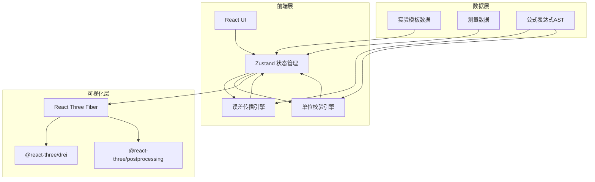
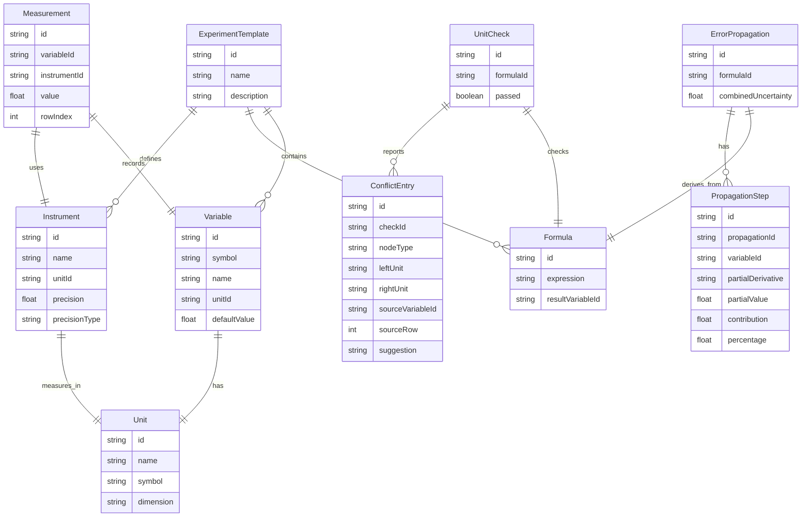

## 1. 架构设计

## 2. 技术说明

- 前端：React@18 + TypeScript + Tailwind CSS@3 + Vite
- 初始化工具：vite-init (react-ts 模板)
- 3D渲染：three + @react-three/fiber + @react-three/drei + @react-three/postprocessing
- 状态管理：Zustand
- 公式渲染：KaTeX
- 公式解析：mathjs（构建AST、符号微分）
- 路由：react-router-dom
- 后端：无（纯前端，数据存储在localStorage）
- 数据库：无（使用localStorage + JSON导出导入）

## 3. 路由定义

| 路由 | 用途 |
|------|------|
| / | 工作台主页面：3D可视化 + 参数控制 + 误差传播 + 单位校验 |
| /experiments | 实验管理：模板库 + 测量数据表 + 导入导出 |

## 4. 核心模块设计

### 4.1 误差传播引擎

- 输入：公式AST（由mathjs解析生成）、测量值及不确定度
- 处理：对每个变量求偏导数（符号微分），计算合成不确定度
- 输出：传播链步骤数组，每步包含偏导数表达式、数值、贡献百分比
- 联动：参数变化时重新计算，3D椭球和推导面板同步更新

### 4.2 单位校验引擎

- 输入：公式AST、每个变量的单位定义
- 处理：沿AST树推导每层子表达式的单位，检测加法/减法两侧单位是否一致
- 输出：校验结果数组，每条包含状态(通过/冲突)、冲突位置(AST节点)、涉及的变量和材料行号
- 定位：冲突信息关联到具体测量数据行和仪器精度来源

### 4.3 3D误差可视化

- 误差椭球：以测量值为中心，半轴长度对应各方向不确定度
- 参数拖动：滑块值变化 → 更新Store → 重新计算误差 → 更新椭球几何体
- 传播路径：从各变量到结果用发光线条连接，线条粗细对应贡献百分比
- 时间轴：记录参数快照序列，播放时依次恢复快照状态

## 5. 数据模型

### 5.1 数据模型定义

### 5.2 预设实验模板数据

- 单摆测重力加速度：T=2π√(L/g)，变量L/T，仪器米尺/秒表
- 杨氏模量：E=FL/(AΔL)，变量F/L/A/ΔL，仪器砝码/米尺/螺旋测微器
- 牛顿环测曲率半径：R=D²/(4mλ)，变量D/m/λ，仪器读数显微镜
