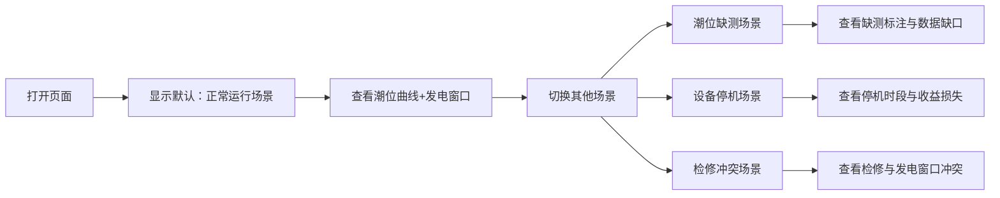

## 1. 产品概述

潮汐能发电窗口演示系统，用于海洋能源工程师在会议或教学中展示潮位数据、设备状态与电价日历的对齐关系，重点标注潮位缺测、设备停机、检修冲突等异常情况。

- 解决问题：直观展示潮汐发电中的数据异常与运维冲突，便于工程师沟通解释
- 目标用户：海洋能源工程师、运维人员、科研教学人员
- 核心价值：通过可视化标注清晰呈现"尴尬场景"，提升沟通效率

## 2. 核心功能

### 2.1 功能模块
1. **时间轴主视图**：潮位曲线、发电窗口、异常标注一体化展示
2. **潮位数据表**：展示潮位记录，高亮缺测数据
3. **设备状态面板**：展示设备运行/停机/检修状态
4. **电价日历**：分时电价与发电收益展示
5. **场景切换器**：正常/缺测/停机/冲突四种演示场景

### 2.2 页面详情
| 页面名称 | 模块名称 | 功能描述 |
|-----------|-------------|---------------------|
| 主页面 | 时间轴主视图 | 24小时潮位曲线，支持缩放，标注发电窗口与异常点 |
| 主页面 | 潮位数据表 | 表格展示每小时潮位数据，缺测行红色高亮并带缺测标记 |
| 主页面 | 设备状态面板 | 时间条展示设备状态，停机时段带斜线填充与文字标注 |
| 主页面 | 电价日历 | 电价热力图，标注峰谷时段 |
| 主页面 | 场景切换器 | 一键切换四种演示场景：正常运行、潮位缺测、设备停机、检修冲突 |

## 3. 核心流程

## 4. 用户界面设计

### 4.1 设计风格
- **主色调**：深海蓝 (#0F4C75) 代表海洋，科技感
- **辅助色**：警示橙 (#FF6B35) 标注异常，安全绿 (#2ECC71) 正常运行
- **警告色**：危险红 (#E74C3C) 标注冲突与严重问题
- **背景**：浅灰蓝渐变 (#F8FAFC → #E8F4F8)，清新专业
- **字体**：使用 'Noto Sans SC' 中文字体，清晰易读
- **卡片风格**：圆角 8px，轻微阴影，层次分明

### 4.2 标注设计（重点）
- **潮位缺测**：虚线连接 + 红色圆点 + "缺测"文字标签 + 表格行背景高亮
- **设备停机**：灰色斜线填充 + "停机维护"文字徽章 + 起止时间标注
- **检修冲突**：黄色警告边框 + 感叹号图标 + "冲突"标签
- **发电窗口**：绿色半透明填充 + 发电量预估数字

### 4.3 页面布局
| 区域 | 位置 | 内容 |
|-----------|-------------|-------------|
| 顶部 | 全宽 | 标题 + 场景切换按钮组 |
| 左侧上 | 2/3 宽 | 时间轴主视图（潮位曲线） |
| 左侧下 | 2/3 宽 | 潮位数据表 |
| 右侧上 | 1/3 宽 | 设备状态时间条 |
| 右侧中 | 1/3 宽 | 电价日历热力图 |
| 右侧下 | 1/3 宽 | 场景说明与统计数据 |

### 4.4 响应式
- 桌面端优先，1200px 以上最优显示
- 平板端：左右布局改为上下布局
- 移动端：卡片堆叠展示，数据表可横向滚动
