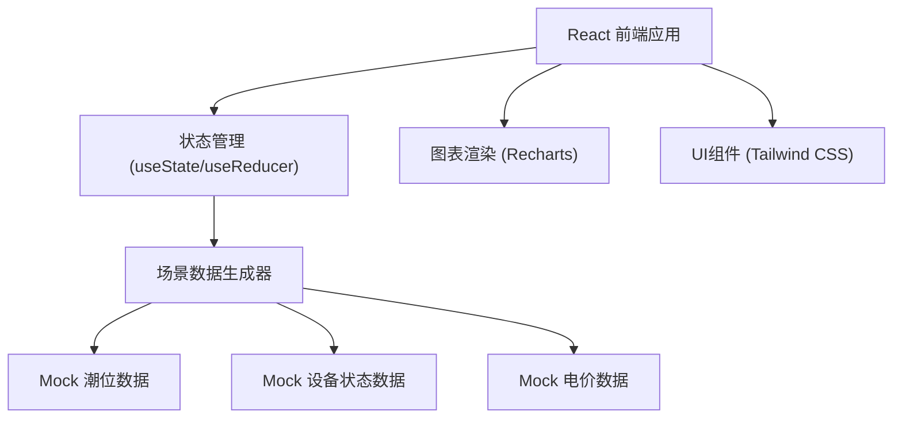

## 1. 架构设计



## 2. 技术描述

- **前端框架**：React@18 + TypeScript
- **构建工具**：Vite@5
- **样式方案**：Tailwind CSS@3
- **图表库**：Recharts@2 (轻量级 React 图表库)
- **图标**：Lucide React
- **后端**：无，纯前端 Mock 数据
- **数据持久化**：无需，演示数据内置

## 3. 数据结构定义

### 3.1 潮位数据
```typescript
interface TideData {
  time: string;      // "00:00"
  level: number;     // 潮位高度 (米)
  isMissing: boolean;// 是否缺测
  predicted?: number;// 预测值(缺测时显示)
}
```

### 3.2 设备状态
```typescript
interface DeviceStatus {
  time: string;
  status: 'running' | 'stopped' | 'maintenance';
  power: number;     // 发电量 (MW)
}
```

### 3.3 电价数据
```typescript
interface ElectricityPrice {
  time: string;
  price: number;     // 电价 (元/MWh)
  period: 'peak' | 'flat' | 'valley';
}
```

### 3.4 场景类型
```typescript
type ScenarioType = 'normal' | 'missing' | 'outage' | 'conflict';
```

## 4. 组件结构

```
src/
├── components/
│   ├── TideChart.tsx        # 潮位曲线图
│   ├── TideTable.tsx        # 潮位数据表
│   ├── DeviceStatus.tsx     # 设备状态面板
│   ├── PriceCalendar.tsx    # 电价日历
│   ├── ScenarioSwitcher.tsx # 场景切换器
│   └── StatusBadge.tsx      # 状态徽章组件
├── data/
│   └── mockData.ts          # Mock 数据生成器
├── types/
│   └── index.ts             # 类型定义
├── App.tsx
└── main.tsx
```

## 5. 核心计算逻辑

### 5.1 发电窗口识别
- 潮位高于阈值（如 2.5米）且处于涨潮或落潮阶段
- 设备状态为 running
- 计算预估发电量：`功率 × 时长 × 电价`

### 5.2 异常检测
- 缺测检测：`isMissing === true`，计算连续缺测时长
- 停机检测：`status === 'stopped'`，计算机组损失
- 冲突检测：检修时段与发电窗口重叠
