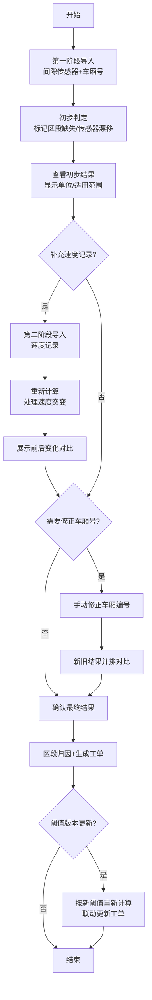

## 1. 产品概述

磁悬浮列车间隙监测计算工具，为轨道交通运维人员提供专业的间隙数据分析平台。系统通过两阶段数据导入，结合多版本阈值管理，实现精准的间隙判定、区段归因和工单联动，解决"速度突变算不算"等运维争议问题。

### 1.1 核心价值
- **透明化判定**：不仅输出结果，更标注单位、适用范围、失败原因
- **渐进式分析**：支持先导入间隙/车厢号，再补充速度记录，清晰展示前后变化
- **边界场景覆盖**：专门处理传感器漂移、速度突变、区段缺失等异常情况
- **结果可追溯**：阈值版本变化自动联动更新，支持手动修正和新旧结果并排对比

---

## 2. 核心功能

### 2.1 用户角色
| 角色 | 登录方式 | 核心权限 |
|------|----------|----------|
| 运维工程师 | 工号登录 | 数据导入、查看分析结果、提交工单 |
| 运维主管 | 工号登录 | 阈值管理、手动修正、结果审批 |

### 2.2 功能模块
1. **数据导入页面**：两阶段数据上传（间隙传感器+车厢号 / 速度记录）
2. **间隙分析页面**：核心计算引擎、结果详情、边界异常标记
3. **阈值管理页面**：阈值版本管理、适用范围配置
4. **工单联动页面**：区段归因、工单生成与追踪
5. **手动修正页面**：车厢号修正、新旧结果并排对比

### 2.3 页面详情
| 页面名称 | 模块名称 | 功能描述 |
|----------|----------|----------|
| 数据导入 | 第一阶段导入 | 上传间隙传感器CSV、车厢编号映射表，预览数据质量 |
| 数据导入 | 第二阶段导入 | 补充速度记录，系统自动计算并高亮前后变化差异 |
| 数据导入 | 边界样例测试 | 内置传感器漂移、速度突变、区段缺失样例一键导入 |
| 间隙分析 | 结果总览 | 卡片式展示通过/警告/失败统计，标注判定单位和阈值版本 |
| 间隙分析 | 区段详情 | 按线路区段展示监测数据，标记异常点和失败原因 |
| 间隙分析 | 变化对比 | 两阶段导入前后结果对比，明确标注速度突变影响 |
| 阈值管理 | 版本列表 | 展示历史阈值版本，支持版本切换和回滚 |
| 阈值管理 | 版本详情 | 配置间隙阈值、速度突变阈值、适用线路范围 |
| 工单联动 | 区段归因 | 自动关联异常区段到对应检修班组 |
| 工单联动 | 工单生成 | 根据异常等级自动生成检修工单 |
| 手动修正 | 修正表单 | 支持修改车厢编号映射关系 |
| 手动修正 | 并排对比 | 左侧原始结果、右侧修正后结果，差异高亮显示 |

---

## 3. 核心流程

### 3.1 主流程描述
1. 运维工程师登录系统，进入数据导入页面
2. 第一阶段：导入间隙传感器数据和车厢编号映射，系统执行初步判定
3. 查看初步分析结果，确认数据完整性
4. 第二阶段：补充导入速度记录，系统重新计算并展示前后变化
5. 如存在边界异常（传感器漂移、速度突变、区段缺失），系统自动标记并说明原因
6. 可选择手动修正车厢编号，新旧结果并排对比确认
7. 确认最终结果后，系统自动生成检修工单并关联到对应区段
8. 阈值版本更新后，历史分析数据可选择按新阈值重新计算

### 3.2 核心流程图

---

## 4. 用户界面设计

### 4.1 设计风格
- **主色调**：工业蓝 (#165DFF) 作为主色，警示橙 (#FF7D00) 用于警告，危险红 (#F53F3F) 用于失败，成功绿 (#00B42A) 用于通过
- **辅助色**：深空灰 (#1D2129) 背景，金属银 (#C9CDD4) 边框
- **按钮风格**：直角矩形，2px边框，点击时轻微凹陷效果，工业控制台风格
- **字体**：等宽字体 JetBrains Mono 用于数据展示，Noto Sans SC 用于中文说明
- **布局风格**：仪表盘式布局，左侧导航栏固定，右侧内容区卡片式分组，数据表格占主要区域
- **图标风格**：线性图标，工业感强，避免圆润卡通风格

### 4.2 页面设计概述
| 页面名称 | 模块名称 | UI元素 |
|----------|----------|--------|
| 间隙分析 | 结果总览 | 4张状态卡片（通过/警告/失败/待确认），每张显示数值+单位+占比，背景色对应状态 |
| 间隙分析 | 区段时间轴 | 横向时间轴，按区段排列，每个区段用色块标记状态，hover显示详情 |
| 间隙分析 | 异常详情面板 | 右侧抽屉式面板，展示失败原因、适用范围、阈值版本、建议措施 |
| 数据导入 | 上传区域 | 拖拽上传区，显示文件格式要求，上传后显示数据预览表格 |
| 数据导入 | 阶段指示器 | 顶部步骤条，清晰标记当前处于第一/第二阶段 |
| 手动修正 | 并排对比 | 50:50 分屏布局，左侧灰色调显示原始结果，右侧蓝色调显示修正后结果，差异处黄色高亮闪烁 |
| 阈值管理 | 版本时间线 | 垂直时间线展示阈值版本历史，可点击切换查看各版本参数 |

### 4.3 响应式
- **Desktop-first**：针对1920×1080及以上分辨率优化，运维人员使用大屏显示器
- **Tablet适配**：1024px以上保持主要布局，导航栏可折叠
- **移动端**：768px以下简化为列表视图，仅展示核心数据，不支持复杂操作

---

## 5. 边界场景处理规范

### 5.1 传感器漂移
- **判定规则**：同一传感器连续5个采样点偏差超过±15%，标记为漂移
- **结果展示**：橙色警告标记，说明"传感器X可能存在漂移，建议校准"
- **计算策略**：漂移区段数据使用加权平滑算法处理，不直接判定为故障

### 5.2 速度突变
- **判定规则**：相邻采样点速度变化率>50km/h/s，标记为速度突变
- **结果展示**：明确标注"速度突变点已纳入判定"，展示突变前后间隙值对比
- **计算策略**：速度突变区段使用动态阈值（比正常阈值宽20%）

### 5.3 区段缺失
- **判定规则**：连续10个以上采样点无数据，标记为区段缺失
- **结果展示**：灰色占位，说明"区段X数据缺失，无法判定"
- **计算策略**：缺失区段不参与统计，在最终报告中明确标注

### 5.4 结果重复性保障
- 所有计算使用固定种子的确定性算法
- 浮点运算精度统一为小数点后6位
- 相同输入重复计算结果哈希值必须一致
