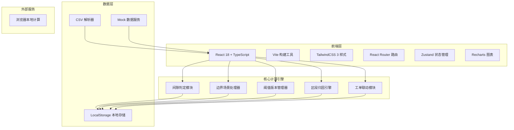
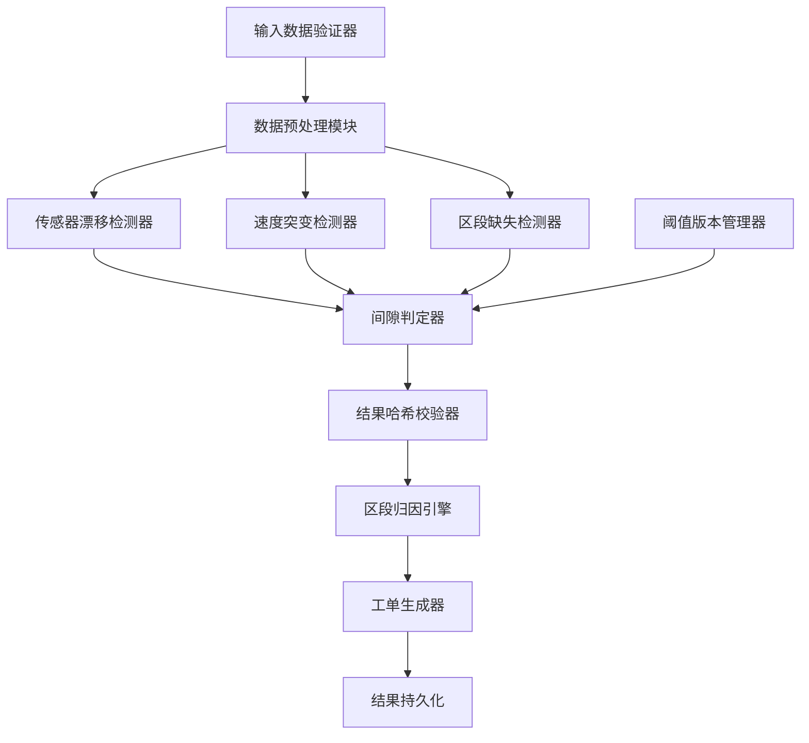
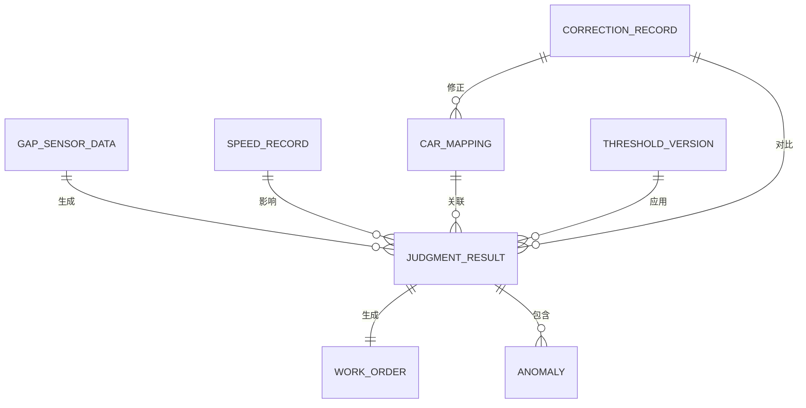

## 1. 架构设计



## 2. 技术描述

- **前端**：React@18.2.0 + TypeScript@5.0 + TailwindCSS@3.4 + Vite@5.0
- **状态管理**：Zustand@4.4（轻量型，适合计算密集型应用）
- **图表库**：Recharts@2.10（专业数据可视化）
- **路由**：React Router@6.20
- **初始化工具**：pnpm create vite
- **后端**：无（纯前端计算，数据存储在 LocalStorage）
- **数据**：内置 Mock 数据 + CSV 导入，支持边界样例一键加载

## 3. 路由定义

| 路由 | 页面名称 | 核心功能 |
|------|----------|----------|
| / | 间隙分析首页 | 结果总览、区段时间轴、异常详情 |
| /import | 数据导入 | 两阶段数据上传、边界样例测试 |
| /threshold | 阈值管理 | 阈值版本列表、版本配置 |
| /workorder | 工单联动 | 区段归因、工单列表 |
| /correction | 手动修正 | 车厢号修正、新旧结果并排对比 |

## 4. 核心数据类型定义

```typescript
// 间隙传感器数据
interface GapSensorData {
  timestamp: number;
  sensorId: string;
  carNumber: string;
  gapValue: number; // 单位：mm
  sectionId: string;
}

// 速度记录
interface SpeedRecord {
  timestamp: number;
  carNumber: string;
  speed: number; // 单位：km/h
  sectionId: string;
}

// 车厢编号映射
interface CarMapping {
  sensorId: string;
  carNumber: string;
  lineId: string;
}

// 阈值版本
interface ThresholdVersion {
  id: string;
  version: string;
  name: string;
  effectiveDate: string;
  applicableLines: string[];
  normalGap: { min: number; max: number }; // 单位：mm
  warningGap: { min: number; max: number };
  speedSuddenChange: number; // 单位：km/h/s
  sensorDriftThreshold: number; // 百分比
  missingSectionThreshold: number; // 采样点数
  dynamicThresholdAdjustment: number; // 速度突变时阈值放宽比例
}

// 判定结果
interface JudgmentResult {
  id: string;
  sectionId: string;
  carNumber: string;
  status: 'PASS' | 'WARNING' | 'FAIL' | 'MISSING';
  gapValue: number;
  unit: string;
  thresholdVersion: string;
  applicableScope: string;
  failureReason?: string;
  anomalies: Anomaly[];
  createdAt: number;
}

// 异常标记
interface Anomaly {
  type: 'DRIFT' | 'SPEED_SUDDEN_CHANGE' | 'MISSING' | 'GAP_ABNORMAL';
  description: string;
  severity: 'LOW' | 'MEDIUM' | 'HIGH';
  timestamp: number;
}

// 工单
interface WorkOrder {
  id: string;
  sectionId: string;
  carNumber: string;
  anomalyType: string;
  description: string;
  status: 'PENDING' | 'IN_PROGRESS' | 'RESOLVED';
  assignedTeam: string;
  createdAt: number;
  judgmentResultId: string;
}

// 修正记录
interface CorrectionRecord {
  id: string;
  originalCarMapping: CarMapping[];
  correctedCarMapping: CarMapping[];
  originalResults: JudgmentResult[];
  correctedResults: JudgmentResult[];
  createdAt: number;
  operator: string;
}
```

## 5. 核心计算引擎架构



## 6. 数据模型

### 6.1 ER 图



### 6.2 存储结构（LocalStorage）

| Key | 数据结构 | 说明 |
|-----|----------|------|
| gap_sensor_data | GapSensorData[] | 间隙传感器原始数据 |
| speed_records | SpeedRecord[] | 速度记录 |
| car_mappings | CarMapping[] | 车厢编号映射 |
| threshold_versions | ThresholdVersion[] | 阈值版本历史 |
| judgment_results | JudgmentResult[] | 判定结果历史 |
| work_orders | WorkOrder[] | 工单列表 |
| correction_records | CorrectionRecord[] | 修正记录 |
| current_threshold_id | string | 当前生效阈值ID |

### 6.3 计算确定性保障

```typescript
// 固定精度的数值计算
const PRECISION = 6;

function round(num: number): number {
  return Number(num.toFixed(PRECISION));
}

// 确定性哈希计算
function calculateResultHash(result: JudgmentResult): string {
  const canonical = JSON.stringify({
    sectionId: result.sectionId,
    carNumber: result.carNumber,
    gapValue: round(result.gapValue),
    thresholdVersion: result.thresholdVersion,
    anomalies: result.anomalies.sort((a, b) => a.timestamp - b.timestamp)
  });
  return btoa(canonical);
}
```
