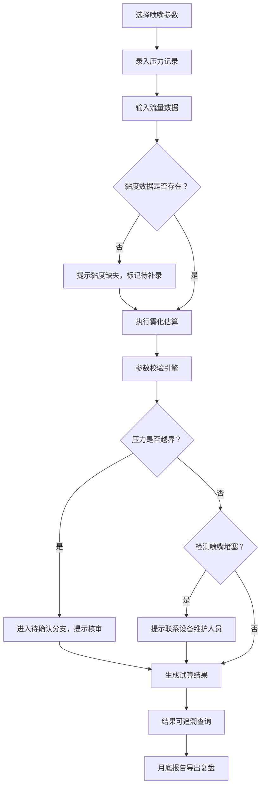

## 1. 产品概述

流体喷嘴雾化试算系统是专为农业设备工程师设计的专业工具，用于估算喷雾设备更换喷嘴后的雾滴大小和覆盖宽度，辅助评估施药效果。系统支持从喷嘴参数、压力记录、流量到药液黏度的完整数据链路，提供压力越界校验、黏度缺失提示和喷嘴堵塞检测等专业功能。

- 核心目标：帮助农业设备工程师快速评估喷嘴更换对施药效果的影响
- 核心价值：建立可追溯的雾化试算流程，支持参数→结果→记录的双向追溯

## 2. 核心功能

### 2.1 用户角色
| 角色 | 注册方式 | 核心权限 |
|------|----------|----------|
| 农业设备工程师 | 无需注册，本地使用 | 完整的参数录入、计算、校验、追溯、导出权限 |

### 2.2 功能模块
1. **喷嘴参数管理**：喷嘴型号、孔径、喷雾角度、标称流量等基础参数录入与查询
2. **压力记录管理**：工作压力数据录入、历史记录追溯、越界标记
3. **雾化试算核心**：雾滴大小估算、覆盖宽度计算、施药效果评估
4. **参数校验引擎**：压力越界校验、黏度缺失检测、喷嘴堵塞预警
5. **数据追溯模块**：参数→结果正向追溯、结果→压力记录反向追溯
6. **报告导出模块**：月度报告生成、试算结果导出

### 2.3 页面详情
| 页面名称 | 模块名称 | 功能描述 |
|----------|----------|----------|
| 首页/仪表盘 | 概览模块 | 快捷入口、最近试算记录、待确认事项统计 |
| 喷嘴参数管理 | 参数列表 | 喷嘴型号列表、搜索筛选、新增/编辑/删除 |
| 压力记录管理 | 记录列表 | 压力记录列表、按喷嘴关联、越界标记高亮 |
| 雾化试算页 | 试算表单 | 参数录入区、实时计算、校验结果展示 |
| 试算结果页 | 结果详情 | 雾化参数展示、校验结论、追溯链路 |
| 报告导出页 | 报告中心 | 月度报告生成、历史报告查询、导出下载 |

## 3. 核心流程

### 3.1 雾化试算主流程

### 3.2 数据追溯流程
- **正向追溯**：喷嘴参数 → 压力记录 → 试算结果
- **反向追溯**：试算结果 → 压力记录详情 → 喷嘴参数来源

## 4. 用户界面设计

### 4.1 设计风格
- **主色调**：工业蓝 (#165DFF) - 专业、可靠、科技感
- **辅助色**：警示橙 (#FF7D00) - 越界提醒；成功绿 (#00B42A) - 正常状态；危险红 (#F53F3F) - 堵塞报警
- **中性色**：深灰 (#1D2129)、中灰 (#4E5969)、浅灰 (#C9CDD4)、背景白 (#F2F3F5)
- **按钮风格**：圆角8px，微阴影，悬停有微妙缩放和颜色加深
- **字体**：Inter - 现代无衬线字体，专业清晰
  - 标题：20px / 600
  - 正文：14px / 400
  - 数据数值：16px / 500
- **布局风格**：卡片式布局，左侧导航 + 右侧内容区，工业仪表盘风格
- **图标风格**：线性图标，统一24px尺寸，蓝色系

### 4.2 页面设计概览
| 页面名称 | 模块名称 | UI元素 |
|----------|----------|--------|
| 仪表盘 | 概览卡片 | 数据卡片网格、统计图表、待办事项列表、渐变色背景 |
| 雾化试算 | 表单区域 | 分组表单、实时计算预览、校验状态徽章、计算结果面板 |
| 结果详情 | 追溯面板 | 时间线追溯视图、参数溯源链接、结论变更记录 |
| 报告导出 | 报告列表 | 卡片式报告预览、导出按钮组、时间范围选择器 |

### 4.3 响应式
- Desktop-first设计，适配1280px以上
- 平板端：导航收缩为图标，卡片自适应宽度
- 移动端：底部导航栏，单列布局

### 4.4 动效设计
- 页面加载：元素渐入 + 轻微上移动画，错开100ms延迟
- 校验提示：警告/错误状态滑入动画，脉冲效果
- 数据更新：数值变化时平滑过渡动画
- 卡片悬停：轻微上浮 + 阴影加深
