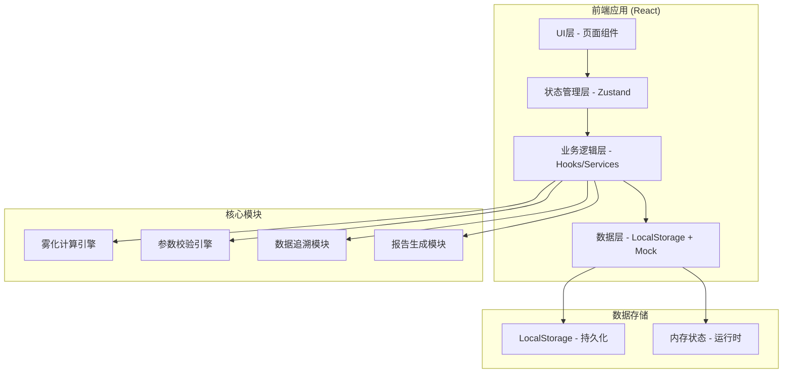
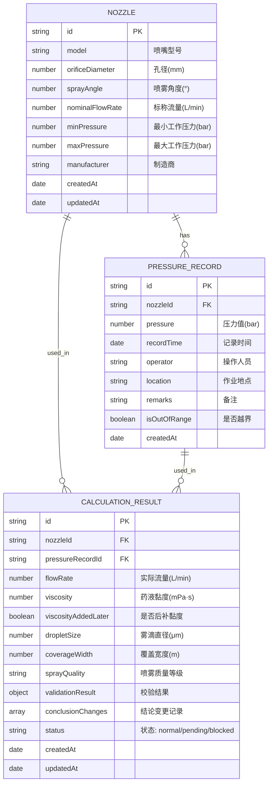

## 1. 架构设计



## 2. 技术描述

- **前端框架**: React@18 + TypeScript + Vite
- **样式方案**: TailwindCSS@3 + CSS Variables
- **状态管理**: Zustand - 轻量级状态管理
- **路由管理**: React Router@6
- **UI组件库**: 自定义组件 + Lucide React Icons
- **图表可视化**: Recharts - 数据展示
- **数据持久化**: LocalStorage - 本地数据存储
- **报告导出**: jsPDF + html2canvas - PDF导出
- **后端**: 无后端，纯前端应用，数据本地存储

## 3. 路由定义

| 路由路径 | 页面名称 | 用途 |
|----------|----------|------|
| / | 仪表盘 | 系统概览、快捷入口、统计数据 |
| /nozzles | 喷嘴参数管理 | 喷嘴参数列表、新增、编辑、查询 |
| /pressure | 压力记录管理 | 压力记录列表、关联喷嘴、越界标记 |
| /calculation | 雾化试算 | 核心试算页面、参数录入、实时计算 |
| /results | 试算结果 | 结果列表、详情查看、数据追溯 |
| /results/:id | 结果详情 | 单条结果详情、追溯链路展示 |
| /reports | 报告导出 | 月度报告生成、历史报告、导出下载 |

## 4. 数据模型

### 4.1 实体关系图



### 4.2 TypeScript 类型定义

```typescript
// 喷嘴参数
interface Nozzle {
  id: string;
  model: string;
  orificeDiameter: number;
  sprayAngle: number;
  nominalFlowRate: number;
  minPressure: number;
  maxPressure: number;
  manufacturer: string;
  createdAt: string;
  updatedAt: string;
}

// 压力记录
interface PressureRecord {
  id: string;
  nozzleId: string;
  pressure: number;
  recordTime: string;
  operator: string;
  location: string;
  remarks: string;
  isOutOfRange: boolean;
  createdAt: string;
}

// 校验结果
interface ValidationResult {
  pressureOutOfRange: boolean;
  pressureWarning: string | null;
  viscosityMissing: boolean;
  nozzleBlocked: boolean;
  nextStepContact: string | null;
  requiresConfirmation: boolean;
}

// 结论变更记录
interface ConclusionChange {
  field: string;
  oldValue: any;
  newValue: any;
  changedAt: string;
  changedBy: string;
  reason: string;
}

// 试算结果
interface CalculationResult {
  id: string;
  nozzleId: string;
  pressureRecordId: string;
  flowRate: number;
  viscosity: number | null;
  viscosityAddedLater: boolean;
  dropletSize: number;
  coverageWidth: number;
  sprayQuality: 'EXCELLENT' | 'GOOD' | 'FAIR' | 'POOR';
  validationResult: ValidationResult;
  conclusionChanges: ConclusionChange[];
  status: 'normal' | 'pending' | 'blocked';
  createdAt: string;
  updatedAt: string;
}
```

## 5. 核心算法说明

### 5.1 雾滴大小估算公式

基于经验公式估算体积中径(VMD)：
```
VMD = K × (Pressure^-0.4) × (OrificeDiameter^0.5) × (Viscosity^0.2)
其中:
- K: 喷嘴类型系数 (标准扇形喷嘴: 1200)
- Pressure: 工作压力 (bar)
- OrificeDiameter: 喷嘴孔径 (mm)
- Viscosity: 药液黏度 (mPa·s, 水为1)
```

### 5.2 覆盖宽度计算

```
CoverageWidth = 2 × SprayHeight × tan(SprayAngle/2) × CorrectionFactor
其中:
- SprayHeight: 喷雾高度 (m, 默认0.5m)
- SprayAngle: 喷雾角度 (°)
- CorrectionFactor: 压力修正系数 (0.85-1.05)
```

### 5.3 参数校验规则

1. **压力越界**: 工作压力 < 最小压力 或 > 最大压力 → 待确认分支
2. **黏度缺失**: 未录入黏度 → 提示补录，结果标记"估算值"
3. **喷嘴堵塞检测**: 实际流量 < 标称流量×70% → 提示联系设备维护

## 6. 项目结构

```
src/
├── assets/              # 静态资源
├── components/          # 通用组件
│   ├── layout/         # 布局组件
│   ├── ui/             # UI原子组件
│   └── forms/          # 表单组件
├── pages/              # 页面组件
├── store/              # Zustand 状态管理
├── hooks/              # 自定义 Hooks
├── services/           # 业务服务
│   ├── calculation.ts  # 雾化计算引擎
│   ├── validation.ts   # 参数校验引擎
│   └── export.ts       # 报告导出服务
├── types/              # TypeScript 类型定义
├── utils/              # 工具函数
├── data/               # Mock 数据
├── App.tsx
├── main.tsx
└── index.css
```
