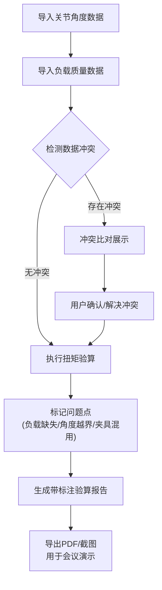

## 1. 产品概述

机器人关节扭矩验算工具，面向机器人研发工程师，解决负载缺失检测、扭矩边界验证、数据合并冲突展示等问题，确保验算结果清晰可追溯，支持会议演示和跨团队协作。

## 2. 核心功能

### 2.1 用户角色
| 角色 | 注册方式 | 核心权限 |
|------|----------|----------|
| 研发工程师 | 直接使用 | 数据录入、扭矩验算、报告导出 |
| 审核人员 | 直接使用 | 查看验算结果、冲突比对、下载报告 |

### 2.2 功能模块
1. **主控制面板**：机器人模型预览、参数配置、实时扭矩显示
2. **数据合并模块**：关节角度与负载质量数据导入、冲突可视化展示
3. **验算分析模块**：扭矩曲线、边界警告、问题追溯标注
4. **报告导出模块**：完整验算报告、截图标注、一键分享

### 2.3 页面详情
| 页面名称 | 模块名称 | 功能描述 |
|----------|----------|----------|
| 主验算页 | 机器人模型区 | 3D机器人可视化，关节角度实时显示，负载缺失位置高亮标注 |
| 主验算页 | 参数配置区 | 关节角度、连杆参数、负载质量的录入与编辑 |
| 主验算页 | 扭矩曲线图 | 各关节扭矩实时曲线，边界阈值线，越界点数字标注 |
| 数据合并页 | 冲突比对区 | 双列展示不同来源数据，差异行高亮，冲突点明确标记 |
| 报告详情页 | 问题追溯区 | 角度越界、夹具混用记录列表，点击跳转具体数据行 |
| 报告详情页 | 导出区 | PDF报告生成，带标注截图导出，分享链接生成 |

## 3. 核心流程

用户导入关节角度数据和负载质量数据 → 系统自动检测数据冲突并展示 → 用户确认或手动解决冲突 → 进行扭矩验算 → 系统标记负载缺失、角度越界、夹具混用问题 → 生成带详细标注的验算报告 → 导出报告或截图用于会议演示

## 4. 用户界面设计

### 4.1 设计风格
- **主色调**：工业蓝 (#165DFF)，代表专业和工程感
- **辅助色**：警告橙 (#FF7D00)、危险红 (#F53F3F)、成功绿 (#00B42A)，用于状态区分
- **背景色**：深灰 (#1D2129) 到 中灰 (#4E5969) 渐变，突出数据可读性
- **字体**：标题使用 JetBrains Mono，正文使用 Inter，保证工程数据可读性
- **按钮风格**：直角矩形，2px 边框，悬停时轻微发光效果
- **布局风格**：三栏式布局，左侧参数配置，中间模型+曲线，右侧问题列表和报告
- **图标风格**：线性图标，与工业主题一致

### 4.2 页面设计概述
| 页面名称 | 模块名称 | UI 元素 |
|----------|----------|---------|
| 主验算页 | 机器人模型区 | 3D 渲染机器人，关节角度数值标签，负载缺失位置红色虚线框标注，悬停显示详细信息 |
| 主验算页 | 扭矩曲线图 | 多色折线图，阈值虚线，越界点红色圆圈+数字标注，可放大查看细节 |
| 数据合并页 | 冲突比对区 | 左右双列表格，差异行黄色背景，冲突单元格红色边框，冲突原因气泡提示 |
| 报告详情页 | 问题追溯区 | 时间线式问题列表，每个问题带编号和类型标签，点击跳转到对应数据行高亮 |
| 报告详情页 | 导出区 | 大按钮组，预览窗口，导出进度条，分享链接一键复制 |

### 4.3 响应式
- 桌面端优先，三栏式布局
- 平板端自动调整为上下布局
- 移动端简化为标签页切换

### 4.4 3D 场景指引
- **环境**：深色工业风格背景，轻微网格地面
- **光照**：主光源+补光，突出机器人关节结构
- **相机**：默认正交视角，支持鼠标拖拽旋转、滚轮缩放
- **交互**：点击关节高亮显示对应扭矩曲线，双击关节打开参数面板
