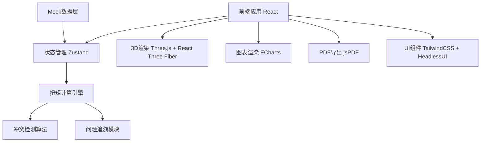
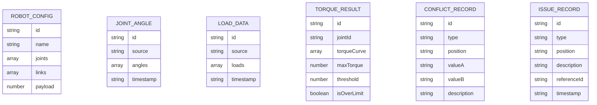

## 1. 架构设计



## 2. 技术描述

- **前端框架**: React@18 + TypeScript + Vite@5
- **状态管理**: Zustand@4，轻量高效的状态管理
- **3D渲染**: Three@0.160 + @react-three/fiber@8 + @react-three/drei@9
- **图表库**: ECharts@5，专业级数据可视化
- **UI框架**: TailwindCSS@3 + HeadlessUI@1.7
- **PDF导出**: jsPDF@2.5 + html2canvas@1.4
- **数据**: 内置 Mock 数据，无需后端服务

## 3. 路由定义

| 路由 | 页面名称 | 用途 |
|------|----------|------|
| / | 主验算页 | 机器人模型预览、参数配置、扭矩曲线、实时验算 |
| /merge | 数据合并页 | 关节角度与负载质量数据导入、冲突比对展示 |
| /report | 报告详情页 | 问题追溯列表、验算报告展示、导出功能 |

## 4. 数据模型

### 4.1 数据模型定义



### 4.2 TypeScript 类型定义

```typescript
// 机器人配置
interface RobotJoint {
  id: string;
  name: string;
  index: number;
  minAngle: number;
  maxAngle: number;
  maxTorque: number;
  position: [number, number, number];
}

interface RobotLink {
  id: string;
  name: string;
  length: number;
  mass: number;
  parentJoint: string;
  childJoint: string;
}

interface RobotConfig {
  id: string;
  name: string;
  joints: RobotJoint[];
  links: RobotLink[];
  defaultPayload: number;
}

// 数据源
interface AngleData {
  jointId: string;
  angle: number;
  timestamp: number;
}

interface LoadData {
  linkId: string;
  mass: number;
  centerOfMass: [number, number, number];
  timestamp: number;
}

interface DataSource<T> {
  id: string;
  name: string;
  source: string;
  data: T[];
  importedAt: string;
}

// 验算结果
interface TorquePoint {
  timestamp: number;
  value: number;
  angle: number;
  load: number;
}

interface TorqueResult {
  jointId: string;
  jointName: string;
  curve: TorquePoint[];
  maxTorque: number;
  minTorque: number;
  threshold: number;
  isOverLimit: boolean;
  overLimitPoints: number[];
}

// 冲突记录
interface ConflictRecord {
  id: string;
  type: 'angle' | 'load' | 'joint';
  rowIndex: number;
  field: string;
  valueA: string | number;
  valueB: string | number;
  resolved: boolean;
  resolution?: 'A' | 'B' | 'custom';
  customValue?: string | number;
  description: string;
}

// 问题记录
type IssueType = 'missing_load' | 'angle_out_of_range' | 'fixture_misuse' | 'torque_over_limit';

interface IssueRecord {
  id: string;
  type: IssueType;
  severity: 'warning' | 'error' | 'critical';
  position: string;
  description: string;
  referenceId: string;
  timestamp: string;
  screenshotPath?: string;
}

// 验算报告
interface VerificationReport {
  id: string;
  title: string;
  createdAt: string;
  robotConfig: RobotConfig;
  torqueResults: TorqueResult[];
  conflicts: ConflictRecord[];
  issues: IssueRecord[];
  summary: {
    totalJoints: number;
    overLimitJoints: number;
    criticalIssues: number;
    warnings: number;
    recommendations: string[];
  };
}
```
