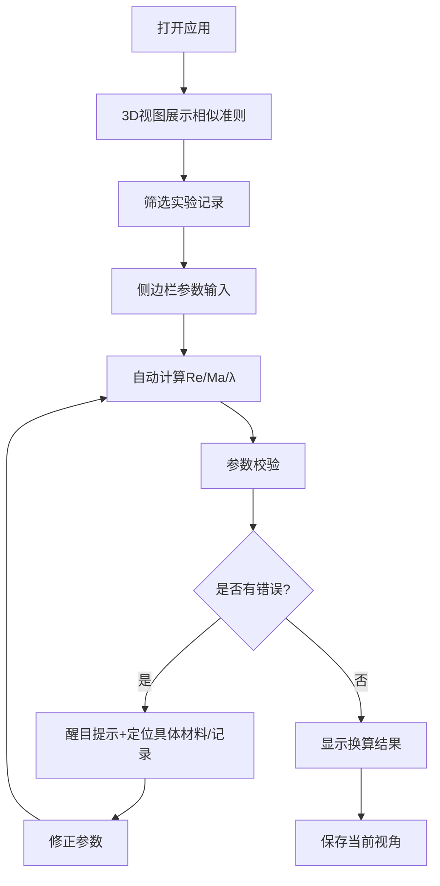

## 1. 产品概述

风洞实验相似准则Web3D工具，面向航空实验助理和学生，解决缩比模型风洞数据换算到实机过程中雷诺数与马赫数混用、单位混乱、参数不匹配等核心问题。通过3D可视化直观展示相似准则关系，侧边栏提供尺度换算和参数校验，将错误定位到具体材料和实验记录。

- **核心问题**：学生混用雷诺数和马赫数，单位混乱导致换算失败，参数不匹配无法定位具体原因
- **目标用户**：航空实验助理、航空专业学生、风洞实验人员
- **产品价值**：将抽象的相似准则具象化，减少参数换算错误，提高实验数据处理效率

## 2. 核心 Features

### 2.1 用户角色

| 角色 | 注册方式 | 核心权限 |
|------|----------|----------|
| 实验助理 | 本地应用，无需注册 | 查看3D相似准则、参数换算、校验数据、保存视角、筛选记录 |
| 学生用户 | 本地应用，无需注册 | 学习相似准则、练习参数换算、查看错误定位 |

### 2.2 功能模块

1. **3D主视图模块**：相似准则三维可视化、模型旋转交互、筛选条件、视角保存与恢复
2. **侧边栏模块**：尺度换算工具、参数校验引擎、实验记录明细、材料参数库
3. **状态同步模块**：主视图与侧边栏筛选条件双向同步、错误状态联动高亮
4. **错误诊断模块**：单位混乱检测、雷诺数不匹配定位、具体材料/记录溯源

### 2.3 页面详情

| 页面名称 | 模块名称 | 功能描述 |
|-----------|-------------|---------------------|
| 主页面 | 3D相似准则视图 | 展示雷诺数Re、马赫数Ma、尺度比λ等参数的三维关系图；支持鼠标拖拽旋转、滚轮缩放；点击准则节点高亮相关实验记录 |
| 主页面 | 顶部筛选栏 | 按实验编号、材料类型、实验日期筛选；筛选条件与侧边栏同步；重置按钮 |
| 主页面 | 视角控制栏 | 保存当前视角（命名存储）、恢复已存视角、重置到默认视角、视角列表管理 |
| 侧边栏 | 尺度换算面板 | 输入模型尺寸、实机尺寸、风速、空气参数（密度、粘度、温度）；自动计算雷诺数、马赫数、尺度比；支持多单位切换（m/mm、m/s/km/h、Pa/atm等） |
| 侧边栏 | 参数校验面板 | 校验当前参数组合的相似性；检测单位不一致；检测雷诺数/马赫数不匹配；定位到具体材料参数和实验记录；醒目红色错误提示 |
| 侧边栏 | 实验记录明细 | 展示筛选后的风洞实验记录列表；点击记录在3D视图中定位；显示记录的材料来源、参数值、换算结果、错误状态 |
| 侧边栏 | 材料参数库 | 常用航空材料参数（密度、粘度、热导率等）；支持快速选用参数到换算面板 |

## 3. 核心流程

用户打开应用 → 查看3D相似准则关系图 → 筛选感兴趣的实验记录 → 在侧边栏进行尺度换算 → 系统自动校验参数 → 若发现错误（单位混乱/雷诺数不匹配）→ 醒目提示并定位到具体材料/记录 → 修正参数后重新计算 → 保存当前分析视角以便后续查看

## 4. 界面设计

### 4.1 设计风格

- **主色调**：深蓝科技风（#0F172A 背景）+ 航空蓝（#3B82F6 主色）+ 警示红（#EF4444 错误高亮）+ 成功绿（#10B981 正常）
- **按钮风格**：矩形直角、细边框、hover时轻微发光
- **字体**：JetBrains Mono（等宽字体，适合数据展示）+ Noto Sans SC（中文）
- **布局**：左侧70% 3D视图 + 右侧30% 侧边栏，顶部通栏筛选和视角控制
- **图标**：使用lucide-react线性图标，保持简洁工业风格
- **整体风格**：工程/工业软件风格，朴素实用，数据优先，错误醒目

### 4.2 页面设计概述

| 页面名称 | 模块名称 | UI元素 |
|-----------|-------------|-------------|
| 主页面 | 3D视图区域 | 深黑色背景、网格辅助线、三维坐标轴、彩色球体代表各相似准则、连线表示准则间关系、hover显示参数详情、选中高亮发光 |
| 主页面 | 顶部控制栏 | 灰色背景、下拉筛选框、保存视角按钮、视角选择下拉、重置按钮 |
| 侧边栏 | 换算面板 | 分组表单、标签+输入框+单位选择下拉、计算结果用大号等宽字体显示、校验状态图标 |
| 侧边栏 | 错误提示 | 红色背景+白色粗体文字+错误图标、显示具体错误位置（材料X 第Y条记录）、点击跳转到对应记录 |
| 侧边栏 | 记录列表 | 斑马纹表格、错误记录红框高亮、正常记录绿色对勾、点击展开详情 |

### 4.3 响应式

- 桌面端优先设计（1280px以上）
- 平板端：侧边栏改为底部抽屉
- 移动端：简化3D视图，优先展示参数校验功能

### 4.4 3D场景指导

- **环境**：深灰色纯色背景，无HDRI，保持简洁工业感
- **光照**：环境光+两盏方向光，确保3D物体清晰可见，无过强阴影
- **相机设置**：PerspectiveCamera，初始位置(5, 5, 5)，lookAt原点，支持OrbitControls
- **核心元素**：
  - 三维坐标轴（红X、绿Y、蓝Z）
  - 网格地面（GridHelper）
  - 多个彩色球体（MeshStandardMaterial）代表不同相似准则
  - 圆柱体连线表示准则间的数学关系
  - 文字标签（Sprite）显示参数名称和数值
- **交互**：OrbitControls旋转缩放，点击球体选中，hover显示信息面板
- **动画**：选中球体轻微上下浮动，错误球体红色脉冲闪烁
- **后处理**：Bloom效果用于选中和错误高亮
- **性能**：控制几何体面数，使用InstancedMesh处理多个重复元素
